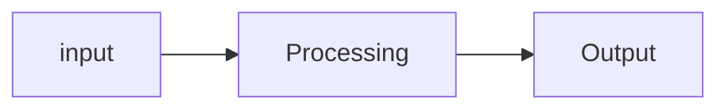
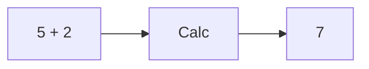
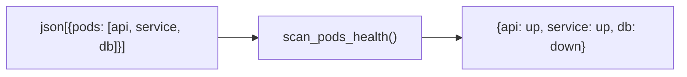

O que é Python
===

<!-- font_size: 2 -->

# Python

Python é uma linguagem de programação de multipropósito, ou seja, com Python
é possível desenvolver software para praticamente todos os nichos.

-------------

<!-- font_size: 2 -->

# Nichos

Os nichos de desenvolvimento de software geralmente se dividem em algumas 
categorias:

<!-- incremental_lists: true -->

- Scripts
- Automação
- Integração de sistemas
- Extensão de sistemas
- Pipelines de tratamento de dados
- Aplicações de Terminal
- Aplicações Desktop
- Aplicações Web
- Aplicações Mobile


<!-- incremental_lists: false -->

I/O
===
<!-- pause -->
<!-- font_size: 2 -->

Independente do nicho em que Python será usada, a parte mais importante será sempre o fluxo que chamamos de `I/O` (Input e Output).

Todo programa depende de:

**Entrada de Dados** ->  **Processamento** -> **Saida de dados**


<!-- pause -->



<!-- pause -->



<!-- pause -->



Saber apenas Python é suficiente para desenvolver software?
===

<!-- pause -->

<!-- font_size: 4 -->

<!-- jump_to_middle -->

<!-- alignment: center -->

### Não


Design de Sistemas
========

Antes mesmo de começar a programar um software, seja apenas um script, um app ou uma plataforma complexa,
independente do tamanho do software, é muito importante organizarmos nosso modelo mental em 2 fases.

<!-- pause -->

# Fase 1: Design de Solução

Nesta fase pensamos na solução **macro**, focamos em responder as seguintes questões:

<!-- incremental_lists: true -->
<!-- font_size: 2 -->

- O **quê** o software deve fazer?
- **Por quê** o software deve fazer isso?

<!-- pause -->

Exemplo:

- **O quê:** O software deve monitorar um cluster Kubernetes, escanear cada pod e verificar o status do pod, em caso de problemas um relatorio deve ser gerado e enviado para o suporte. 

- **Porquê:** Para que nosso suporte possa reagir o mais rápido possível e tomar atitudes corretivas, que podem ser manuais ou automatizadas. 


-------
<!-- font_size: 2 -->

# Fase 2: Design de Componentes


Nesta fase dividimos a nossa solução em pequenos componentes, cada um com sua responsabilidade única, isso faz com que 
ao invés de criarmos um único software totalmente acoplado, criamos pequenos componentes que se comunicam entre sí através de padrões como IPC e API.

<!-- pause -->

<!-- font_size: 2 -->

> A filosofia **unix** é um grupo de preceitos criados por Ken Thompson e Dennis Ritchie que visa justamente prezar pela modularidade dos programas 

<!-- font_size: 1 -->

https://en.wikipedia.org/wiki/Unix_philosophy


-----

<!-- font_size: 2 -->

A partir do **Design de Solução** criamos os componentes isolados ou identificamos dependencias.

<!-- font_size: 1 -->

- "O software deve monitorar um cluster kubernetes"
    - componente: kubernetes-client/python (dependencia)
- "escanear cada pod"
    - componente: `INPUT -> pod_loader -> OUTPUT` 
- "e verificar o status"
    - componente: `INPUT -> pod_validator -> OUTPUT`
- "enviar alerta"
    - component: `INPUT -> send_alert -> OUTPUT`

<!-- pause -->

```bash
# Programas isolados comunicando via IPC
$ pods_loader.py | pods_validator.py | send_alert.py
```

<!-- pause -->

```python
# Funções comunicando via passagem de contexto
from kubernetes import Client
def pods_loader(client: Client) -> list[dict]: ...
def pod_validator(pod_info: dict) -> dict: ...
def send_alert(message: str, recipients: list): ...

def main():
    client = Client(...)
    pods = pods_loader(client)
    for pod in pods:
        validation = pod_validator(pod)
        if validation["failed"]:
            send_alert(f"{pod['name'] failed validation}", ["support@acme.inc"])
```

Python
====

<!-- pause -->

# O quê está contido dentro do **Python**
<!-- font_size: 2 -->

- Expecificação formal (PLR)
    - sintaxe, regras de gramática
- Implementação: Programa que executa programas escritos em Python 
    - **CPython**, PyPy, RustPython, IronPython, Jython, MicroPython
- Ecossistema: Ferramentas e bibliotecas
    - **PyPI**, conda, FastAPI, py-kubernetes, requests. etc 
- Comunidade: Práticas e padrões
    - **PEPs**, **PSF**, **PEP8**

<!-- font_size: 1 -->
## Características de **Python**

- Multiplataforma
- Multi propósito
- Interpretada
- Dinâmica
- Tipagem Forte
- Suporta os paradigmas: Imperativo, Orientado a Objetos, Declarativo, Funcional


Programa Python
===

<!-- pause -->
<!-- alignment: center -->

Considere este simples programa:

```python +exec
# Input
valor = 10
quant = 2
# Processamento
total = valor * quant
# Output
print(f"O total da compra é $ {total:.2f}")
```

<!-- alignment: left -->

- O programa escrito em Python é **interpretado**  
- O Interpretador lê o programa de cima para baixo  
- Da primeira até a última linha  
- Para cada linha o interpretador faz o processo de **tokenização**  
- Com os **tokens** extraidos o interprator faz o **parseamento**  
- O código é então transformado em uma **Árvore Sintática Abstrata**   
- Que depois é **compilada** e **Executada**.


<!-- pause -->

Nesta aula eu não pretendo abordar toda a sintaxe do Python, não vamos falar de **if**, **for**, **funções** ou **estruturas de dados** , ainda!  

Eu prefiro abordar esses assuntos diretamente com exemplos práticos dentro de cada tema de aula.

<!-- font_size: 2 -->

> Vamos então agora abordar algo mais interessante!


Como Python Funciona?
===

<!-- pause -->

```
┌─────────────┐     ┌──────────────┐     ┌─────────┐
│ script.py   │ --> │ Parser/Lexer │ --> │   AST   │
│ (código)    │     └──────────────┘     └─────────┘
└─────────────┘                                │
                                               ▼
┌─────────────┐     ┌──────────────┐     ┌─────────┐
│   Sistema   │ <-- │     PVM      │ <-- │ Bytecode│
│ Operacional │     │ (Interpreta) │     │  (.pyc) │
└─────────────┘     └──────────────┘     └─────────┘
```

<!-- pause -->

<!-- alignment: center -->

# Por que isso importa?

<!-- pause -->

- 🔄 **Interpretado** = Portabilidade total
- ⚡ **Bytecode** = Performance otimizada  
- 🛡️ **Python VM** = Abstração do OS


-----

#### parser

```bash {1-1|2-5|9-100}
❯ python -m ast
valor=10
quant=2
total=valor*quant
print(total)

<pressione Ctr+D>

Module(
   body=[
      Assign(
         targets=[
            Name(id='valor', ctx=Store())],
         value=Constant(value=10)),
      Assign(
         targets=[
            Name(id='quant', ctx=Store())],
         value=Constant(value=2)),
      Assign(
         targets=[
            Name(id='total', ctx=Store())],
         value=BinOp(
            left=Name(id='valor', ctx=Load()),
            op=Mult(),
            right=Name(id='quant', ctx=Load()))),
      Expr(
         value=Call(
            func=Name(id='print', ctx=Load()),
            args=[
               Name(id='total', ctx=Load())]))])
```


-----

#### Bytecode

```bash {1-1|2-5|9-100}
❯ python -m dis
valor=10
quant=2
total=valor*quant
print(total)

<pressione Ctr+D>

  0           RESUME                   0

  1           LOAD_CONST               0 (10)
              STORE_NAME               0 (valor)

  2           LOAD_CONST               1 (2)
              STORE_NAME               1 (quant)

  3           LOAD_NAME                0 (valor)
              LOAD_NAME                1 (quant)
              BINARY_OP                5 (*)
              STORE_NAME               2 (total)

  4           LOAD_NAME                3 (print)
              PUSH_NULL
              LOAD_NAME                2 (total)
              CALL                     1
              POP_TOP
              RETURN_CONST             2 (None)
```

-----

#### Compilação Automática

```bash +exec
# Criamos o script
echo -e "valor=10\nquant=2\ntotal=valor*quant\nprint(total)" > /tmp/script.py
/// bat /tmp/script.py --theme OneHalfDark
# Compilamos manualmente
/// echo -e "\n||| Compilando com -m py_compile"
python -m py_compile /tmp/script.py
# Verificamos o Resultado
/// echo -e "||| O python armazena um cache de compilação em __pycache__"
ls /tmp/__pycache__
/// echo -e "\n||| O Resultado é binário"
hexdump /tmp/__pycache__/script.cpython-313.pyc
```

-------

<!-- font_size: 3 -->

_"Ensinar não é transferir conhecimento,_  
_mas criar as possibilidades para_  
_a sua própria produção ou construção."_

**Paulo Freire**