O Problema Real
===

<!-- font_size: 2 -->
<!-- pause -->

Você gerencia 3 aplicações Python em produção:

* **App A**: Django 3.2 + requests 2.25
* **App B**: Django 4.0 + requests 2.28
* **Sistema**: Scripts com requests 2.20

Como fazer tudo funcionar no mesmo servidor?


Tentativa 1: Instalação Global
===

<!-- pause -->
<!-- font_size: 2 -->

```bash
# No servidor de produção
pip install django==3.2 requests==2.25

# Deploy da App B
pip install django==4.0  # 💥 Quebrou App A!
```

<!-- pause -->


**Consequências:**
* App A para de funcionar
* Scripts do sistema em risco
* Rollback complexo


Como o Python Encontra Módulos?
===

<!-- alignment: center -->

<!-- pause -->
<!-- column_layout: [3, 2] -->
<!-- column: 0 -->

```python
import requests  # Como isso funciona?
```

<!-- pause -->

O Python procura em ordem no `sys.path`:

```bash {1|2-100}
$ python -m site
sys.path = [
    '.',
    '/usr/lib/python313.zip',
    '/usr/lib/python3.13',
    '/usr/lib/python3.13/site-packages',
]
```

<!-- column: 1 -->

<!-- pause -->



```mermaid +render
graph TD
    A[import requests] --> B{Procura em sys.path}
    B --> C[Diretório atual]
    C --> D[PYTHONPATH]
    D --> E[Site-packages]
    C --> F{Encontrou?}
    D --> F
    E --> F
    F -->|Sim| G[Importa módulo]
    F -->|Não| H[ImportError]
```

Manipulando PYTHONPATH
===

<!-- pause -->

```bash
# Criando módulo customizado
mkdir /custom
echo "VERSION = '1.0'" > /custom/config.py
```

<!-- pause -->

```bash
# Sem PYTHONPATH
$ python -c "import config"
ImportError: No module named 'config'
```

<!-- pause -->

```bash
# Com PYTHONPATH
$ PYTHONPATH=/custom python -c "import config; print(config.VERSION)"
1.0
```

<!-- pause -->

> Manipular o PYTHONPATH é uma prática comum mas não é recomendada, o ideal é usar ambientes virtuais.


sys.path: Manipulando de dentro do Python
===

<!-- pause -->
<!-- font_size: 2 -->

```python {1-2}
import sys
sys.path.insert(0, '/custom') 
import config 
print(config.VERSION)
```
<!-- pause -->

```bash
$ python app.py
1.0
```

sys.path: Por que não manipular?
===

```python
# ❌ NÃO FAÇA ISSO em produção
import sys
sys.path.insert(0, '/caminho/hardcoded')
import modulo_especial
```

<!-- pause -->
<!-- font_size: 2 -->
**Problemas:**
* 🔍 Invisível no troubleshooting
* 🐛 Debug impossível remotamente
* 💣 Comportamento não determinístico
* 📦 Dependências ocultas


O que é um Ambiente Virtual?
===

<!-- pause -->

<!-- column_layout: [2, 1, 2] -->

<!-- column: 0 -->

**Sistema Global**
```
/usr/bin/python3
/usr/lib/python3/
├── django 3.2
├── requests 2.20
└── flask 1.0
```

<!-- pause -->

<!-- column: 1 -->

## Copy --> 


<!-- pause -->

<!-- column: 2 -->

**Ambiente Virtual**
```
.venv/bin/python3
.venv/lib/python3/
├── django 4.0
├── requests 2.28
└── (isolado!)
```

----

Criando Ambiente Virtual Manual
===
<!-- alignment: center -->
<!-- pause -->

Vamos entender o que acontece por baixo:

<!-- pause -->

```bash
# 1. Criar estrutura
mkdir -p projeto/.venv/bin
mkdir -p projeto/.venv/lib/python3/site-packages

# 2. Copiar Python
cp /usr/bin/python3 projeto/.venv/bin/

# 3. Ajustar VARIAVEIS DE AMBIENTE
export PATH="$PWD/projeto/.venv/bin:$PATH"
export PYTHONHOME="$PWD/projeto/.venv/lib/python3.10"
```

<!-- pause -->

```bash {2}
$ python --help-env | grep PYTHONHOME   
PYTHONHOME      : alternate <prefix> directory (or <prefix>:<exec_prefix>).
```

<!-- pause -->

É trabalhoso! Por isso usamos `venv`


python -m venv
===

<!-- pause -->  

```bash
# Criando ambiente virtual
$ python -m venv .venv
```

<!-- pause -->
<!-- alignment: center -->
### O que foi criado?

```
.venv/
├── bin/
│   ├── activate
│   ├── pip
│   └── python
├── lib/
│   └── python3.10/
│       └── site-packages/
└── pyvenv.cfg
```

Ativando o Ambiente
===

<!-- pause -->

```bash
# Ativar
$ source .venv/bin/activate
(.venv) $ which python
/home/user/projeto/.venv/bin/python
```

<!-- pause -->

```bash {2}
(.venv) $ pip install django==4.0  # don't do this!
(.venv) $ python -m pip install django==4.0  # do this!
```

<!-- pause -->

```bash
# Desativar
(.venv) $ deactivate
$ which python
/usr/bin/python
```

--system-site-packages
===

<!-- pause -->
<!-- alignment: center -->

Quando você quer acesso aos pacotes do sistema:

```bash
$ python -m venv --system-site-packages .venv
```

<!-- pause -->


Problemas do Workflow Tradicional
===

<!-- font_size: 2 -->
<!-- alignment: center -->

* 😅 Esquecer de ativar a venv
* 🤦 Instalar no ambiente errado
* 😤 Gerenciar múltiplas venvs
* 🔄 Sincronizar dependências
* 📌 Garantir versões exatas

----

<!-- jump_to_middle -->
<!-- font_size: 4 -->
## UV: A Solução Moderna


UV vs Traditional
===

<!-- column_layout: [1, 1] -->

<!-- column: 0 -->

<!-- pause -->

**Tradicional**
```bash
python -m venv .venv
source .venv/bin/activate
python -m pip install django
python -m django
deactivate
```

<!-- column: 1 -->

<!-- pause -->

**UV**
```bash
uv init . --bare
uv add django
uv run django-admin
# Só isso!
```

Instalando UV
===

<!-- pause -->

```bash
# Linux/macOS
$ curl -LsSf https://astral.sh/uv/install.sh | sh

# Ou com pip
$ pip install uv
```

<!-- alignment: center -->
<!-- pause -->

UV é escrito em **Rust** 🦀
* 10-100x mais rápido que pip
* Gerenciamento automático
* Cache inteligente

Projeto com UV
===

<!-- pause -->

<!-- column_layout: [1, 1] -->

<!-- column: 0 -->

# Aplicação simples

Aplicação para executar diretamente  
ex: script de automação, web API etc.

<!-- pause -->

```bash
# Criar projeto
$ uv init meu_app
$ cd meu_app

# Estrutura criada
meu_app/
├── pyproject.toml  # sem build system
├── README.md
└── main.py
```

<!-- column: 1 -->

<!-- pause -->


# Pacote 

Aplicação para ser distribuída e instalada por outros usuários
ou importada por outros projetos.  
ex: CLI, biblioteca, framework, etc.

```bash
$ uv init --package meu_pacote
$ cd meu_pacote

# Estrutura criada
myapp
├── pyproject.toml  # com build system
├── README.md
└── src
    └── myapp
```


Compatibilidade com Ferramentas Existentes
===

<!-- pause -->

<!-- alignment: center -->
<!-- font_size: 2 -->

```bash
# UV cria .venv padrão
$ ls -la .venv/

# Funciona com ferramentas existentes
$ source .venv/bin/activate
(.venv) $ # IDE reconhece normalmente
```


Melhor dos dois mundos! 🎉


Comparação Final
===

<!-- font_size: 2 -->
<!-- alignment: center -->
<!-- pause -->


| Aspecto | venv tradicional | UV |
|---------|------------------|-----|
| Velocidade | 🐌 Lenta | 🚀 Ultra-rápida |
| Ativação | Manual | Automática |
| Lock file | requirements.txt | uv.lock |
| Esquecer de ativar | 😱 Comum | 😎 Impossível |
| Cache | Por projeto | Global |


Boas Práticas 
===

<!-- font_size: 2 -->
<!-- alignment: center -->

1. **Sempre** use ambientes virtuais
2. Nomeie como `.venv` (convenção)
3. **Nunca** instale no Python do sistema
4. Versione `uv.lock` no git
5. Use UV em produção

---

<!-- font_size: 4 -->

<!-- jump_to_middle -->

**UV**: https://docs.astral.sh/uv/


-------

<!-- font_size: 3 -->

_"O trabalho educativo é o ato de produzir,_
_direta e intencionalmente, em cada indivíduo singular,_
_a humanidade que é produzida histórica e coletivamente_
_pelo conjunto dos homens."_

**Dermeval Saviani** 
