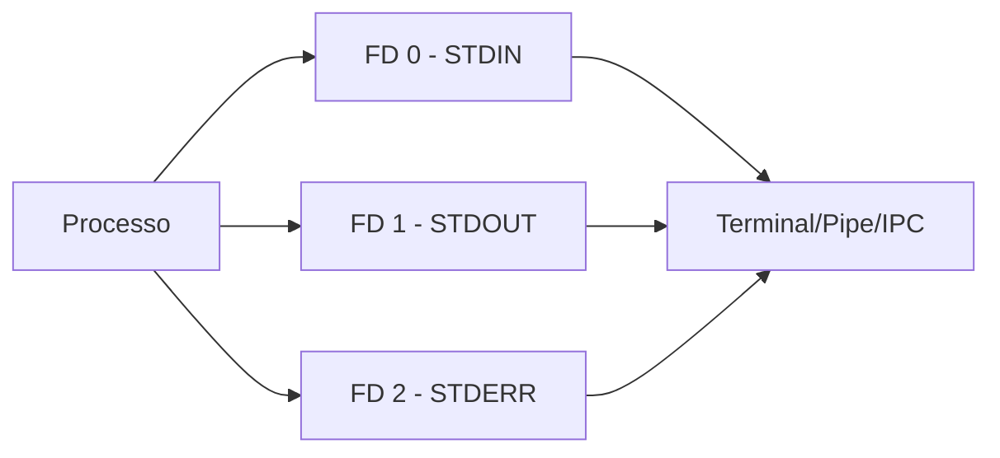
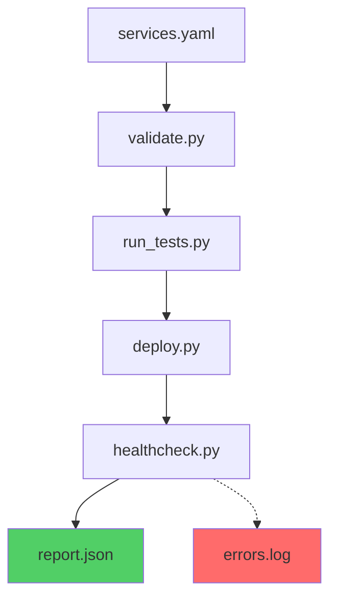

O Problema
===
<!-- alignment: center -->

Você precisa fazer o deploy de 5 microserviços...

<!-- pause -->

Cada um tem seus próprios testes...

<!-- pause -->

Precisa verificar se estão saudáveis após o deploy...

<!-- pause -->

E ainda:
* Capturar outputs de cada comando
* Tomar decisões baseadas nos resultados
* Gerar relatórios do processo


**Como fazer tudo isso se comunicar?**

<!-- end_slide -->

Por que I/O é fundamental?
===

<!-- alignment: center -->
<!-- font_size: 2 -->

* **Automação**: 
    - Scripts que executam e monitoram outros scripts
* **Pipelines CI/CD**: 
    - Integração entre ferramentas de build e deploy
* **Orquestração**: 
    - Coordenar múltiplos serviços
* **Healthchecks**: 
    - Verificar saúde de aplicações


> A filosofia Unix: "Faça uma coisa bem feita"

Vamos ver na prática
===


<!-- alignment: center -->
Rode dentro de um container:

```bash
# Vamos usar um container Ubuntu
docker run -it --rm ubuntu:latest bash

# Instalando o necessário
apt-get update && apt-get install -y python3 procps
```

<!-- pause -->

O procps é um meta pacote que instala:

* `ps`
* `top`
* `kill`
* `free`
* `vmstat`

---

<!-- jump_to_middle -->
<!-- font_size: 4 -->

## File Descriptors
<!-- font_size: 2 -->

O que o Linux usa para I/O


File Descriptors: A Base de Tudo
===



<!-- pause -->

**File Descriptors** são números que identificam:
* Arquivos abertos
* Sockets de rede
* Pipes entre processos
* Dispositivos

<!-- end_slide -->

Visualizando File Descriptors
===

```bash +exec
# Criar um processo que dorme
sleep 90 &
PID=$!
echo "PID do processo: $PID"

# Examinar os file descriptors
ls -la /proc/$PID/fd/
```

<!-- pause -->

Cada processo tem:
* `0` → STDIN (entrada)
* `1` → STDOUT (saída padrão)
* `2` → STDERR (saída de erros)


Interagindo com File Descriptors
===

<!-- alignment: center -->

Podemos escrever diretamente nos FDs:

```bash
# Terminal 1
python3 -c "import time; time.sleep(90)" &

PID=$!
echo "PID do processo: $PID"

# Terminal 2
PID=$(ps aux | grep "python3 -c" | grep -v grep | awk '{print $2}')
echo "PID do processo: $PID"

# Escrevendo no FD 1 (STDOUT)
echo "Surpresa!" > /proc/$PID/fd/1
```

<!-- pause -->

⚡ **Isso é IPC** (Inter Process Communication) em ação!

<!-- end_slide -->

<!-- jump_to_middle -->

Exemplo Prático: base64
===

<!-- end_slide -->

Como o base64 usa I/O?
===

```bash
# Exemplo: Codificar secrets para Kubernetes
$ echo -n "minha-senha-secreta" | base64
bWluaGEtc2VuaGEtc2VjcmV0YQ==
```

<!-- pause -->

```bash
# Exemplo prático de uso do base64
# Criar um Secret do K8s
$ kubectl create secret generic db-pass \
  --from-literal=password=$(echo -n "secret123" | base64)
```

<!-- pause -->

```bash
# Decodificar para verificar
$ echo "bWluaGEtc2VuaGEtc2VjcmV0YQ==" | base64 -d
minha-senha-secreta
```

<!-- end_slide -->

<!-- jump_to_middle -->

Python e I/O
===

<!-- alignment: center -->
O programa escrito em Python inicia um processo  
O processo tem os 3 streams padrão  
E no Python podemos manipular esses streams

<!-- end_slide -->

Acessando STDIN, STDOUT e STDERR
===

```python
import sys

# lendo o stream de entrada padrão
# 0 - STDIN 
data = sys.stdin.readline()
print(f"Você digitou: {data}")

# Escrevendo nos streams
# 1 - STDOUT (saída padrão)    
sys.stdout.write("Mensagem normal\n")
# 2 - STDERR (saída de erros)
sys.stderr.write("Mensagem de erro\n")
```

<!-- pause -->

<!-- alignment: center -->
## Mas e o print e o input?

<!-- pause -->

print, input e raise oferecem uma interface mais amigável para o usuário  
e internamente usam as interfaces padrão do sistema operacional.

* `input()` sempre vem de `stdin`
* `print()` sempre vai para `stdout`
* `raise Exception` vai para `stderr`

<!-- end_slide -->


Pipelines Unix
===

A Arte de Conectar Processos

<!-- pause -->

## Filosofia Unix em Ação


<!-- pause -->

**Cada programa**:
* Faz uma coisa bem feita
* Lê da entrada padrão
* Escreve na saída padrão
* Pode ser combinado com outros

<!-- end_slide -->

Exemplo: Pipeline de Configurações
===

<!-- pause -->

<!-- column_layout: [1, 1] -->

<!-- column: 0 -->

# env_to_json.py
```python
import sys, json

config = {}
for line in sys.stdin:
    line = line.strip()
    if line and '=' in line:
        key, value = line.split('=', 1)
        config[key] = value

json.dump(config, sys.stdout, indent=2)
```

<!-- pause -->

# json_to_yaml.py
```python
import sys, json, yaml
data = json.load(sys.stdin)
yaml.dump(data, sys.stdout, default_flow_style=False)
```

<!-- pause -->

<!-- column: 1 -->

# yaml_to_k8s.py
```python
import sys, yaml, base64

data = yaml.safe_load(sys.stdin)
secret = {
    "apiVersion": "v1",
    "kind": "Secret",
    "data": {
        k: base64.b64encode(v.encode()) 
        for k,v in data.items()
    }
}

yaml.dump(secret, sys.stdout)
```

Executando o Pipeline
===

```bash
cat app.env | \
  python3 env_to_json.py | \
  python3 json_to_yaml.py | \
  python3 yaml_to_k8s.py > secret.yaml
```

<!-- pause -->

### Vantagens:


* **Modular**: Cada conversão é independente
* **Testável**: Valide cada etapa isoladamente  
* **Flexível**: Combine de formas diferentes
* **Reutilizável**: Use em diferentes contextos

<!-- end_slide -->

<!-- jump_to_middle -->

Técnicas Avançadas
===

<!-- end_slide -->

Lendo em Chunks
===

```python
def process_chunks(chunk_size=3):
    """Processa entrada em blocos"""
    chunk = []
    line_count = 0
    
    try:
        while True:
            line = input()
            chunk.append(line)
            line_count += 1
            
            if len(chunk) >= chunk_size:
                print(f"=== Chunk de {len(chunk)} linhas ===")
                for item in chunk:
                    print(f"  > {item}")
                chunk = []
                
    except EOFError:
        if chunk:  # Último chunk parcial
            print(f"=== Último chunk com {len(chunk)} linhas ===")

process_chunks()
```
<!-- pause -->

```bash
ls | python3 process_chunks.py
```


Truque: open(0)
===

```python
# open(0) é o STDIN como file object
with open(0) as stdin:
    content = stdin.read()
    lines = content.splitlines()
    
    print(f"Li {len(lines)} linhas")
    print(f"Total de {len(content)} caracteres")
```

<!-- pause -->

### Quando usar?


* Precisa de métodos de arquivo (seek, tell)
* Quer contexto manager (with)
* Operações mais complexas de I/O


Exemplo: Pipeline de Deploy Completo
===

<!-- pause -->

<!-- column_layout: [1, 2] -->

<!-- column: 0 -->


<!-- pause -->

<!-- column: 1 -->


```bash
# Validar, testar, fazer deploy e verificar
cat services.yaml | \
  python3 validate.py | \
  python3 run_tests.py | \
  python3 deploy.py | \
  python3 healthcheck.py > report.json 2> errors.log
```

<!-- pause -->

Repare no redirecionamento de erros para um arquivo de log,
usando o `2>` fazemos com que apenas o STDERR seja redirecionado para o arquivo
`erros.log` e o `>` redireciona o STDOUT para o arquivo `report.json`.

<!-- end_slide -->

Melhores Práticas
===

<!-- incremental_lists: true -->

1. **Sempre trate EOFError** ao ler de STDIN

2. **Use STDERR para debug**, mantendo STDOUT para dados

3. **Processe linha por linha** para grandes volumes

4. **Flush quando necessário**: `sys.stdout.flush()`

5. **Documente formatos** de entrada/saída

6. **Mantenha scripts simples** - filosofia Unix

---

<!-- font_size: 4 -->

_"Estude muito o que mais lhe interessa da maneira mais indisciplinada, irreverente e original possível."_

**Richard Feynman** 