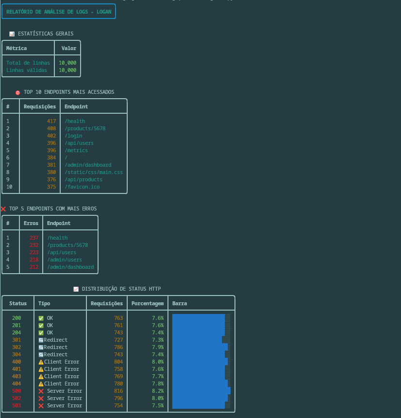
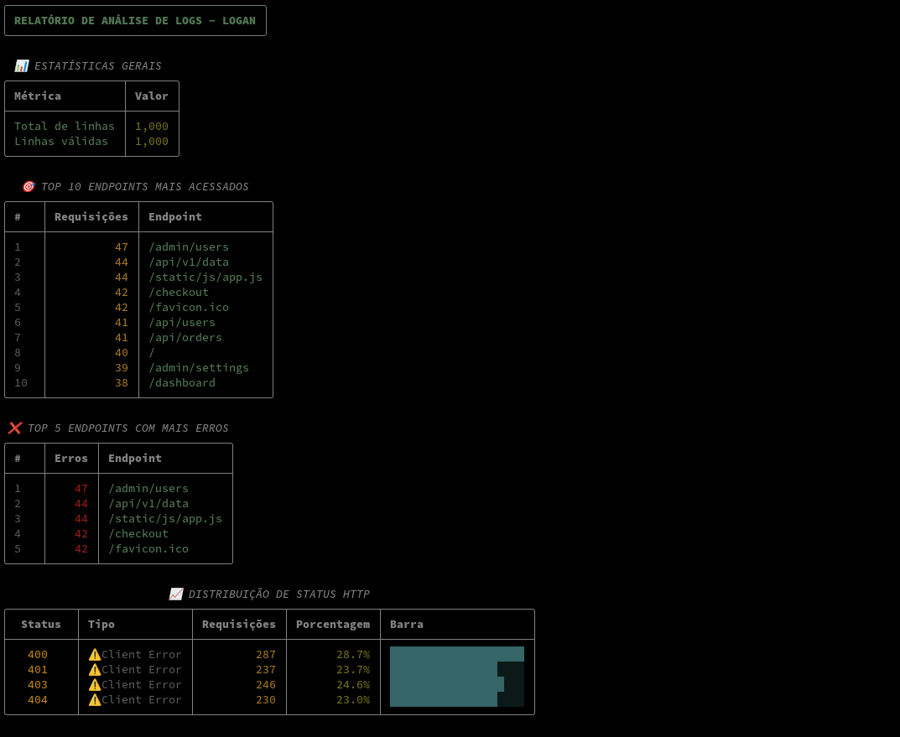

O Problema
===

- O site está lento
- Você tem um arquivo de log de *50GB*
- Como descobrir RÁPIDO qual endpoint está causando problema?


Como Resolver?
===

<!-- alignment: center -->

```bash
# grep? 
grep "500" /var/log/nginx/access.log
```


✅ Funciona para buscar erros

❌ Não conta, não agrupa, não dá estatísticas


```bash
# awk?
awk '{print $9}' access.log | sort | uniq -c
```


✅ Poderoso

❌ Sintaxe complexa, difícil de expandir


Logan: Log Analyzer
===

<!-- font_size: 2 --> 
<!-- alignment: center -->


Nossa missão hoje: criar um analisador de logs que:

<!-- incremental_lists: true -->

* Processe arquivos **gigantes** sem travar
* Extraia **insights úteis** automaticamente
* Seja **extensível** para diferentes formatos
* Use apenas Python **básico**


O Problema da Memória
===

<!-- alignment: center --> 

## ❌ Abordagem ingênua

```python
# NÃO FAÇA ISSO!
def read_log_bad(filename):
    with open(filename, 'r') as f:
        lines = f.readlines()  # 50GB na RAM! 💥
    return lines
```

## ✅ Abordagem correta

```python
# Leitura linha por linha
def read_log_good(filename):
    with open(filename, 'r') as f:
        for line in f:  # Iterator! 
            yield line     # Uma linha por vez
```

Por que `with open()`?
===

```python
# Jeito antigo (perigoso)
f = open('arquivo.log')
dados = f.read()
# E se der erro? Arquivo fica aberto!
f.close()
```


```python
# Jeito Pythônico (seguro)
with open('arquivo.log') as f:
    dados = f.read()
# Arquivo SEMPRE será fechado
```

<!-- alignment: center --> 

**Context Manager**: garante limpeza automática! 🧹


Versão 1: MVP
===

```python +exec
# logan_v1.py
import sys

def analyze_logs(file_handle):
    line_count = 0
    for line in file_handle:
        line_count += 1
    
    print(f"Total de linhas: {line_count}")

# Simular execução
from io import StringIO
fake_log = StringIO("linha1\nlinha2\nlinha3\n")
analyze_logs(fake_log)
```

<!-- alignment: center -->


Flexibilidade de Entrada
===

<!-- alignment: center -->

```python
if __name__ == "__main__":
    # Suporta arquivo ou stdin
    if len(sys.argv) > 1:
        with open(sys.argv[1], 'r') as f:
            analyze_logs(f)
    else:
        analyze_logs(sys.stdin)
```

## Formas de usar:

```bash
# Método 1: Arquivo direto
uv run loganv1.py access.log

# Método 2: Pipeline Unix
cat access.log | uv run loganv1.py

# Redirecionamento
uv run loganv1.py < access.log 
```

## Simplificando 

```python
if __name__ == "__main__":
    file = sys.argv[1] if len(sys.argv) > 1 else 0
    with open(file) as f:
        analyze_logs(f)
```

Arquivo vs STDIN
===

<!-- column_layout: [1, 1] -->

<!-- column: 0 -->

## 📁 Arquivo Direto

### Vantagens:
* Seek possível
* Mais controle

### Desvantagens:
* Precisa acesso ao arquivo
* Python vai ter que fazer mmap buffering 

<!-- column: 1 -->

## 🔀 Via STDIN

### Vantagens:
* Composição Unix
* Filtros prévios
* Streaming real-time
* Buffer controlado pelo SO

### Desvantagens:
* Sem seek
* Menos controle sobre fonte


Comparando
===

<!-- column_layout: [1, 1] -->
<!-- column: 0 -->


Abra o vim e digite a seguinte combinação em sequencia:

```
10001oHello World<Esc>
```
Aguarde um pouco e o vim vai criar um arquivo com 10.001 linhas "Hello World".  
Agora salve o arquivo `:w text`

```bash {1-7|8-11|13-18}
$ apt install time

$ /usr/bin/time -f "%M" uv run loganv1.py < text
# Output:
# Total de linhas: 10001
> 37796

$ /usr/bin/time -f "%M" uv run loganv1.py text
# Output:
# Total de linhas: 10001
> 37720

$ /usr/bin/time -f "%M" bash -c "cat text | uv run loganv1.py"
# Output:
> 1516
# Total de linhas: 10001
```

<!-- column: 1 -->

### Memória usada (KB):

* Arquivo direto: ~37MB
* Via redirecionamento: ~37MB
* Via pipe: ~1.5MB

**Por quê?**

- Arquivo direto precisa de Buffer I/O e mmap, o file descriptor para gerenciar o arquivo aberto acaba consumindo mais espaço pois precisa manter mais informações.
- Via Pipe o `cat` detecta que o `stdout` em uso não é um termimal (tty) e então utiliza buffering. 
- O sistema operacional gerencia o buffer de forma mais eficiente, o Kernel gerencia o tamanho do buffer, liberando memória conforme necessário, o Python não tem outra opção a não ser ler o que vem chunck a chunk do pipe, não tem o mesmo controle mas é mais eficiente em termos de memória.

Dá para melhorar?
```python {3}
if __name__ == "__main__":
    file = sys.argv[1] if len(sys.argv) > 1 else 0
    with open(file, buffering=1) as f:
        analyze_logs(f)
```

Ou usar low level `os.read` ou unbuffered I/O com `io.TextIOWrapper` pois com essa abordagem podemos controlar exatamente o tamanho dos chunks lidos pelo python, reduzindo o overhead de memória.

Anatomia de um Log NGINX
===

<!-- alignment: center --> 


```
192.168.1.10 - - [01/Jan/2024:10:15:23 +0000] "GET /api/users HTTP/1.1" 200 2326
```

<!-- font_size: 2 --> 

<!-- incremental_lists: true -->

* **IP**: `192.168.1.10`
* **Timestamp**: `01/Jan/2024:10:15:23 +0000`
* **Método**: `GET`
* **Endpoint**: `/api/users`
* **Status**: `200`
* **Tamanho**: `2326` bytes
* **Referrer**: (opcional) 
* **User-Agent**: (opcional)
* **Response Time**: (opcional)

**Log de Exemplo**: 


Versão 2: Parser com Regex
===

```python {1-6|8-12}
import re

LOG_PATTERN = re.compile(
    r'(?P<ip>\S+) \S+ \S+ \[(?P<datetime>[^\]]+)\] '
    r'"(?P<method>\S+) (?P<path>\S+) (?P<protocol>\S+)" '
    r'(?P<status>\d+) (?P<size>\S+)'
)

def parse_line(line):
    match = LOG_PATTERN.match(line)
    if match:
        return match.groupdict()
    return None
```

<!-- alignment: center --> 

**Grupos nomeados** = código mais legível! 📖


O Poder do Counter
===

```python +exec +line_numbers {1|3-10|12-17|19-23}
log = ['/api', '/api', '/home', '/api', '/contact', '/home', '/contact']

# Acumulando manualmente
endpoints = {}
for endpoint in log:
    if endpoint in endpoints:
        endpoints[endpoint] += 1
    else:
        endpoints[endpoint] = 1
print("Manual:", endpoints)

# Com DefaultDict
from collections import defaultdict
endpoints = defaultdict(int)
for endpoint in log:
    endpoints[endpoint] += 1
print("DefaultDict:", dict(endpoints))

# Com Counter (Pythônico!)
from collections import Counter
endpoints = Counter(log)
print("Counter:", endpoints)
print("Top 2:", endpoints.most_common(2))
```

Versão Final: Análise Completa
===

```python +line_numbers {1|3-7|9-22|24-30}
def analyze_logs(file_handle, verbose=False):
    # Contadores eficientes
    endpoint_counter = Counter()
    status_counter = Counter()
    error_endpoints = defaultdict(int)
    total_lines = 0
    valid_lines = 0

    for line_num, line in enumerate(file_handle, 1):
        total_lines = line_num
        if verbose and line_num % 10000 == 0:
            print(f"Processadas {line_num:,} linhas...", file=sys.stderr)

        if parsed := parse_line(line.strip()):
            valid_lines += 1
            # Coleta estatísticas
            endpoint = parsed["path"]
            status = int(parsed["status"])
            endpoint_counter[endpoint] += 1
            status_counter[status] += 1
            if status >= 400:
                error_endpoints[endpoint] += 1

    return {
        "total_lines": total_lines,
        "valid_lines": valid_lines,
        "endpoints": endpoint_counter,
        "status_codes": status_counter,
        "error_endpoints": dict(error_endpoints),
    }
```


Relatório Visual
===

<!-- column_layout: [1, 2] -->

<!-- column: 0 -->

```
=====================================
RELATÓRIO DE ANÁLISE DE LOGS - LOGAN
=====================================

📊 ESTATÍSTICAS GERAIS:
   Total de linhas: 1,234,567
   Linhas válidas: 1,234,000

🎯 TOP 10 ENDPOINTS MAIS ACESSADOS:
   450,123 - /api/users
   234,567 - /api/products
   123,456 - /

❌ TOP 5 ENDPOINTS COM MAIS ERROS:
    12,345 - /api/orders
     5,432 - /api/payment

📈 DISTRIBUIÇÃO DE STATUS HTTP:
   200: 900,000 (72.9%)
   404: 123,456 (10.0%)
   500:  12,345 (1.0%)
```

<!-- column: 1 -->
<!-- pause --> 
```python +line_numbers {2-5|7-9|11-14|15-24|25-29|30}
def generate_report(stats):
    report = []
    report.append("=" * 50)
    report.append("RELATÓRIO DE ANÁLISE DE LOGS - LOGAN")
    report.append("=" * 50)
    report.append("")
    report.append("📊 ESTATÍSTICAS GERAIS:")
    report.append(f"   Total de linhas: {stats['total_lines']:,}")
    report.append(f"   Linhas válidas: {stats['valid_lines']:,}")
    report.append("")
    report.append("🎯 TOP 10 ENDPOINTS MAIS ACESSADOS:")
    for endpoint, count in stats["endpoints"].most_common(10):
        report.append(f"   {count:,} - {endpoint}")
    report.append("")
    if stats["error_endpoints"]:
        report.append("❌ TOP 5 ENDPOINTS COM MAIS ERROS:")
        error_sorted = sorted(
            stats["error_endpoints"].items(), 
            key=lambda x: x[1], 
            reverse=True
        )[:5]
        for endpoint, count in error_sorted:
            report.append(f"    {count:,} - {endpoint}")
        report.append("")
    report.append("📈 DISTRIBUIÇÃO DE STATUS HTTP:")
    total_requests = sum(stats["status_codes"].values())
    for status, count in sorted(stats["status_codes"].items()):
        percentage = (count / total_requests) * 100
        report.append(f"   {status}: {count:,} ({percentage:.1f}%)")
    return "\n".join(report)
```

Dá para melhorar?
===




UV Script Dependencies
===

<!-- column_layout: [1, 1] -->
<!-- column: 0 -->

```bash
touch loganv3.py
uv add --script loganv3.py rich
```
```python
❯ cat loganv3.py
# /// script
# requires-python = ">=3.13"
# dependencies = [
#     "rich",
# ]
# ///
```

<!-- column: 1 -->

```python +exec
# /// script
# requires-python = ">=3.13"
# dependencies = [
#     "rich",
# ]
# ///
from rich.console import Console
from rich.table import Table

console = Console()
table = Table(show_header=True, header_style="bold magenta")
table.add_column("Name", style="dim", width=12)
table.add_column("Age", justify="right")
table.add_column("City", justify="right")
table.add_row("Alice", "24", "New York")
table.add_row("Bob", "19", "Los Angeles")
table.add_row("Charlie", "22", "Chicago")
console.print(table)
```


Logan com Rich
===


```python +line_numbers {1-6|9-11|12-22|23-30}
status_table = Table(title="📈 DISTRIBUIÇÃO DE STATUS HTTP", box=box.ROUNDED)
status_table.add_column("Status", justify="center", style="cyan", width=8)
status_table.add_column("Tipo", style="dim")
status_table.add_column("Requisições", justify="right", style="yellow")
status_table.add_column("Porcentagem", justify="right", style="green")
status_table.add_column("Barra", style="blue")
total_requests = sum(stats["status_codes"].values())
max_count = max(stats["status_codes"].values()) if stats["status_codes"] else 1
for status, count in sorted(stats["status_codes"].items()):
    percentage = (count / total_requests) * 100
    bar_length = int((count / max_count) * 20)
    bar = "█" * bar_length + "░" * (20 - bar_length)
    if 200 <= status < 300:
        status_type, status_style = "✅ OK", "[green]"
    elif 300 <= status < 400:
        status_type, status_style = "↪️ Redirect", "[yellow]"
    elif 400 <= status < 500:
        status_type, status_style = "⚠️ Client Error", "[orange1]"
    elif 500 <= status < 600:
        status_type, status_style = "❌ Server Error", "[red]"
    else:
        status_type, status_style = "❓ Unknown", "[dim]"
    status_table.add_row(
        f"{status_style}{status}[/]", 
        status_type, 
        f"{count:,}", 
        f"{percentage:.1f}%", 
        bar
    )
console.print(status_table)
```

Resultado 
===

```
                         📈 DISTRIBUIÇÃO DE STATUS HTTP                          
╭──────────┬─────────────────┬─────────────┬─────────────┬──────────────────────╮
│  Status  │ Tipo            │ Requisições │ Porcentagem │ Barra                │
├──────────┼─────────────────┼─────────────┼─────────────┼──────────────────────┤
│   200    │ ✅ OK           │           8 │        8.0% │ ████████████░░░░░░░░ │
│   201    │ ✅ OK           │           6 │        6.0% │ █████████░░░░░░░░░░░ │
│   204    │ ✅ OK           │           5 │        5.0% │ ███████░░░░░░░░░░░░░ │
│   301    │ ↪️ Redirect     │           5 │        5.0% │ ███████░░░░░░░░░░░░░ │
│   302    │ ↪️ Redirect     │           6 │        6.0% │ █████████░░░░░░░░░░░ │
│   304    │ ↪️ Redirect     │           8 │        8.0% │ ████████████░░░░░░░░ │
│   400    │ ⚠️ Client Error │          10 │       10.0% │ ███████████████░░░░░ │
│   401    │ ⚠️ Client Error │           9 │        9.0% │ █████████████░░░░░░░ │
│   403    │ ⚠️ Client Error │           8 │        8.0% │ ████████████░░░░░░░░ │
│   404    │ ⚠️ Client Error │           3 │        3.0% │ ████░░░░░░░░░░░░░░░░ │
│   500    │ ❌ Server Error │           9 │        9.0% │ █████████████░░░░░░░ │
│   502    │ ❌ Server Error │          10 │       10.0% │ ███████████████░░░░░ │
│   503    │ ❌ Server Error │          13 │       13.0% │ ████████████████████ │
╰──────────┴─────────────────┴─────────────┴─────────────┴──────────────────────╯
```

<!-- alignment: center -->
Exceute `head -n 100000 sample_nginx.log | uv run loganv3.py` para ver o Logan em ação!


O que mais dá para fazer?
===

<!-- alignment: center -->

Filtrar endpoints
```bash
# uv run
loganv3.py --filter "/api/*"
```

Filtrar status
```bash
# uv run
loganv3.py --status ">=400"
```

Escolher colunas *
```bash
# uv run
loganv3.py --columns "status,count,percentage"
```

Formatos de saída *
```bash
# uv run
loganv3.py --output json
```

Precisamos implementar de tudo isso?
===

<!-- alignment: center -->

<!-- pause --> 

**Unix Philosophy**: Faça uma coisa e faça bem feita! 🛠️

<!-- pause --> 

```bash
grep -E '" 4[0-9]{2} ' nginx_sample.log | head -n 1000 | uv run loganv3.py
```

<!-- pause --> 




Aplicação no Mundo Real
===

## 🚨 Detecção de ataques

```python
# IPs com muitas requisições
ip_counter = Counter()
for parsed in log_entries:
    ip_counter[parsed['ip']] += 1

suspicious = [ip for ip, count in ip_counter.items() 
              if count > 1000]
```


## 📊 Análise de performance

```python
# Endpoints lentos (status 504)
slow_endpoints = [e for e in endpoints 
                  if e['status'] == 504]
```


<!-- jump_to_middle -->

Conclusão
===

<!-- font_size: 2 -->

1. Sempre pense em **escalabilidade**
2.  **Context managers** para lidar com recursos
3.  Python tem **ferramentas poderosas** na stdlib
4. Use a **filosofia Unix** a seu favor
5. Ferramentas como **Rich** melhoram UX dramaticamente
6. **UV** pode gerenciar dependências em scripts

