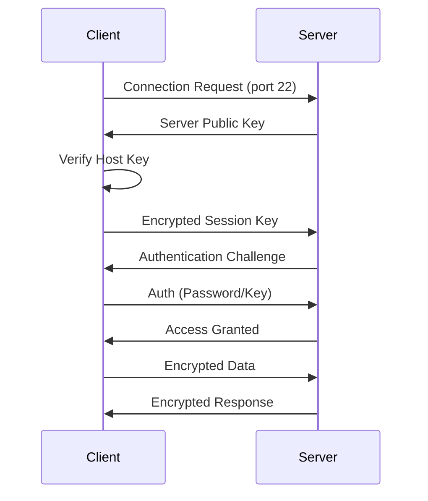

O que é SSH?
===
<!-- alignment: center --> 
<!-- font_size: 2 --> 
## 🔒 Protocolo de Acesso Remoto Seguro

- **S**ecure **S**hell - Substituto seguro do Telnet
- Protocolo criptografado para acesso remoto
- Padrão de facto para administração Linux/Unix
- Porta padrão: **22**

<!-- pause -->

### Mais que um Terminal
- 🖥️ **Shell remoto** - Executar comandos
- 📁 **SFTP** - Transferência de arquivos
- 🔀 **Port forwarding** - Túneis seguros
- 🔑 **Autenticação** - Chaves públicas/privadas


Qual Problema Resolve?
===
<!-- alignment: center -->
<!-- font_size: 2 --> 
## 🎯 Administração Remota Segura


- **Acesso remoto** criptografado a servidores
- **Automação** de tarefas em máquinas remotas
- **Transferência segura** de arquivos
- **Túneis seguros** para outros protocolos
- **Autenticação forte** sem senhas
- **Auditoria** e controle de acesso

<!-- pause -->

> Antes do SSH, usávamos Telnet e FTP.
> Tudo em texto puro na rede! 😱


Como SSH Funciona?
===

<!-- alignment: center --> 

## 🔄 Handshake e Criptografia




Autenticação SSH
===

## 🔑 Métodos de Autenticação

<!-- column_layout: [1, 1] -->
<!-- column: 0 -->

### Password
```bash
ssh user@server
# Digite a senha
```
❌ Menos seguro
❌ Não automatizável
❌ Brute force

### Host-based
Confiança por hostname
❌ Raramente usado

<!-- column: 1 -->

### Public Key
```bash
ssh-keygen -t ed25519
ssh-copy-id user@server
ssh user@server  # Sem senha!
```
✅ Mais seguro
✅ Automatizável
✅ Sem senha na rede


Exemplos do Mundo Real
===
<!-- font_size: 2 --> 
## 🌍 SSH em DevOps

- **Ansible**: Execução remota via SSH
- **GitHub/GitLab**: Git over SSH
- **CI/CD**: Deploy via SSH (Jenkins, GitLab CI)
- **Kubernetes**: kubectl exec usa SSH internamente
- **Bastion Hosts**: Jump servers para acesso
- **Backup**: rsync over SSH
- **Monitoring**: Coleta de métricas via SSH

<!-- pause -->

**Qualquer automação Linux passa por SSH!**


Cliente SSH com Paramiko
===

## 🐍 Biblioteca Python para SSH

```python +exec:uv {1|6-8|10-20|1-20}
/// # /// script
/// # dependencies = ["paramiko"] 
/// # ///
import paramiko
import io

/// # Simular conexão SSH
/// class MockSSHClient:
///     def connect(self, hostname, username, password):
///         print(f"🔗 Conectando a {username}@{hostname}")
///     
///     def exec_command(self, command):
///         outputs = {
///             'hostname': 'server01.example.com\n',
///             'df -h': 'Filesystem      Size  Used Avail Use% Mounted on\n/dev/sda1        20G  5.5G   14G  30% /\n',
///             'uptime': ' 10:42:31 up 45 days,  3:21,  2 users,  load average: 0.15, 0.12, 0.09\n'
///         }
///         stdin = io.StringIO()
///         stdout = io.StringIO(outputs.get(command, f"Executado: {command}\n"))
///         stderr = io.StringIO()
///         return stdin, stdout, stderr
///     
///     def close(self):
///         print("🔌 Conexão fechada")
/// paramiko.SSHClient = MockSSHClient

# Usar cliente
ssh = paramiko.SSHClient()
ssh.connect('192.168.1.100', username='admin', password='secret')

# Executar comandos
for cmd in ['hostname', 'df -h', 'uptime']:
    print(f"\n$ {cmd}")
    stdin, stdout, stderr = ssh.exec_command(cmd)
    print(stdout.read().strip())

ssh.close()
```

SFTP - Transferência de Arquivos
===

## 📁 Upload/Download Seguro

```python +line_numbers {7-9,12,18,22,26,30,33}
import paramiko

def sftp_operations(host, username, password):
    """Operações SFTP"""
    
    # Criar cliente SSH
    ssh = paramiko.SSHClient()
    ssh.set_missing_host_key_policy(paramiko.AutoAddPolicy())
    ssh.connect(host, username=username, password=password)
    
    # Abrir sessão SFTP
    sftp = ssh.open_sftp()
    
    try:
        # Upload
        local_file = '/local/config.yaml'
        remote_file = '/remote/config.yaml'
        sftp.put(local_file, remote_file)
        print(f"📤 Upload: {local_file} → {remote_file}")
        
        # Download
        sftp.get('/remote/backup.tar.gz', '/local/backup.tar.gz')
        print(f"📥 Download: backup.tar.gz")
        
        # Listar diretório
        files = sftp.listdir('/remote/logs')
        print(f"📂 Arquivos em /remote/logs: {files}")
        
        # Criar diretório
        sftp.mkdir('/remote/new_dir')
        
        # Remover arquivo
        sftp.remove('/remote/old_file.txt')
        
    finally:
        sftp.close()
        ssh.close()
```

SSH Config File
===

## 📋 Configuração Avançada

### ~/.ssh/config
```bash
# Servidor de produção
Host prod
    HostName production.example.com
    User admin
    Port 22
    IdentityFile ~/.ssh/prod_key
    
# Bastion/Jump host
Host internal
    HostName 10.0.1.50
    User developer
    ProxyJump bastion
    
# Múltiplos servidores
Host web-*
    User www-data
    IdentityFile ~/.ssh/web_key
    StrictHostKeyChecking no
```

### Usar com Paramiko
```python
import paramiko

# Carregar config
config = paramiko.SSHConfig()
with open(os.path.expanduser('~/.ssh/config')) as f:
    config.parse(f)

# Usar configuração
host_config = config.lookup('prod')
ssh.connect(
    hostname=host_config['hostname'],
    username=host_config['user'],
    key_filename=host_config['identityfile']
)
```


Parallel SSH
===

## ⚡ Execução em Múltiplos Servidores

```python +exec
from concurrent.futures import ThreadPoolExecutor, as_completed
import time

def ssh_command(host, command):
    """Simula execução SSH"""
    time.sleep(0.1)  # Simular latência
    # aqui usaria Paramiko para conectar e executar
    return f"{host}: {command} executado"

servers = [
    'web01.example.com',
    'web02.example.com',
    'db01.example.com',
    'cache01.example.com'
]

command = 'systemctl status nginx'
print(f"🚀 Executando '{command}' em {len(servers)} servidores...\n")

# Execução paralela
with ThreadPoolExecutor(max_workers=10) as executor:
    futures = {
        executor.submit(ssh_command, host, command): host 
        for host in servers
    }
    
    for future in as_completed(futures):
        host = futures[future]
        try:
            result = future.result()
            print(f"✅ {result}")
        except Exception as e:
            print(f"❌ {host}: {e}")
```


Ansible-like com Python
===

<!-- alignment: center -->

## 🤖 Automação Estilo Ansible

<!-- column_layout: [1, 1] -->
<!-- column: 0 -->


```python {6-9|13-14|18-22|24-32|37-44|1-44}
import paramiko
import yaml
from typing import List, Dict

class SimpleAutomation:
    def __init__(self, inventory_file):
        with open(inventory_file) as f:
            self.inventory = yaml.safe_load(f) # hosts: ...
        self.results = []
    
    def run_task(self, host: str, task: Dict):
        """Executa uma task em um host"""
        ssh = paramiko.SSHClient()
        ssh.set_missing_host_key_policy(paramiko.AutoAddPolicy())
        
        try:
            # Conectar
            ssh.connect(
                host, 
                username=self.inventory['vars']['ansible_user'],
                key_filename=self.inventory['vars']['ansible_ssh_key']
            )
            
            # Executar comando
            if task['module'] == 'shell':
                stdin, stdout, stderr = ssh.exec_command(task['args'])
                return stdout.read().decode()
            
            elif task['module'] == 'copy':
                sftp = ssh.open_sftp()
                sftp.put(task['src'], task['dest'])
                return f"Copied {task['src']} to {task['dest']}"
            
        finally:
            ssh.close()
    
    def run_playbook(self, playbook: List[Dict]):
        """Executa playbook em todos os hosts"""
        for task in playbook:
            print(f"\n📋 Task: {task['name']}")
            
            for host in self.inventory['hosts']:
                result = self.run_task(host, task)
                print(f"  ✅ {host}: {result[:50]}...")
```

<!-- pause --> 

<!-- column: 1 -->
### Exemplo de Inventário (inventory.yaml)
```yaml
hosts:
  - web01.example.com
  - web02.example.com
  - db01.example.com
vars:
  ansible_user: admin
  ansible_ssh_key: ~/.ssh/id_rsa
```
### Exemplo de Playbook (playbook.yaml)
```yaml
- name: Verificar espaço em disco
  module: shell
  args: df -h
- name: Copiar arquivo de configuração
  module: copy
  args:
    src: ./nginx.conf
    dest: /etc/nginx/nginx.conf
```

# Uso
```python
automation = SimpleAutomation('inventory.yaml')
playbook = yaml.safe_load(open('playbook.yaml'))
automation.run_playbook(playbook)
```


SSH Jump Host (Bastion)
===

## 🏰 Acesso via Bastion

```python {1-3|6-8|10-14|15-20|22-34|36-44|1-44}
import paramiko

def connect_via_jump_host(target_host, target_user, 
                          jump_host, jump_user, jump_key):
    """Conecta a servidor interno via jump host"""
    
    # 1. Conectar ao jump host
    jump_client = paramiko.SSHClient()
    jump_client.set_missing_host_key_policy(paramiko.AutoAddPolicy())
    jump_client.connect(
        jump_host,
        username=jump_user,
        key_filename=jump_key
    )
    
    # 2. Criar canal para o servidor interno
    jump_transport = jump_client.get_transport()
    dest_addr = (target_host, 22)
    local_addr = ('127.0.0.1', 22)
    channel = jump_transport.open_channel(
        "direct-tcpip", dest_addr, local_addr
    )
    
    # 3. Conectar ao servidor interno através do canal
    target_client = paramiko.SSHClient()
    target_client.set_missing_host_key_policy(paramiko.AutoAddPolicy())
    target_client.connect(
        target_host,
        username=target_user,
        sock=channel  # Usar canal do jump host
    )
    
    return target_client, jump_client

# Usar
target, jump = connect_via_jump_host(
    '10.0.1.50', 'admin',     # Servidor interno
    'bastion.example.com', 'user', '~/.ssh/bastion_key'
)

stdin, stdout, stderr = target.exec_command('hostname')
print(stdout.read().decode())
```


Segurança SSH
===
<!-- alignment: center -->

### Configuração Segura (/etc/ssh/sshd_config)
```bash
# Desabilitar root login
PermitRootLogin no

# Apenas autenticação por chave
PasswordAuthentication no
PubkeyAuthentication yes

# Limitar usuários
AllowUsers admin developer

# Timeout de inatividade
ClientAliveInterval 300
ClientAliveCountMax 2

# Versão do protocolo
Protocol 2

# Fail2ban para proteção contra brute force
```

### Python - Validação de Host Key
```python
import paramiko

class StrictSSHClient(paramiko.SSHClient):
    def __init__(self):
        super().__init__()
        # Carregar known_hosts
        self.load_system_host_keys()
        self.load_host_keys(os.path.expanduser('~/.ssh/known_hosts'))
        
        # Política estrita - rejeitar hosts desconhecidos
        self.set_missing_host_key_policy(paramiko.RejectPolicy())
```


Logs e Auditoria
===

## 📝 Monitoramento de Acesso

<!-- column_layout: [1, 1] -->
<!-- column: 0 -->


```python +exec +id:ssh_audit
import json
from datetime import datetime

class SSHAuditor:
    def __init__(self):
        self.log_file = '/var/log/ssh_audit.json'
        self.sessions = []
    
    def log_session(self, user, host, command, result):
        """Registra atividade SSH"""
        session = {
            'timestamp': datetime.now().isoformat(),
            'user': user,
            'host': host,
            'command': command,
            'exit_code': result.get('exit_code', 0),
            'duration_ms': result.get('duration', 0)
        }
        self.sessions.append(session)
        
        # Alertas
        if 'rm -rf' in command:
            print(f"⚠️ ALERTA: Comando perigoso detectado!")
        
        if result.get('exit_code') != 0:
            print(f"❌ Comando falhou: {command}")
    
    def generate_report(self):
        """Gera relatório de atividades"""
        print("\n📊 Relatório de Auditoria SSH")
        print("-" * 40)
        
        for s in self.sessions[-5:]:
            print(f"{s['timestamp'][:19]} | {s['user']}@{s['host']}")
            print(f"  Comando: {s['command'][:50]}")
            print(f"  Status: {'✅' if s['exit_code'] == 0 else '❌'}")

# Exemplo de uso
auditor = SSHAuditor()
auditor.log_session('admin', 'web01', 'systemctl restart nginx', {'exit_code': 0, 'duration': 1250})
auditor.log_session('dev', 'db01', 'rm -rf /tmp/*', {'exit_code': 0, 'duration': 500})
auditor.generate_report()
```

<!-- column: 1 -->
<!-- snippet_output: ssh_audit -->


SSH Multiplexing
===

<!-- alignment: center -->

## 🔀 Reutilização de Conexões

### Configuração (~/.ssh/config)
```bash
Host *
    ControlMaster auto
    ControlPath ~/.ssh/sockets/%r@%h-%p
    ControlPersist 600
```

### Com Paramiko
```python
import paramiko
import threading

class SSHConnectionPool:
    """Pool de conexões SSH reutilizáveis"""
    
    def __init__(self, max_connections=10):
        self.pool = {}
        self.lock = threading.Lock()
        self.max_connections = max_connections
    
    def get_connection(self, host, username, **kwargs):
        """Pega ou cria conexão"""
        
        key = f"{username}@{host}"
        
        with self.lock:
            if key in self.pool:
                # Reutilizar conexão existente
                return self.pool[key]
            
            # Criar nova conexão
            ssh = paramiko.SSHClient()
            ssh.set_missing_host_key_policy(paramiko.AutoAddPolicy())
            ssh.connect(host, username=username, **kwargs)
            
            self.pool[key] = ssh
            return ssh
    
    def close_all(self):
        """Fecha todas as conexões"""
        for ssh in self.pool.values():
            ssh.close()
        self.pool.clear()
```


Exercício Prático
===
<!-- alignment: center -->
### Desafio: Sistema de Backup Distribuído

Crie um sistema que:
1. Conecte a múltiplos servidores via SSH
2. Execute backup de diretórios específicos
3. Transfira backups via SFTP
4. Gere relatório de status
5. Envie notificação em caso de falha

### Requisitos:
- Parallelização de operações
- Retry em caso de falha
- Compressão antes da transferência
- Rotação de backups antigos

<!-- pause -->

```python
class BackupManager:
    def backup_server(self, server, directories):
        """Realiza backup de diretórios em servidor remoto"""
        # Passos:
        # 1. SSH para criar tar.gz
        # 2. SFTP para download
        # 3. Verificar integridade
        # 4. Limpar remoto

    def run(self, servers: List[Dict]):
        """Executa backup em múltiplos servidores"""
        # Paralelizar com ThreadPoolExecutor
        # Gerar relatório final

# Exemplo de uso
# servers = [{'host': 'web01', 'dirs': ['/var/www', '/etc/nginx']}, ...]
# manager = BackupManager()
# manager.run(servers)
```

Alternativas ao Paramiko
===

<!-- font_size: 2 --> 

- **Fabric**: Framework de automação de tarefas via SSH
- **AsyncSSH**: Biblioteca assíncrona para SSH
- **Netmiko**: SSH para dispositivos de rede
- **Plumbum**: Shell scripting em Python com suporte a SSH
- **Pexpect**: Automação de interações com programas via terminal

Recursos e Próximos Passos
===
<!-- font_size: 2 -->
## 📚 Continue Aprendendo!

### Documentação
- [Paramiko Documentation](https://www.paramiko.org/)
- [OpenSSH Manual](https://www.openssh.com/manual.html)

### Ferramentas Relacionadas
- **Ansible**: Automação declarativa
- **Salt**: Execução remota em massa
- **Teleport**: SSH moderno com auditoria

### Próxima Aula
**MCP** - Model Context Protocol
- Protocolo moderno para LLMs
- Integração com ferramentas
- Automação inteligente

