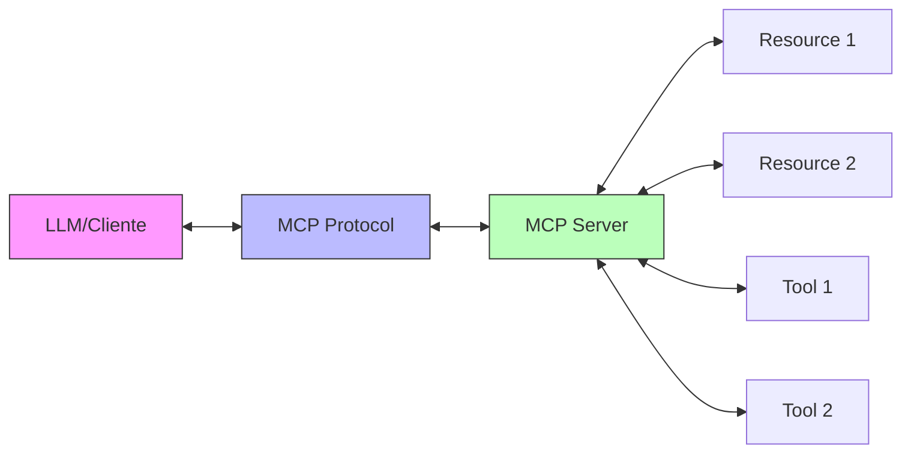

MCP
===

<!-- alignment: center -->

# 🤖 MCP

Model Context Protocol

<!-- pause --> 

### Python para DevOps
#### Protocolos de Comunicação


O que é MCP?
===

## 🧠 Protocolo para LLMs

- **M**odel **C**ontext **P**rotocol
- Criado pela Anthropic (Claude)
- Padrão aberto para conectar LLMs a ferramentas
- Interface unificada para contexto e ações
- JSON-RPC sobre stdio/HTTP

<!-- pause -->

### Objetivo Principal
Permitir que **modelos de linguagem** interajam com:
- 🗄️ Bases de dados
- 🛠️ Ferramentas e APIs
- 📁 Sistemas de arquivos
- 🌐 Serviços web


Qual Problema Resolve?
===

## 🎯 Integração LLM ↔ Ferramentas

### Problemas que MCP resolve:

- **Contexto dinâmico** para LLMs
- **Execução de ações** pelo modelo
- **Padronização** de integrações
- **Segurança** e controle de acesso
- **Interoperabilidade** entre sistemas
- **Observabilidade** de ações do LLM

<!-- pause -->

> Antes: Cada LLM tinha seu próprio formato de plugins.
> Agora: Um protocolo padrão para todos!


Arquitetura MCP
===

## 🏗️ Componentes



### Elementos
- **Cliente**: LLM ou aplicação que usa MCP
- **Servidor MCP**: Expõe recursos e ferramentas
- **Recursos**: Dados que o LLM pode ler
- **Ferramentas**: Ações que o LLM pode executar


Conceitos Fundamentais
===

## 📚 Elementos do MCP

<!-- column_layout: [1, 1] -->
<!-- column: 0 -->

### Resources
**Dados contextuais**
```json
{
  "type": "resource",
  "uri": "file:///docs/api.md",
  "mimeType": "text/markdown",
  "content": "# API Docs..."
}
```

### Prompts
**Templates reutilizáveis**
```json
{
  "name": "debug_error",
  "template": "Debug: {error}"
}
```

<!-- column: 1 -->

### Tools
**Ações executáveis**
```json
{
  "name": "run_query",
  "description": "Execute SQL",
  "parameters": {
    "query": "string"
  }
}
```

### Sampling
**Requisitar completions**
```json
{
  "prompt": "Analyze this",
  "maxTokens": 1000
}
```


Exemplos do Mundo Real
===

## 🌍 MCP em DevOps

- **Claude Desktop**: Acessa arquivos locais via MCP
- **Database Tools**: Query SQL através do LLM
- **Git Integration**: Commits e PRs via MCP
- **Kubernetes**: Gerenciar clusters com LLM
- **Monitoring**: Análise de logs e métricas
- **CI/CD**: Trigger de pipelines
- **Documentation**: Atualização automática

<!-- pause -->

**O futuro do DevOps: LLMs orquestrando infraestrutura!**


Instalação MCP
===

## 📦 Setup do Ambiente

```bash
# Instalar SDK Python
pip install mcp

# Ou com extras
pip install "mcp[client]"  # Para clientes
pip install "mcp[server]"  # Para servidores

# Estrutura de projeto
mcp_project/
├── server.py         # Servidor MCP
├── client.py         # Cliente de teste
├── tools/           # Implementação de tools
│   ├── database.py
│   └── filesystem.py
└── resources/       # Recursos expostos
    └── docs.md
```


Servidor MCP Básico
===

## 🖥️ Implementando Servidor

```python +exec
# Simulação de servidor MCP
import json

class SimpleMCPServer:
    def __init__(self):
        self.tools = {}
        self.resources = {}
    
    def register_tool(self, name, func, description):
        """Registra uma ferramenta"""
        self.tools[name] = {
            'function': func,
            'description': description
        }
        print(f"🔧 Tool registrada: {name}")
    
    def register_resource(self, uri, content, mime_type='text/plain'):
        """Registra um recurso"""
        self.resources[uri] = {
            'content': content,
            'mimeType': mime_type
        }
        print(f"📄 Recurso registrado: {uri}")
    
    def list_tools(self):
        """Lista ferramentas disponíveis"""
        return [
            {'name': name, 'description': info['description']}
            for name, info in self.tools.items()
        ]

# Criar servidor
server = SimpleMCPServer()

# Registrar ferramentas
server.register_tool(
    'get_system_info',
    lambda: {'os': 'Linux', 'cpu': 8, 'memory_gb': 32},
    'Retorna informações do sistema'
)

server.register_tool(
    'run_command',
    lambda cmd: f"Executado: {cmd}",
    'Executa comando no sistema'
)

# Registrar recursos
server.register_resource(
    'file:///etc/config.yaml',
    'database:\n  host: localhost\n  port: 5432',
    'text/yaml'
)

print("\n📋 Ferramentas disponíveis:")
for tool in server.list_tools():
    print(f"  - {tool['name']}: {tool['description']}")
```


MCP Server Completo
===

## 🚀 Servidor Python Real

```python
from mcp.server import Server, Tool, Resource
from mcp.server.stdio import stdio_server
import subprocess
import psutil

# Criar servidor MCP
server = Server("devops-tools")

@server.tool()
async def execute_command(command: str) -> str:
    """Executa comando shell"""
    try:
        result = subprocess.run(
            command, 
            shell=True, 
            capture_output=True, 
            text=True,
            timeout=30
        )
        return {
            "stdout": result.stdout,
            "stderr": result.stderr,
            "returncode": result.returncode
        }
    except Exception as e:
        return {"error": str(e)}

@server.tool()
async def get_system_metrics() -> dict:
    """Retorna métricas do sistema"""
    return {
        "cpu_percent": psutil.cpu_percent(interval=1),
        "memory": psutil.virtual_memory()._asdict(),
        "disk": psutil.disk_usage('/')._asdict(),
        "network": psutil.net_io_counters()._asdict()
    }

@server.tool()
async def manage_docker(action: str, container: str = None) -> dict:
    """Gerencia containers Docker"""
    commands = {
        "list": "docker ps -a --format json",
        "start": f"docker start {container}",
        "stop": f"docker stop {container}",
        "logs": f"docker logs --tail 50 {container}"
    }
    
    if action in commands:
        cmd = commands[action]
        result = subprocess.run(cmd, shell=True, capture_output=True)
        return {"output": result.stdout.decode()}
```


Resources no MCP
===

## 📁 Expondo Dados

```python
from mcp.server import Resource
import os
import yaml

@server.resource("config://app")
async def get_app_config() -> Resource:
    """Expõe configuração da aplicação"""
    
    with open('/app/config.yaml') as f:
        config = yaml.safe_load(f)
    
    return Resource(
        uri="config://app",
        name="Application Config",
        mimeType="application/yaml",
        content=yaml.dump(config)
    )

@server.resource("logs://recent")
async def get_recent_logs() -> Resource:
    """Expõe logs recentes"""
    
    with open('/var/log/app.log') as f:
        lines = f.readlines()[-100:]  # Últimas 100 linhas
    
    return Resource(
        uri="logs://recent",
        name="Recent Logs",
        mimeType="text/plain",
        content=''.join(lines)
    )

@server.resource("metrics://prometheus")
async def get_prometheus_metrics() -> Resource:
    """Expõe métricas Prometheus"""
    
    import requests
    response = requests.get('http://localhost:9090/api/v1/query',
                           params={'query': 'up'})
    
    return Resource(
        uri="metrics://prometheus",
        name="Prometheus Metrics",
        mimeType="application/json",
        content=response.text
    )
```


Cliente MCP
===

## 💻 Consumindo Servidor MCP

```python
from mcp.client import Client
import asyncio

async def test_mcp_server():
    """Cliente para testar servidor MCP"""
    
    # Conectar ao servidor
    async with Client("stdio://./mcp_server.py") as client:
        
        # 1. Listar ferramentas disponíveis
        tools = await client.list_tools()
        print("🔧 Ferramentas disponíveis:")
        for tool in tools:
            print(f"  - {tool.name}: {tool.description}")
        
        # 2. Executar ferramenta
        result = await client.call_tool(
            "get_system_metrics",
            {}
        )
        print(f"\n📊 Métricas: {result}")
        
        # 3. Listar recursos
        resources = await client.list_resources()
        print("\n📁 Recursos disponíveis:")
        for resource in resources:
            print(f"  - {resource.uri}: {resource.name}")
        
        # 4. Ler recurso
        content = await client.read_resource("config://app")
        print(f"\n📄 Configuração: {content}")

# Executar
# asyncio.run(test_mcp_server())
```


MCP para Kubernetes
===

## ☸️ Gerenciando K8s via LLM

```python
from mcp.server import Server
from kubernetes import client, config

server = Server("k8s-mcp")

# Carregar config do kubectl
config.load_kubeconfig()
v1 = client.CoreV1Api()
apps_v1 = client.AppsV1Api()

@server.tool()
async def list_pods(namespace: str = "default") -> list:
    """Lista pods em um namespace"""
    pods = v1.list_namespaced_pod(namespace)
    
    return [{
        "name": pod.metadata.name,
        "status": pod.status.phase,
        "ready": all(c.ready for c in pod.status.container_statuses or []),
        "restarts": sum(c.restart_count for c in pod.status.container_statuses or [])
    } for pod in pods.items]

@server.tool()
async def scale_deployment(name: str, replicas: int, namespace: str = "default") -> dict:
    """Escala um deployment"""
    
    # Pegar deployment atual
    deployment = apps_v1.read_namespaced_deployment(name, namespace)
    old_replicas = deployment.spec.replicas
    
    # Atualizar replicas
    deployment.spec.replicas = replicas
    apps_v1.patch_namespaced_deployment(name, namespace, deployment)
    
    return {
        "deployment": name,
        "old_replicas": old_replicas,
        "new_replicas": replicas,
        "status": "scaled"
    }

@server.tool()
async def get_pod_logs(pod_name: str, namespace: str = "default", lines: int = 50) -> str:
    """Busca logs de um pod"""
    
    logs = v1.read_namespaced_pod_log(
        name=pod_name,
        namespace=namespace,
        tail_lines=lines
    )
    
    return logs
```


MCP para Databases
===

## 🗄️ Query via LLM

```python
from mcp.server import Server
import psycopg2
import sqlite3

server = Server("database-mcp")

@server.tool()
async def query_postgres(query: str, database: str = "myapp") -> list:
    """Executa query no PostgreSQL"""
    
    # Validação básica de segurança
    if any(word in query.upper() for word in ['DROP', 'DELETE', 'TRUNCATE']):
        return {"error": "Query potencialmente perigosa bloqueada"}
    
    conn = psycopg2.connect(
        host="localhost",
        database=database,
        user="readonly",
        password="password"
    )
    
    try:
        cursor = conn.cursor()
        cursor.execute(query)
        
        # Se for SELECT, retornar resultados
        if query.strip().upper().startswith('SELECT'):
            columns = [desc[0] for desc in cursor.description]
            rows = cursor.fetchall()
            
            return [
                dict(zip(columns, row))
                for row in rows
            ]
        else:
            conn.commit()
            return {"affected_rows": cursor.rowcount}
            
    finally:
        conn.close()

@server.resource("schema://postgres/myapp")
async def get_database_schema() -> Resource:
    """Expõe schema do banco"""
    
    query = """
    SELECT table_name, column_name, data_type
    FROM information_schema.columns
    WHERE table_schema = 'public'
    ORDER BY table_name, ordinal_position
    """
    
    results = await query_postgres(query)
    
    return Resource(
        uri="schema://postgres/myapp",
        name="Database Schema",
        mimeType="application/json",
        content=json.dumps(results, indent=2)
    )
```


MCP para CI/CD
===

## 🔄 Automação de Pipelines

```python
from mcp.server import Server
import requests
from github import Github

server = Server("cicd-mcp")

@server.tool()
async def trigger_github_action(
    repo: str, 
    workflow: str, 
    branch: str = "main",
    inputs: dict = None
) -> dict:
    """Dispara GitHub Action"""
    
    g = Github(os.getenv("GITHUB_TOKEN"))
    repository = g.get_repo(repo)
    
    # Trigger workflow
    workflow = repository.get_workflow(workflow)
    success = workflow.create_dispatch(
        ref=branch,
        inputs=inputs or {}
    )
    
    return {
        "workflow": workflow.name,
        "branch": branch,
        "status": "triggered" if success else "failed"
    }

@server.tool()
async def check_pipeline_status(pipeline_id: str, system: str = "jenkins") -> dict:
    """Verifica status de pipeline"""
    
    if system == "jenkins":
        url = f"http://jenkins.local/job/{pipeline_id}/lastBuild/api/json"
        response = requests.get(url, auth=('user', 'token'))
        data = response.json()
        
        return {
            "id": data['id'],
            "result": data['result'],
            "duration": data['duration'],
            "timestamp": data['timestamp']
        }
    
    elif system == "gitlab":
        # GitLab CI implementation
        pass
```


Segurança MCP
===

## 🔐 Controle de Acesso

```python
from mcp.server import Server, SecurityPolicy
from functools import wraps

class MCPSecurity:
    def __init__(self):
        self.allowed_tools = set()
        self.rate_limits = {}
    
    def authorize(self, required_permission):
        """Decorator para autorização"""
        def decorator(func):
            @wraps(func)
            async def wrapper(*args, **kwargs):
                # Verificar permissão
                if not self.has_permission(required_permission):
                    return {"error": "Permission denied"}
                
                # Rate limiting
                if self.is_rate_limited(func.__name__):
                    return {"error": "Rate limit exceeded"}
                
                # Log de auditoria
                self.audit_log(func.__name__, args, kwargs)
                
                return await func(*args, **kwargs)
            return wrapper
        return decorator

security = MCPSecurity()

@server.tool()
@security.authorize("admin:write")
async def dangerous_operation(confirm: bool = False) -> dict:
    """Operação que requer confirmação"""
    
    if not confirm:
        return {
            "warning": "This operation will delete data",
            "confirm": "Set confirm=true to proceed"
        }
    
    # Executar operação perigosa
    return {"status": "completed"}
```


Observabilidade MCP
===

## 📊 Monitoramento e Logs

```python +exec
import time
from datetime import datetime
import json

class MCPObservability:
    def __init__(self):
        self.metrics = {
            'tool_calls': {},
            'resource_reads': {},
            'errors': [],
            'latencies': []
        }
    
    def track_tool_call(self, tool_name, duration, success):
        """Rastreia chamadas de ferramentas"""
        
        if tool_name not in self.metrics['tool_calls']:
            self.metrics['tool_calls'][tool_name] = {
                'count': 0,
                'success': 0,
                'failed': 0,
                'avg_duration': 0
            }
        
        stats = self.metrics['tool_calls'][tool_name]
        stats['count'] += 1
        
        if success:
            stats['success'] += 1
        else:
            stats['failed'] += 1
        
        # Média móvel da duração
        stats['avg_duration'] = (
            (stats['avg_duration'] * (stats['count'] - 1) + duration) 
            / stats['count']
        )
        
        self.metrics['latencies'].append(duration)
    
    def generate_report(self):
        """Gera relatório de uso"""
        print("📊 MCP Observability Report")
        print("=" * 40)
        
        for tool, stats in self.metrics['tool_calls'].items():
            success_rate = (stats['success'] / stats['count'] * 100) if stats['count'] > 0 else 0
            print(f"\n🔧 {tool}:")
            print(f"  Chamadas: {stats['count']}")
            print(f"  Taxa de sucesso: {success_rate:.1f}%")
            print(f"  Duração média: {stats['avg_duration']:.2f}ms")

# Exemplo de uso
obs = MCPObservability()
obs.track_tool_call('execute_command', 125.5, True)
obs.track_tool_call('execute_command', 89.2, True)
obs.track_tool_call('query_database', 45.8, True)
obs.track_tool_call('query_database', 234.1, False)

obs.generate_report()
```


MCP com Streaming
===

## 📡 Respostas em Stream

```python
from mcp.server import Server
import asyncio

server = Server("streaming-mcp")

@server.tool()
async def stream_logs(service: str, follow: bool = True):
    """Stream de logs em tempo real"""
    
    async def log_generator():
        log_file = f"/var/log/{service}.log"
        
        with open(log_file, 'r') as f:
            if not follow:
                # Retornar logs existentes
                for line in f:
                    yield {"line": line.strip(), "timestamp": time.time()}
            else:
                # Seguir logs (tail -f)
                f.seek(0, 2)  # Ir para o fim
                
                while True:
                    line = f.readline()
                    if line:
                        yield {"line": line.strip(), "timestamp": time.time()}
                    else:
                        await asyncio.sleep(0.1)
    
    # Retornar generator para streaming
    return log_generator()

@server.tool()
async def monitor_metrics(interval: int = 5):
    """Stream de métricas do sistema"""
    
    async def metrics_generator():
        import psutil
        
        while True:
            yield {
                "timestamp": time.time(),
                "cpu": psutil.cpu_percent(interval=1),
                "memory": psutil.virtual_memory().percent,
                "disk": psutil.disk_usage('/').percent,
                "network": {
                    "sent": psutil.net_io_counters().bytes_sent,
                    "recv": psutil.net_io_counters().bytes_recv
                }
            }
            
            await asyncio.sleep(interval)
    
    return metrics_generator()
```


MCP Bridge Pattern
===

## 🌉 Conectando Sistemas

```python
from mcp.server import Server
import httpx

class MCPBridge:
    """Bridge entre MCP e APIs existentes"""
    
    def __init__(self):
        self.server = Server("api-bridge")
        self.register_bridges()
    
    def register_bridges(self):
        """Registra pontes para APIs"""
        
        # Bridge para Prometheus
        @self.server.tool()
        async def prometheus_query(query: str, time_range: str = "1h"):
            async with httpx.AsyncClient() as client:
                response = await client.get(
                    "http://prometheus:9090/api/v1/query_range",
                    params={
                        "query": query,
                        "start": f"now-{time_range}",
                        "end": "now",
                        "step": "1m"
                    }
                )
                return response.json()
        
        # Bridge para Grafana
        @self.server.tool()
        async def grafana_snapshot(dashboard_id: str):
            async with httpx.AsyncClient() as client:
                response = await client.post(
                    f"http://grafana:3000/api/dashboards/uid/{dashboard_id}/snapshots",
                    headers={"Authorization": f"Bearer {GRAFANA_TOKEN}"},
                    json={"expires": 3600}
                )
                return response.json()
        
        # Bridge para Terraform
        @self.server.tool()
        async def terraform_plan(workspace: str):
            result = subprocess.run(
                ["terraform", "plan", "-json"],
                cwd=f"/terraform/{workspace}",
                capture_output=True
            )
            return json.loads(result.stdout)
```


Testing MCP Servers
===

## 🧪 Testes Automatizados

```python
import pytest
from mcp.testing import MCPTestClient

@pytest.fixture
async def mcp_client():
    """Fixture para cliente de teste"""
    async with MCPTestClient("stdio://./server.py") as client:
        yield client

@pytest.mark.asyncio
async def test_list_tools(mcp_client):
    """Testa listagem de ferramentas"""
    tools = await mcp_client.list_tools()
    
    assert len(tools) > 0
    assert any(t.name == "execute_command" for t in tools)

@pytest.mark.asyncio
async def test_execute_command(mcp_client):
    """Testa execução de comando"""
    result = await mcp_client.call_tool(
        "execute_command",
        {"command": "echo 'test'"}
    )
    
    assert result["stdout"] == "test\n"
    assert result["returncode"] == 0

@pytest.mark.asyncio
async def test_resource_access(mcp_client):
    """Testa acesso a recursos"""
    resources = await mcp_client.list_resources()
    assert len(resources) > 0
    
    # Ler recurso específico
    content = await mcp_client.read_resource("config://app")
    assert "database" in content
```


MCP + LangChain
===

## 🔗 Integração com LangChain

```python
from langchain.tools import Tool
from langchain.agents import initialize_agent
from mcp.client import Client

class MCPLangChainAdapter:
    """Adapta MCP tools para LangChain"""
    
    def __init__(self, mcp_server_url):
        self.client = Client(mcp_server_url)
    
    async def create_langchain_tools(self):
        """Converte MCP tools em LangChain tools"""
        
        mcp_tools = await self.client.list_tools()
        langchain_tools = []
        
        for mcp_tool in mcp_tools:
            # Criar wrapper
            async def tool_wrapper(**kwargs):
                return await self.client.call_tool(
                    mcp_tool.name,
                    kwargs
                )
            
            # Criar LangChain tool
            lc_tool = Tool(
                name=mcp_tool.name,
                func=tool_wrapper,
                description=mcp_tool.description
            )
            
            langchain_tools.append(lc_tool)
        
        return langchain_tools

# Usar com LangChain
adapter = MCPLangChainAdapter("stdio://./mcp_server.py")
tools = await adapter.create_langchain_tools()

# Criar agente
agent = initialize_agent(
    tools=tools,
    llm=llm,
    agent="zero-shot-react-description"
)

# Executar
result = agent.run("Check system metrics and analyze if there are issues")
```


Exercício Prático
===

## 💪 Mãos à Obra!

### Desafio: MCP DevOps Assistant

Crie um servidor MCP que:
1. **Monitore** serviços (Docker, K8s, VMs)
2. **Execute** comandos de troubleshooting
3. **Analise** logs e métricas
4. **Sugira** ações corretivas
5. **Documente** incidentes automaticamente

### Requisitos:
- Tools para diferentes sistemas
- Resources com documentação
- Segurança e rate limiting
- Logging de todas ações

<!-- pause -->

```python
class DevOpsAssistant:
    @server.tool()
    async def diagnose_issue(service: str):
        # 1. Checar status
        # 2. Coletar logs
        # 3. Analisar métricas
        # 4. Sugerir fixes
        pass
```


MCP Config & Deploy
===

## 🚀 Configuração e Deploy

### Configuração (mcp.json)
```json
{
  "mcpServers": {
    "devops-tools": {
      "command": "python",
      "args": ["./mcp_server.py"],
      "env": {
        "DATABASE_URL": "postgresql://localhost/ops",
        "LOG_LEVEL": "INFO"
      }
    }
  }
}
```

### Docker Deploy
```dockerfile
FROM python:3.11-slim

WORKDIR /app
COPY requirements.txt .
RUN pip install -r requirements.txt

COPY . .

# MCP via stdio
CMD ["python", "mcp_server.py"]
```

### Systemd Service
```ini
[Unit]
Description=MCP DevOps Server
After=network.target

[Service]
Type=simple
User=mcp
ExecStart=/usr/bin/python3 /opt/mcp/server.py
Restart=always

[Install]
WantedBy=multi-user.target
```


Futuro do MCP
===

## 🔮 O que vem por aí

### Roadmap
- 🌐 **Federação**: Servidores MCP distribuídos
- 🔒 **Auth avançado**: OAuth2, mTLS
- 📊 **Telemetria**: OpenTelemetry nativo
- 🔄 **Sync/Async**: Melhor suporte híbrido
- 🎯 **Type safety**: Schemas mais ricos

### Ecossistema
- Mais integrações (AWS, Azure, GCP)
- IDE plugins (VSCode, IntelliJ)
- Marketplaces de MCP servers
- Standards da indústria

<!-- pause -->

> "MCP é para LLMs o que REST APIs foram para a web"


Recursos e Próximos Passos
===

## 📚 Continue Aprendendo!

### Documentação
- [MCP Specification](https://modelcontextprotocol.io)
- [Anthropic MCP SDK](https://github.com/anthropics/mcp-python)
- [MCP Examples](https://github.com/anthropics/mcp-examples)

### Projetos Open Source
- **MCP Servers**: Coleção de servidores
- **LangChain MCP**: Integração oficial
- **AutoGPT MCP**: Agentes autônomos

### Comunidade
- Discord MCP
- GitHub Discussions
- Stack Overflow tag: `mcp-protocol`


Conclusão
===

## 🎯 O que Aprendemos

<!-- font_size: 1 -->

✅ MCP **padroniza** a integração LLM ↔ Ferramentas

✅ Python facilita criar **servidores MCP** poderosos

✅ DevOps + MCP = **Automação inteligente**

✅ O futuro é LLMs **orquestrando infraestrutura**

<!-- pause -->

> "MCP transforma LLMs de assistentes passivos
> em agentes ativos capazes de operar infraestrutura."
> 
> -- A nova era do DevOps com IA