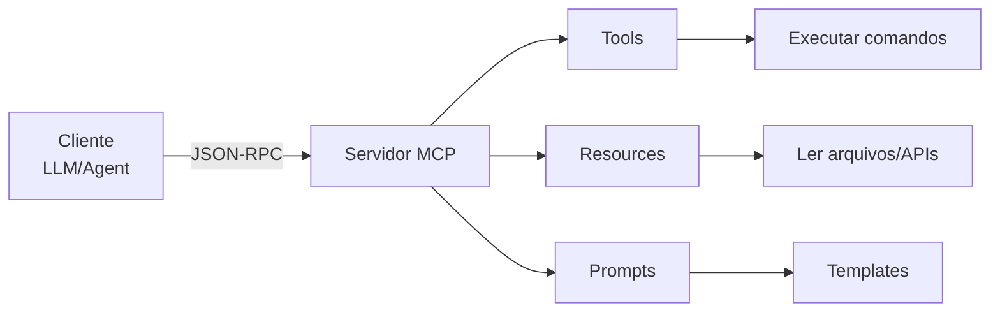

# Model Context Protocol (MCP)
## Para Profissionais DevOps

---

## O que é MCP?

- **Protocolo padrão** para conectar ferramentas externas a LLMs
- Desenvolvido pela **Anthropic** (Claude)
- **Open source** e agnóstico de modelo
- Define como **servidores** expõem recursos para **clientes** (LLMs)
- Substitui integrações customizadas por padrão universal

---

## Para que serve?

### Casos de uso em DevOps:
- **Monitoramento**: Queries em Prometheus, Grafana, logs
- **Cloud**: Gerenciar recursos AWS, GCP, Azure
- **CI/CD**: Integrar com Jenkins, GitLab, GitHub Actions  
- **Infraestrutura**: Terraform, Kubernetes, Docker
- **Bancos de dados**: Consultas, backups, métricas
- **Alertas**: PagerDuty, Slack, email

---

## Arquitetura MCP



---

## Servidor MCP com FastMCP

```python
# /// script
# requires-python = ">=3.13"
# dependencies = ["fastmcp"]
# ///

from fastmcp import FastMCP
import subprocess

# Criar servidor MCP
mcp = FastMCP("DevOps Tools")

@mcp.tool()
def check_disk_usage(path: str = "/") -> str:
    """Verificar uso de disco no servidor"""
    result = subprocess.run(
        ["df", "-h", path], 
        capture_output=True, 
        text=True
    )
    return result.stdout

@mcp.tool()  
def get_running_containers() -> str:
    """Listar containers Docker em execução"""
    result = subprocess.run(
        ["docker", "ps", "--format", "table"],
        capture_output=True,
        text=True
    )
    return result.stdout

# Executar servidor
if __name__ == "__main__":
    mcp.run()
```

---

## Cliente com Pydantic AI

```python
# /// script  
# requires-python = ">=3.13"
# dependencies = ["pydantic-ai", "mcp"]
# ///

from pydantic_ai import Agent
from mcp import ClientSession, StdioServerParameters

# Conectar ao servidor MCP
server_params = StdioServerParameters(
    command="python",
    args=["mcp_server.py"]
)

async def create_devops_agent():
    # Agent com acesso ao servidor MCP
    agent = Agent(
        "claude-3-5-sonnet-20241022",
        system_prompt="""
        Você é um assistente DevOps.
        Use as ferramentas MCP para:
        - Monitorar recursos do sistema
        - Gerenciar containers Docker  
        - Analisar logs e métricas
        """
    )
    
    # Conectar ferramentas MCP
    async with ClientSession(server_params) as session:
        tools = await session.list_tools()
        agent.add_tools(tools.tools)
        
        # Executar tarefas
        response = await agent.run(
            "Verifique o uso de disco e containers ativos"
        )
        return response
```

---

## Vantagens para DevOps

### ✅ **Padronização**
- Uma interface para todas as ferramentas
- Reutilização entre diferentes LLMs

### ✅ **Segurança** 
- Controle granular de permissões
- Isolamento de recursos

### ✅ **Escalabilidade**
- Servidores distribuídos
- Load balancing automático

### ✅ **Produtividade**
- Automação inteligente
- Troubleshooting assistido por IA
