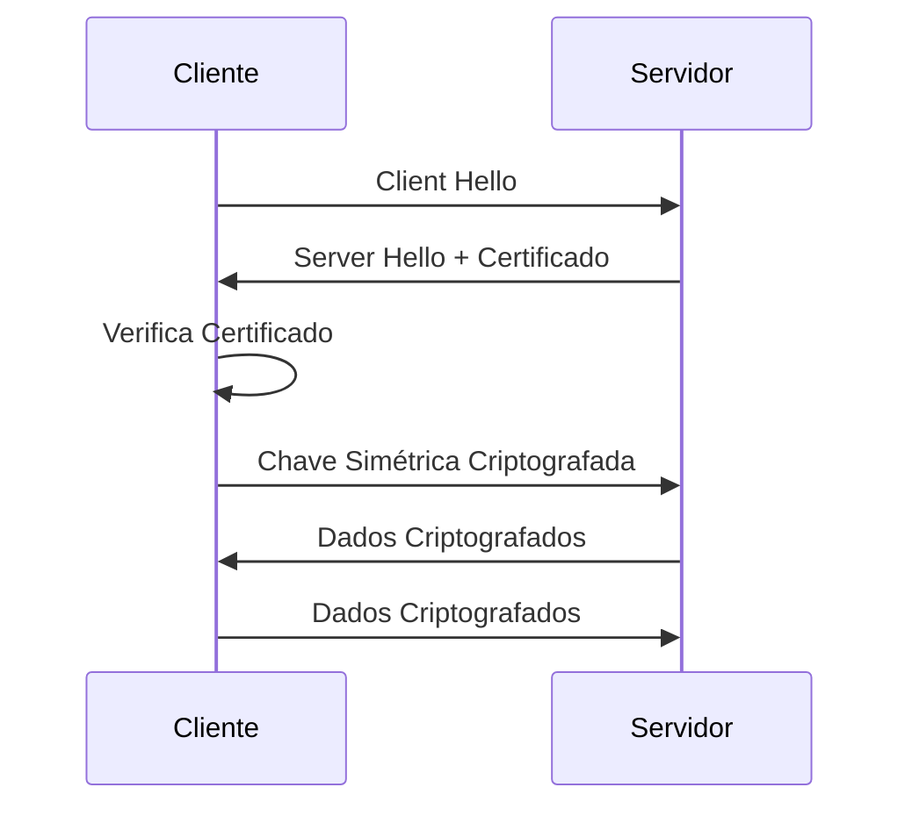
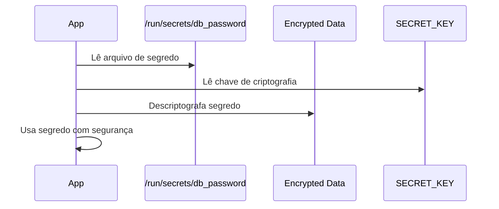
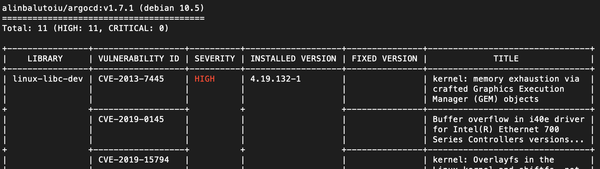

tópicos
===

<!-- font_size: 2 -->

Existem questões inerentes a segurança de software que se aplicam a projetos Python de qualquer tamanho e em qualquer nicho de atuação, nesta semana falaremos sobre os principais pontos de atenção no que diz respeito a segurança de projetos Python.

- Segurança de código
- Segurança de rede
- Secrets management
- PII Personally Identifiable Information  
- Supply Chain Security


Vamos ver cada um desses tópicos e exemplos práticos de como abordar com Python em cada um deles.


<!-- end_slide -->
<!-- jump_to_middle -->
<!-- font_size: 4 --> 
## Segurança de código 


Injeção de comandos
===
<!-- pause --> 
<!-- alignment: center -->
<!-- font_size: 2 --> 
Ao usar subsistemas como sistema de arquivos, banco de dados e qualquer   
outro sistema externo, devemos sempre validar e sanitizar a entrada de dados.

Injeção de código malicioso é uma das principais vulnerabilidades em software.

<!-- pause --> 

Exemplo: Criando pastas dinamicamente.

```python +exec
import os
dir_name = "my files"
/// try:
///     os.rmdir(dir_name)
/// except FileNotFoundError:
///     pass
os.mkdir(dir_name)
```
<!-- pause --> 
```bash +exec
ls -d "my files"
/// rm -rf "my files"
```

<!-- pause --> 

A pasta "my files" foi criada com sucesso mesmo contendo espaço pois o `os.mkdir` trata o nome como string literal.


Criando com subprocess
===

<!-- font_size: 2 --> 

Agora vamos criar a mesma pasta usando subprocess com `shell=True`:
<!-- pause --> 
```python +exec
import subprocess
dir_name = "my files"
/// try:
///     subprocess.run(f"rmdir {dir_name}", shell=True)
/// except FileNotFoundError:
///     pass
subprocess.run(f"mkdir {dir_name}", shell=True)
```
<!-- pause -->
```bash +exec
ls -d "my"
ls -d "files"
```
<!-- pause --> 
Ao usar subprocess com `shell=True` o nome da pasta foi interpretado como dois comandos separados, criando duas pastas "my" e "files".


Explorando a injeção
===
<!-- font_size: 2 --> 

Se ao usar subprocess com `shell=True` o nome da pasta for controlado por um usuário malicioso, ele pode injetar comandos arbitrários.

<!-- pause --> 

```bash +exec
echo "important data" > important_file.txt
```
<!-- pause --> 

```python +exec
import subprocess
# Nome malicioso tentando injetar comando
dir_name = "my files; rm -rf important_file.txt"
/// try:
///     subprocess.run(f"rmdir {dir_name}", shell=True)
/// except FileNotFoundError:
///     pass
subprocess.run(f"mkdir {dir_name}", shell=True)
```

<!-- pause -->
```bash +exec
ls -d "my"
ls -d "files"
ls -l important_file.txt
```

Solução
===

<!-- font_size: 2 --> 

- Evite usar `shell=True` sempre que possível
- Use listas de argumentos ao invés de strings
- Valide e sanitize entradas de usuários
- Quoting de argumentos com `shlex.quote()`

```python +exec
import subprocess
import shlex
dir_name = "my files; rm -rf important_file.txt"
safe_dir_name = shlex.quote(dir_name)
/// try:
///     subprocess.run(["rmdir", dir_name])
/// except Exception:
///     pass
subprocess.run(["mkdir", dir_name])
```
<!-- pause -->

```bash +exec
/// echo "important data" > important_file.txt
ls -d "my files; rm -rf important_file.txt"
ls important_file.txt
/// rm -rf "my files; rm -rf important_file.txt" important_file.txt
```

<!-- end_slide -->
<!-- jump_to_middle -->
<!-- font_size: 4 --> 
# Continua no próximo video
## Segurança de rede


Segurança de rede
===

<!-- font_size: 4 -->
<!-- jump_to_middle -->
## Segurança da transmissão de dados entre cliente e servidor

Como funciona o TLS/SSL
===
<!-- font_size: 2 --> 

Transport Layer Security (TLS) e seu predecessor Secure Sockets Layer (SSL) são protocolos que fornecem comunicação segura sobre uma rede, como a internet.

<!-- column_layout: [1, 1] -->
<!-- column: 0 -->

<!-- font_size: 2 -->
- Cliente inicia conexão
- Servidor responde com certificado
- Cliente verifica certificado
- Troca de chaves simétricas


<!-- column: 1 -->



TLS/SSL em Python
===
<!-- font_size: 2 --> 
- **ssl** - Módulo builtin para conexões seguras
- Verificação de certificados
- Contextos de segurança personalizados
<!-- font_size: 1 --> 
<!-- column_layout: [1, 1] -->
<!-- column: 0 -->

```python +exec
import ssl
import socket

# Criar contexto SSL seguro
context = ssl.create_default_context()
context.check_hostname = True
context.verify_mode = ssl.CERT_REQUIRED  # OPTIONS: ssl.CERT_NONE, ssl.CERT_OPTIONAL

# Conectar com HTTPS
with socket.create_connection(('httpbin.org', 443)) as sock:
    with context.wrap_socket(sock, server_hostname='httpbin.org') as ssock:
        print(f"Cifra: {ssock.cipher()}")
        print(f"Versão SSL: {ssock.version()}")
```
<!-- column: 1 -->
<!-- pause -->

Usando a cifra para enviar o pedido HTTPS
```python +exec
/// import ssl
/// import socket
/// import pprint
/// context = ssl.create_default_context()
/// context.check_hostname = True
/// context.verify_mode = ssl.CERT_REQUIRED
/// # Conectar com HTTPS
/// #with socket.create_connection(('httpbin.org', 443)) as sock:
/// #   with context.wrap_socket(sock, server_hostname='httpbin.org') as ssock:
/// sock = socket.create_connection(('httpbin.org', 443))
/// ssock = context.wrap_socket(sock, server_hostname='httpbin.org')

# Fazer requisição HTTPS
request = (
  "GET /get HTTP/1.1\r\nHost: httpbin.org\r\nConnection: close\r\n\r\n"
)
ssock.sendall(request.encode())
response = b""
while True:
    data = ssock.recv(4096)
    if not data:
        break
    response += data
headers, body = response.split(b"\r\n\r\n", 1)
print("Headers:")
pprint.pprint(headers.decode().split("\r\n"))
print("\nBody:")
pprint.pprint(body.decode()[:200] + "...")
```


A mesma coisa usando urllib.request
===
<!-- alignment: center -->
<!-- font_size: 2 --> 
Útil quando não queremos lidar com sockets diretamente 
e não podemos instalar libs externas.

<!-- font_size: 1 --> 
<!-- pause --> 
```python +exec
import ssl
import certifi
import urllib.request
import pprint
# Usar certificados confiáveis
context = ssl.create_default_context(cafile=certifi.where())
# Fazer requisição HTTPS
with urllib.request.urlopen('https://httpbin.org/get', context=context) as response:
    print(f"Status: {response.status}")
    print("Headers:")
    pprint.pprint(response.getheaders())
    print("\nBody:")
    pprint.pprint(response.read().decode()[:200] + "...")
```

Com a lib requests
===
<!-- pause --> 
<!-- font_size: 2 --> 

```python +exec
import requests
# requests usa verificação de certificados por padrão
response = requests.get('https://httpbin.org/get')
/// print(f"Status: {response.status_code}")
/// print("Headers:")
/// for k, v in response.headers.items():
///     print(f"  {k}: {v}")
/// print("\nBody:")
/// print(response.text[:200] + "...")
```

Servidor HTTPS com certificado
===
<!-- pause --> 
<!-- alignment: center -->
<!-- font_size: 2 --> 

# Gerar certificado auto-assinado:
```bash
openssl req -x509 -newkey rsa:4096 \
        -keyout key.pem -out cert.pem -days 365 -nodes
```

> Para certificados válidos, use Let's Encrypt ou uma CA confiável.
<!-- pause --> 

# Servidor HTTPS simples

```python
import ssl
from http.server import HTTPServer, SimpleHTTPRequestHandler

server = HTTPServer(('localhost', 4443), SimpleHTTPRequestHandler)
server.socket = ssl.wrap_socket(
    server.socket,
    certfile='./cert.pem',
    keyfile='./key.pem',
    server_side=True
)
server.serve_forever()
```

<!-- end_slide -->
<!-- jump_to_middle -->
<!-- font_size: 4 --> 
# Continua no próximo video
## Secrets management


Secrets management
===

<!-- alignment: center -->
<!-- font_size: 2 --> 
## Entrada segura de senhas
<!-- pause --> 

```python +exec
import getpass
import hashlib

# Ocultar entrada de senha
# password = getpass.getpass("Digite a senha: ")
/// password = "senha123"  # Para demonstração

# Hash seguro com salt
import secrets
salt = secrets.token_bytes(32)
hashed = hashlib.pbkdf2_hmac(
    'sha256',
    password.encode('utf-8'),
    salt,
    100000 # 100k iterações
) 
print(f"Hash: {hashed.hex()}")
```

Integração com gerenciadores
===
<!-- font_size: 2 --> 
<!-- pause --> 
```python
# HashiCorp Vault
import hvac
client = hvac.Client(url='http://localhost:8200')
client.token = os.environ['VAULT_TOKEN']
secret = client.secrets.kv.v2.read_secret_version(path='myapp/config')

# AWS Secrets Manager
import boto3
client = boto3.client('secretsmanager')
response = client.get_secret_value(SecretId='prod/myapp/db')

# Azure Key Vault
from azure.keyvault.secrets import SecretClient
from azure.identity import DefaultAzureCredential
vault_url = "https://myvault.vault.azure.net/"
client = SecretClient(vault_url=vault_url, credential=DefaultAzureCredential())
secret = client.get_secret("mySecret")
```

Password Manager
===
<!-- pause --> 
```python +exec {3-15|18-26|29-33|1-33}
/// import os; os.environ["PATH"] += os.pathsep + "."  # Ajuste conforme necessário
import subprocess

class Secret(str):
    def __init__(self, value: str):
        self._value = value

    @property
    def safe(self):
        return  f"{self._value[:2]}****"

    def __repr__(self):
        return f"<Secret {self.safe}>"

    def decode(self) -> str:
        return self._value


def get_1password_secret(item: str, field: str) -> Secret:
    """Recupera segredo do 1Password CLI"""
    result = subprocess.run(
        ['op', 'read', f'item/{item}/field/{field}'],
        capture_output=True, text=True
    )
    if result.returncode != 0:
        raise Exception("Erro ao recuperar segredo")
    return Secret(result.stdout.strip())

# Exemplo de uso
db_password = get_1password_secret('MyDatabase', 'password')
print(db_password)  # Faz decode do valor real
print(f"Senha do DB: {db_password.safe}")  # Não expõe valor real
# exemplo de uso em repr
print(f"Objeto secreto: {db_password!r}")
```

Logging seguro
===
<!-- pause --> 

```python +exec +line_numbers {7|11-16|19-27|27-31|1-31}
import re
import logging
import sys


# matches key=value or key:value or key = value or key : value
secret_pattern = re.compile(r'\b(senha|password|token|key)\s*[:=]\s*\S+', re.IGNORECASE)


# Configurar logging
class SecretFilter(logging.Filter):
    def filter(self, record):
        """Detect and omit sensitive information"""
        if secret_pattern.search(record.getMessage()):
            record.args = tuple("*****" for arg in record.args)
        return True


logger = logging.getLogger('secure_logger')
handler = logging.StreamHandler(sys.stdout)
handler.addFilter(SecretFilter())
formatter = logging.Formatter('%(asctime)s - %(levelname)s - %(message)s')
handler.setFormatter(formatter)
logger.addHandler(handler)
logger.setLevel(logging.DEBUG)

# Uso do logger
secret_value = "senha123"
logger.info("Iniciando aplicação")
logger.debug("Conectando ao banco com senha=%s", secret_value)
logger.error("Erro ao autenticar usuário com senha: %s", secret_value)
```

Encrypted secret mounted files
===
<!-- pause --> 
<!-- font_size: 2 --> 
<!-- alignment: center -->
Assumindo um arquivo `/run/secrets/db_password` com o conteúdo `supersecretpassword`   
encriptado usando a chave contida em `SECRET_KEY` (variável de ambiente).:



Implementação
===

<!-- font_size: 1 --> 

<!-- column_layout: [1, 1] -->
<!-- column: 0 -->
<!-- pause --> 

```python
import os
import logging
from cryptography.fernet import Fernet, InvalidToken
/// logging.basicConfig(level=logging.INFO)

class Secret(str):
    def __init__(self, value: str):
        self._value = value
    @property
    def safe(self):
        return  f"{self._value[:3]}****"
    def __repr__(self):
        return f"<Secret {self.safe}>"
    def decode(self) -> str:
        return self._value

def load_secret(secret_file: str, secret_key: str) -> Secret:
    """Lê e descriptografa o conteúdo do arquivo de segredo"""
    try:
        with open(secret_file, 'rb') as f:
            encrypted_data = f.read()
        fernet = Fernet(secret_key)
        decrypted_data = fernet.decrypt(encrypted_data)
        return Secret(decrypted_data.decode('utf-8'))
    except FileNotFoundError:
        logging.error(f"Arquivo de segredo não encontrado: {secret_file}")
        raise
    except InvalidToken:
        logging.error("Chave de segredo inválida ou dados corrompidos")
        raise
    except Exception as e:
        logging.error(f"Erro ao carregar segredo: {e}")
        raise
```
<!-- pause --> 
<!-- column: 1 -->

```python +exec {3-4|7-10|13-22|1-22}
/// import os
/// import logging
/// from cryptography.fernet import Fernet, InvalidToken
/// logging.basicConfig(level=logging.INFO)
/// class Secret(str):
///    def __init__(self, value: str):
///        self._value = value
///    @property
///    def safe(self):
///        return  f"{self._value[:3]}****"
///    def __repr__(self):
///        return f"<Secret {self.safe}>"
///    def decode(self) -> str:
///        return self._value
/// def load_secret(secret_file: str, secret_key: str) -> Secret:
///    """Lê e descriptografa o conteúdo do arquivo de segredo"""
///    try:
///        with open(secret_file, 'rb') as f:
///            encrypted_data = f.read()
///        fernet = Fernet(secret_key)
///        decrypted_data = fernet.decrypt(encrypted_data)
///        return Secret(decrypted_data.decode('utf-8'))
///    except FileNotFoundError:
///        logging.error(f"Arquivo de segredo não encontrado: {secret_file}")
///        raise
///    except InvalidToken:
///        logging.error("Chave de segredo inválida ou dados corrompidos")
///        raise
///    except Exception as e:
///        logging.error(f"Erro ao carregar segredo: {e}")
///        raise
# Exemplo de uso
# Key must be 32 url-safe base64-encoded bytes
os.environ['SECRET_KEY'] = Fernet.generate_key().decode()
secret_key = os.getenv('SECRET_KEY')

# Simular criação do arquivo de segredo
with open('/tmp/db_password', 'wb') as f:
    fernet = Fernet(secret_key)
    encrypted = fernet.encrypt(b'supersecretpassword')
    f.write(encrypted)

# Carregar segredo
secret_file = '/tmp/db_password'  # Ajuste conforme necessário
if not secret_key:
    raise Exception("Variável de ambiente SECRET_KEY não definida")
try:
    db_password = load_secret(secret_file, secret_key)
    logging.info("Senha do banco carregada com sucesso")
    # Use db_password com segurança
    print(f"DB PASSWORD: {db_password.safe}")
except Exception:
    logging.error("Falha ao carregar a senha do banco")
```


Boas práticas
===

<!-- font_size: 2 --> 

- Nunca fazer hardcode de secrets
- Usar `repr()` customizado para ocultar valores sensíveis
- Configurar logging para não expor secrets
- Rotacionar chaves regularmente


<!-- end_slide -->
<!-- jump_to_middle -->
<!-- font_size: 4 --> 
# Continua no próximo video: 
## PII Personally Identifiable Information 


PII Personally Identifiable Information
===

<!-- font_size: 3 --> 

PII são informações que podem identificar uma pessoa, como nome, email, CPF, endereço, telefone, etc.

Ou a simples exposição de que um e-mail já está cadastrado em um sistema.


Proteção de dados pessoais
===

<!-- pause --> 

```python +exec
import uuid
import json
from cryptography.fernet import Fernet

# Gerar chave de criptografia
key = Fernet.generate_key()
print(f"Chave de criptografia (guarde com segurança!): {key.decode()}")

cipher = Fernet(key)

# Usar UUIDs ao invés de IDs sequenciais
user_data = {
    'id': str(uuid.uuid4()),
    'email': 'user@example.com',
    'cpf': '123.456.789-00'
}

encrypted = cipher.encrypt(json.dumps(user_data).encode())
print(f"Dados criptografados: {encrypted[:100].decode('utf-8')}...")
print()
# Estes dados agora podem ser armazenados em arquivos ou 
# bancos de dados com segurança.

# ----------------------------------------------

print("Descriptografando dados...")
decrypted = json.loads(cipher.decrypt(encrypted))
print(f"ID do usuário: {decrypted['id']}")
print(f"Email do usuário: {decrypted['email']}")
print(f"CPF do usuário: {decrypted['cpf']}")
```

Mascaramento de dados
===
<!-- pause --> 

```python +exec
def mask_email(email: str) -> str:
    """Mascara endereço de email"""
    if '@' not in email:
        return '***'
    local, domain = email.split('@')
    if len(local) <= 2:
        masked = '*' * len(local)
    else:
        masked = local[0] + '*' * (len(local)-2) + local[-1]
    return f"{masked}@{domain}"

def mask_cpf(cpf: str) -> str:
    """Mascara CPF mantendo apenas últimos 2 dígitos"""
    clean = ''.join(c for c in cpf if c.isdigit())
    return '*' * 9 + clean[-2:] if len(clean) >= 11 else '***'

print(f"Email: {mask_email('bruno@example.com')}")
print(f"CPF: {mask_cpf('123.456.789-00')}")
```

Tratamento seguro de exceções
===

<!-- pause --> 

```python +exec
import sys
import uuid
import traceback

def safe_error_handler(exc_type, exc_value, exc_traceback):
    """Handler que não expõe informações sensíveis"""
    if exc_type == KeyboardInterrupt:
        sys.__excepthook__(exc_type, exc_value, exc_traceback)
        return

    # Log completo para desenvolvimento
    with open('errors.log', 'a') as f:
        traceback.print_exception(exc_type, exc_value, exc_traceback, file=f)

    # Mensagem genérica para usuário
    print("Ocorreu um erro. Por favor, contate o suporte.")
    print(f"ID do erro: {uuid.uuid4()}")

# Configurar handler customizado
sys.excepthook = safe_error_handler

# Teste
password = "senha123"
raise ValueError(f"Senha inválida: {password}")

```
<!-- pause --> 

```bash +exec
head -n 10 errors.log
```

Verificação sem expor existência
===

<!-- pause --> 

```python
import time
import hashlib

def verify_user(email: str, password: str) -> bool:
    """Verifica sem expor se usuário existe"""
    # Sempre fazer hash mesmo se usuário não existir
    hashed = hashlib.sha256(password.encode()).hexdigest()

    # Simular delay consistente
    time.sleep(0.1)
    user = db_get_user_by_email(email)  # Função fictícia
    if user and user['password_hash'] == hashed:
        return True  # "Login bem-sucedido"

    # Mensagem genérica
    return False  # "Credenciais inválidas"
```


<!-- end_slide -->

<!-- jump_to_middle -->

<!-- font_size: 4 --> 

# Continua no próximo video: 
## Supply Chain Security 


Supply Chain Security
===

Verificação de integridade de pacotes
===

<!-- pause --> 
<!-- font_size: 2 --> 

Ao criar o arquivo de requirements é possível incluir os hashes dos pacotes para garantir que o que está sendo instalado é exatamente o que foi aprovado.
e evitar ataques de supply chain onde um pacote malicioso é injetado em um repositório público ou usando técnicas de typosquatting.

<!-- pause --> 
A forma mais simples de gerar o arquivo requirements.txt com hashes é usando o pip-compile do pacote pip-tools:

```bash +exec
/// TEMP_DIR=$(mktemp -d)
/// cd $TEMP_DIR
/// echo "requests" > requirements.in
uv pip compile --generate-hashes requirements.in > requirements.txt
head -n 4 requirements.txt
```
<!-- pause --> 
Desta forma ao instalar as dependências, o pip poderá verificar os hashes:

```bash
pip install -r requirements.txt --require-hashes
```

Análise de vulnerabilidades
===
<!-- pause -->
<!-- font_size: 3 -->
<!-- alignment: center -->

- pip-audit - Verifica CVEs em dependências Python
- safety - Análise de vulnerabilidades
- bandit - Análise de código Python
- trivy - Scan de container
- grype - Vulnerabilidades em dependências


Scan de Containers
===
<!-- pause --> 
```bash
# Exemplo com Trivy
# Instalar Trivy: https://aquasecurity.github.io/trivy/v0.35.0/getting-started/installation/
trivy image python:3.11-slim
```


<!-- pause --> 

Pode usar Python para automatizar scans e enviar alertas

```python
import subprocess
def scan_image(image: str):
    """Escaneia imagem Docker usando Trivy"""
    try:
        result = subprocess.run(
            ['trivy', 'image', image],
            capture_output=True, text=True, check=True
        )
        print(f"Scan completo para {image}:\n{result.stdout[:500]}...")
    except subprocess.CalledProcessError as e:
        print(f"Erro ao escanear {image}:\n{e.stderr}")
# Exemplo de uso
scan_image('python:3.11-slim')
```


Scan com Python e Trivy como Conjob no Kubernetes
===

Um script Python executa periodicamente, faz o scan das imagens e em caso de vulnerabilidades críticas, envia um alerta por email.

<!-- column_layout: [1, 1] -->

<!-- column: 0 -->
<!-- pause --> 

```python
#!/usr/bin/env python3
# /// script
# dependencies = ["kubernetes"]
# ///
import subprocess
import smtplib
from email.mime.text import MIMEText
def send_alert(subject: str, body: str, to_email: str):
    """Envia alerta por email"""
    msg = MIMEText(body)
    msg['Subject'] = subject
    msg['From'] = "sysadmin"
    msg['To'] = to_email
    with smtplib.SMTP('smtp.example.com') as server:
        server.login('user', 'password')
        server.send_message(msg)

def scan_image(image: str) -> str:
    """Escaneia imagem Docker usando Trivy"""
    try:
        result = subprocess.run(
            ['trivy', 'image', '--severity', 'CRITICAL', image],
            capture_output=True, text=True, check=True
        )
        return result.stdout
    except subprocess.CalledProcessError as e:
        return f"Erro ao escanear {image}:\n{e.stderr}"

# Exemplo de uso
from kubernetes import client, config
config.load_kube_config()
v1 = client.CoreV1Api()
pods = v1.list_pod_for_all_namespaces(watch=False)
for pod in pods.items:
    for container in pod.spec.containers:
        image = container.image
        scan_result = scan_image(image)
        if "CRITICAL" in scan_result:
            send_alert(
                subject=f"Alerta de Vulnerabilidade Crítica na imagem {image}",
                body=scan_result,
                to_email="support"
            )
```
<!-- pause --> 

<!-- column: 1 -->

Agendando executando o script como CronJob no Kubernetes
```yaml
apiVersion: batch/v1
kind: CronJob
metadata:
  name: image-scan
spec:
  schedule: "0 2 * * *"  # Executa diariamente às 2h
  jobTemplate:
    spec:
      template:
        spec:
          containers:
          - name: image-scan
            image: python:3.11-slim
            command: ["python", "/scripts/scan.py"]
            volumeMounts:
            - name: script-volume
              mountPath: /scripts
          restartPolicy: OnFailure
          volumes:
          - name: script-volume
            configMap:
              name: image-scan-script
```


```bash
kubectl apply -f cronjob.yaml
```

<!-- end_slide -->




SBOM - Software Bill of Materials
===
<!-- pause --> 
```python +exec
import subprocess
import json
from pathlib import Path

def generate_sbom():
    """Gera SBOM básico do projeto"""
    sbom = {
        "bomFormat": "CycloneDX",
        "specVersion": "1.4",
        "components": []
    }

    # Coletar dependências
    if Path('requirements.txt').exists():
        with open('requirements.txt') as f:
            for line in f:
                if line.strip() and not line.strip().startswith('#') and '--hash=' not in line:
                    parts = line.replace("\\","").strip().split('==')
                    component = {
                        "type": "library",
                        "name": parts[0],
                        "version": parts[1] if len(parts) > 1 else "latest"
                    }
                    sbom["components"].append(component)

    return sbom

# Exemplo de SBOM
sbom_example = generate_sbom()
print(f"SBOM gerado com {len(sbom_example['components'])} componentes")
print(json.dumps(sbom_example, indent=2) + "...")
```

Configuração de repositório privado
===
<!-- pause --> 
```yaml
# pip config para repositório privado
# ~/.pip/pip.conf ou pip.conf no projeto
"""
[global]
index-url = https://pypi.org/simple
extra-index-url = https://private.repo.com/simple/
trusted-host = private.repo.com
"""

# Poetry com fonte privada
# pyproject.toml
"""
[[tool.poetry.source]]
name = "private"
url = "https://private.repo.com/simple/"
secondary = true
"""

# UV com índice privado
# uv pip install --index-url https://private.repo.com/simple/ package
```

Boas práticas
===

<!-- font_size: 2 --> 

- Usar lock files (requirements.lock, uv.lock)
- Verificar assinaturas GPG quando disponível
- Manter dependências atualizadas
- Implementar política de aprovação para novas deps
- Monitorar CVEs continuamente
- Usar ferramentas: pip-audit, safety, snyk, dependabot
- Manter dependencias verificadas em repos privados

