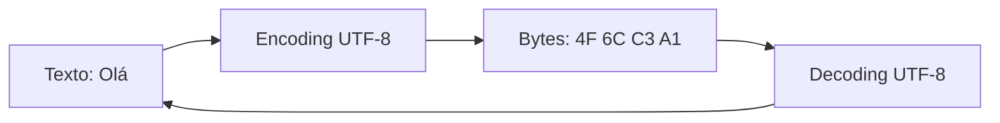
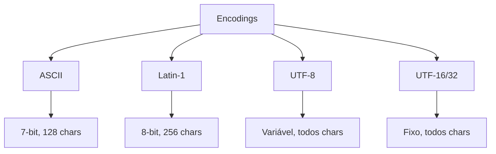
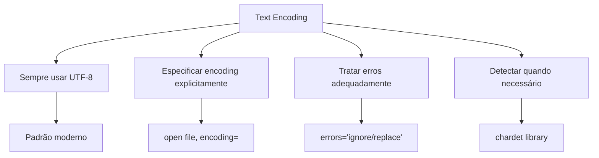

# Aula 1: Text Encoding com Python

## 1. O que é Encoding?

Encoding (codificação) é o processo de converter caracteres em bytes para armazenamento ou transmissão.



**Conceitos fundamentais:**
- **Character**: Símbolo abstrato (ex: 'A', 'ã', '🐍')
- **Code Point**: Número que representa o character (ex: U+00E1 para 'á')
- **Encoding**: Forma de representar code points como bytes

## 2. Principais Tipos de Encoding

### ASCII (7-bit)
- 128 caracteres (0-127)
- Apenas inglês básico
- Obsoleto para uso geral

### Latin-1 (ISO-8859-1)
- 256 caracteres (0-255)
- Suporta línguas da Europa Ocidental
- 1 byte por caractere

### UTF-8 (Recomendado)
- Tamanho variável (1-4 bytes)
- Compatível com ASCII
- Suporta todos os caracteres Unicode
- Padrão web e Python 3

### UTF-16 e UTF-32
- UTF-16: 2 ou 4 bytes
- UTF-32: 4 bytes fixos
- Usados em Windows e Java



## 3. Como Lidar com Encoding em Python

### Strings em Python 3

```python
# Strings são Unicode por padrão
texto = "Olá, Python! 🐍"
print(type(texto))  # <class 'str'>

# Codificar string para bytes
bytes_utf8 = texto.encode('utf-8')
print(bytes_utf8)  # b'Ol\xc3\xa1, Python! \xf0\x9f\x90\x8d'
print(type(bytes_utf8))  # <class 'bytes'>

# Decodificar bytes para string
texto_decoded = bytes_utf8.decode('utf-8')
print(texto_decoded)  # Olá, Python! 🐍
```

### Lendo Arquivos

```python
# Forma CORRETA - especificando encoding
with open('arquivo.txt', 'r', encoding='utf-8') as f:
    conteudo = f.read()

# Escrevendo com encoding específico
with open('saida.txt', 'w', encoding='utf-8') as f:
    f.write("Conteúdo com acentuação")

# Lendo bytes (modo binário)
with open('arquivo.txt', 'rb') as f:
    bytes_conteudo = f.read()
    texto = bytes_conteudo.decode('utf-8')
```

### Diferentes Encodings

```python
texto = "Olá"

# Encoding para diferentes formatos
utf8 = texto.encode('utf-8')
latin1 = texto.encode('latin-1')
utf16 = texto.encode('utf-16')

print(f"UTF-8: {utf8}")      # b'Ol\xc3\xa1'
print(f"Latin-1: {latin1}")  # b'Ol\xe1'
print(f"UTF-16: {utf16}")    # b'\xff\xfeO\x00l\x00\xe1\x00'
```

## 4. Como Detectar e Converter Encodings

### Detectando Encoding com chardet

```python
import chardet

# Ler bytes do arquivo
with open('arquivo_desconhecido.txt', 'rb') as f:
    raw_data = f.read()

# Detectar encoding
resultado = chardet.detect(raw_data)
print(resultado)
# {'encoding': 'utf-8', 'confidence': 0.99, 'language': ''}

# Decodificar com encoding detectado
texto = raw_data.decode(resultado['encoding'])
```

### Convertendo entre Encodings

```python
# Ler arquivo em Latin-1
with open('antigo.txt', 'r', encoding='latin-1') as f:
    conteudo = f.read()

# Salvar em UTF-8
with open('novo.txt', 'w', encoding='utf-8') as f:
    f.write(conteudo)
```

### Ferramenta de Conversão

```python
def converter_encoding(arquivo_origem, arquivo_destino,
                      encoding_origem='latin-1',
                      encoding_destino='utf-8'):
    """Converte arquivo de um encoding para outro"""
    with open(arquivo_origem, 'r', encoding=encoding_origem) as f:
        conteudo = f.read()

    with open(arquivo_destino, 'w', encoding=encoding_destino) as f:
        f.write(conteudo)

    print(f"Convertido: {encoding_origem} -> {encoding_destino}")

# Uso
converter_encoding('dados_antigos.csv', 'dados_novos.csv')
```

## 5. Principais Problemas e Soluções

### Problema 1: UnicodeDecodeError

```python
# ERRO: Tentando decodificar com encoding errado
try:
    with open('arquivo_latin1.txt', 'r', encoding='utf-8') as f:
        conteudo = f.read()
except UnicodeDecodeError as e:
    print(f"Erro: {e}")

# SOLUÇÃO: Usar encoding correto ou 'errors' parameter
with open('arquivo_latin1.txt', 'r', encoding='latin-1') as f:
    conteudo = f.read()

# Ou ignorar erros
with open('arquivo_latin1.txt', 'r', encoding='utf-8', errors='ignore') as f:
    conteudo = f.read()

# Ou substituir caracteres inválidos
with open('arquivo_latin1.txt', 'r', encoding='utf-8', errors='replace') as f:
    conteudo = f.read()  # Caracteres inválidos vão virar �
```

### Problema 2: UnicodeEncodeError

```python
# ERRO: Tentando codificar caractere não suportado
texto = "Python 🐍"
try:
    bytes_ascii = texto.encode('ascii')
except UnicodeEncodeError as e:
    print(f"Erro: {e}")

# SOLUÇÃO: Usar UTF-8 ou tratar erros
bytes_utf8 = texto.encode('utf-8')  # Funciona
bytes_ascii = texto.encode('ascii', errors='ignore')  # 'Python '
bytes_ascii = texto.encode('ascii', errors='replace')  # 'Python ?'
```

### Problema 3: Mixing Bytes and Strings

```python
# ERRO
texto = "Olá"
bytes_obj = b"mundo"
# resultado = texto + bytes_obj  # TypeError

# SOLUÇÃO
resultado = texto + bytes_obj.decode('utf-8')
# ou
resultado = texto.encode('utf-8') + bytes_obj
```

### Problema 4: Default Encoding do Sistema

```python
import sys
import locale

# Verificar encoding padrão
print(f"Default encoding: {sys.getdefaultencoding()}")  # utf-8
print(f"Filesystem encoding: {sys.getfilesystemencoding()}")
print(f"Locale encoding: {locale.getpreferredencoding()}")

# SEMPRE especificar encoding explicitamente
# BOM
with open('arquivo.txt', 'r', encoding='utf-8') as f:
    pass

# RUIM (depende do sistema)
with open('arquivo.txt', 'r') as f:  # Pode variar entre sistemas
    pass
```

## 6. Exercícios Práticos

### Exercício 1: Detector de Encoding

```python
#!/usr/bin/env python3
"""Detecta o encoding de um arquivo"""

import chardet
import sys

def detectar_encoding(arquivo):
    with open(arquivo, 'rb') as f:
        raw_data = f.read()

    resultado = chardet.detect(raw_data)

    print(f"Arquivo: {arquivo}")
    print(f"Encoding detectado: {resultado['encoding']}")
    print(f"Confiança: {resultado['confidence'] * 100:.2f}%")
    print(f"Idioma: {resultado.get('language', 'N/A')}")

if __name__ == '__main__':
    if len(sys.argv) < 2:
        print("Uso: python detect_encoding.py <arquivo>")
        sys.exit(1)

    detectar_encoding(sys.argv[1])
```

### Exercício 2: Conversor de Encoding em Lote

```python
#!/usr/bin/env python3
"""Converte múltiplos arquivos de um encoding para outro"""

import os
import sys
from pathlib import Path

def converter_lote(diretorio, extensao, encoding_origem, encoding_destino):
    arquivos = Path(diretorio).glob(f"*.{extensao}")

    for arquivo in arquivos:
        try:
            # Ler com encoding original
            with open(arquivo, 'r', encoding=encoding_origem) as f:
                conteudo = f.read()

            # Criar arquivo novo com sufixo
            novo_arquivo = arquivo.with_suffix(f'.{encoding_destino}{arquivo.suffix}')

            # Escrever com novo encoding
            with open(novo_arquivo, 'w', encoding=encoding_destino) as f:
                f.write(conteudo)

            print(f"✓ Convertido: {arquivo.name}")

        except Exception as e:
            print(f"✗ Erro em {arquivo.name}: {e}")

if __name__ == '__main__':
    converter_lote('.', 'txt', 'latin-1', 'utf-8')
```

### Exercício 3: Limpador de Texto

```python
#!/usr/bin/env python3
"""Remove caracteres não-ASCII de um arquivo"""

def limpar_texto(arquivo_entrada, arquivo_saida):
    with open(arquivo_entrada, 'r', encoding='utf-8', errors='ignore') as f:
        conteudo = f.read()

    # Remover caracteres não-ASCII
    conteudo_limpo = ''.join(char for char in conteudo if ord(char) < 128)

    with open(arquivo_saida, 'w', encoding='ascii') as f:
        f.write(conteudo_limpo)

    print(f"Arquivo limpo salvo em: {arquivo_saida}")

# Versão que substitui acentos
import unicodedata

def normalizar_texto(arquivo_entrada, arquivo_saida):
    with open(arquivo_entrada, 'r', encoding='utf-8') as f:
        conteudo = f.read()

    # Normalizar (NFKD remove acentos)
    conteudo_normalizado = unicodedata.normalize('NFKD', conteudo)
    conteudo_ascii = conteudo_normalizado.encode('ascii', 'ignore').decode('ascii')

    with open(arquivo_saida, 'w', encoding='ascii') as f:
        f.write(conteudo_ascii)

    print(f"Texto normalizado salvo em: {arquivo_saida}")

if __name__ == '__main__':
    # Teste
    with open('teste.txt', 'w', encoding='utf-8') as f:
        f.write("Olá, Pythõn! Ação 🐍")

    normalizar_texto('teste.txt', 'teste_limpo.txt')
    # Resultado: "Ola, Python! Acao "
```

## Resumo



**Pontos-chave:**
- Python 3 usa Unicode (str) internamente
- Sempre especifique `encoding='utf-8'` ao abrir arquivos
- Use `chardet` para detectar encodings desconhecidos
- Trate erros com `errors='ignore'` ou `errors='replace'`
- UTF-8 é o padrão recomendado para novos projetos
