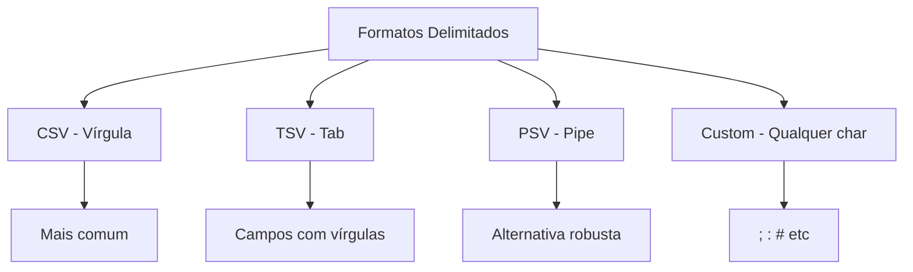
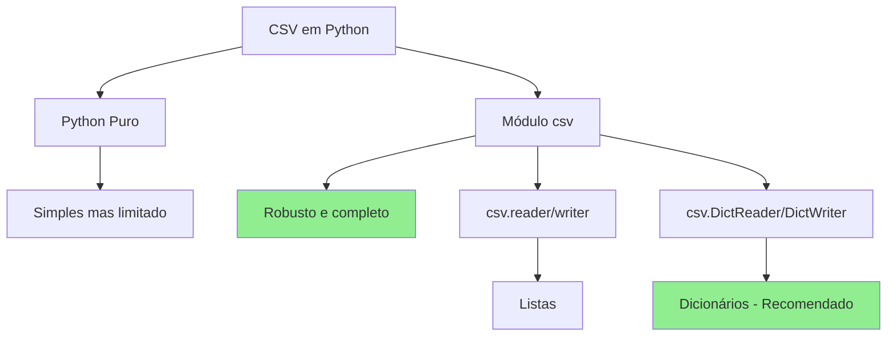

# Aula 2: CSV, TSV e Formatos Delimitados

## 1. O que são Arquivos Delimitados

Arquivos delimitados são formatos de texto onde dados tabulares são separados por caracteres especiais (delimitadores).


**Características:**
- Texto plano (human-readable)
- Cada linha = um registro
- Campos separados por delimitador
- Primeira linha geralmente contém cabeçalhos
- Simples e portável

## 2. Principais Formatos: CSV, TSV, PSV

### CSV (Comma-Separated Values)

```csv
nome,idade,cidade
João,30,São Paulo
Maria,25,Rio de Janeiro
Pedro,35,Belo Horizonte
```

**Delimitador:** `,` (vírgula)

### TSV (Tab-Separated Values)

```tsv
nome	idade	cidade
João	30	São Paulo
Maria	25	Rio de Janeiro
Pedro	35	Belo Horizonte
```

**Delimitador:** `\t` (tab)

### PSV (Pipe-Separated Values)

```psv
nome|idade|cidade
João|30|São Paulo
Maria|25|Rio de Janeiro
Pedro|35|Belo Horizonte
```

**Delimitador:** `|` (pipe)



## 3. Lendo e Escrevendo com Python

### Método 1: Python Puro (string methods)

```python
# Lendo CSV com Python puro
with open('dados.csv', 'r', encoding='utf-8') as f:
    linhas = f.readlines()

# Separar cabeçalho
cabecalho = linhas[0].strip().split(',')
print(cabecalho)  # ['nome', 'idade', 'cidade']

# Processar dados
dados = []
for linha in linhas[1:]:
    campos = linha.strip().split(',')
    registro = dict(zip(cabecalho, campos))
    dados.append(registro)

print(dados)
# [{'nome': 'João', 'idade': '30', 'cidade': 'São Paulo'}, ...]
```

```python
# Escrevendo CSV com Python puro
cabecalho = ['nome', 'idade', 'cidade']
dados = [
    ['Ana', '28', 'Curitiba'],
    ['Carlos', '32', 'Porto Alegre']
]

with open('saida.csv', 'w', encoding='utf-8') as f:
    # Escrever cabeçalho
    f.write(','.join(cabecalho) + '\n')

    # Escrever dados
    for linha in dados:
        f.write(','.join(linha) + '\n')
```

**Limitações:**
- Não trata vírgulas dentro de campos
- Não trata aspas corretamente
- Sem conversão de tipos
- Código verboso

### Método 2: Módulo csv (Recomendado)

```python
import csv

# Lendo CSV com módulo csv
with open('dados.csv', 'r', encoding='utf-8') as f:
    leitor = csv.reader(f)
    cabecalho = next(leitor)  # Primeira linha

    for linha in leitor:
        print(linha)  # Lista de valores
        # ['João', '30', 'São Paulo']
```

```python
# Lendo com DictReader (retorna dicionários)
import csv

with open('dados.csv', 'r', encoding='utf-8') as f:
    leitor = csv.DictReader(f)

    for registro in leitor:
        print(registro)
        # {'nome': 'João', 'idade': '30', 'cidade': 'São Paulo'}
        print(f"{registro['nome']} tem {registro['idade']} anos")
```

```python
# Escrevendo CSV com csv.writer
import csv

dados = [
    ['nome', 'idade', 'cidade'],
    ['João', '30', 'São Paulo'],
    ['Maria', '25', 'Rio de Janeiro']
]

with open('saida.csv', 'w', encoding='utf-8', newline='') as f:
    escritor = csv.writer(f)
    escritor.writerows(dados)  # Escreve múltiplas linhas
```

```python
# Escrevendo com DictWriter
import csv

dados = [
    {'nome': 'João', 'idade': 30, 'cidade': 'São Paulo'},
    {'nome': 'Maria', 'idade': 25, 'cidade': 'Rio de Janeiro'}
]

with open('saida.csv', 'w', encoding='utf-8', newline='') as f:
    campos = ['nome', 'idade', 'cidade']
    escritor = csv.DictWriter(f, fieldnames=campos)

    escritor.writeheader()  # Escreve cabeçalho
    escritor.writerows(dados)  # Escreve dados
```

## 4. Lidando com Diferentes Delimitadores e Citações

### Delimitadores Customizados

```python
import csv

# TSV (tab-separated)
with open('dados.tsv', 'r', encoding='utf-8') as f:
    leitor = csv.reader(f, delimiter='\t')
    for linha in leitor:
        print(linha)

# PSV (pipe-separated)
with open('dados.psv', 'r', encoding='utf-8') as f:
    leitor = csv.reader(f, delimiter='|')
    for linha in leitor:
        print(linha)

# Delimitador customizado (ponto-e-vírgula)
with open('dados.csv', 'r', encoding='utf-8') as f:
    leitor = csv.reader(f, delimiter=';')
    for linha in leitor:
        print(linha)
```

### Campos com Delimitadores (Quoting)

```python
# Dados com vírgulas nos campos
dados = [
    ['nome', 'cargo', 'salario'],
    ['João Silva', 'Desenvolvedor, Senior', '10000'],
    ['Maria Santos', 'Gerente, TI', '15000']
]

# Escrevendo com quoting
import csv

with open('saida.csv', 'w', encoding='utf-8', newline='') as f:
    escritor = csv.writer(f, quoting=csv.QUOTE_MINIMAL)
    escritor.writerows(dados)

# Resultado:
# nome,cargo,salario
# João Silva,"Desenvolvedor, Senior",10000
# Maria Santos,"Gerente, TI",15000
```

### Opções de Quoting

```python
import csv

# QUOTE_MINIMAL - Apenas campos com delimitador (padrão)
csv.writer(f, quoting=csv.QUOTE_MINIMAL)

# QUOTE_ALL - Todos os campos entre aspas
csv.writer(f, quoting=csv.QUOTE_ALL)
# "nome","cargo","salario"
# "João Silva","Desenvolvedor, Senior","10000"

# QUOTE_NONNUMERIC - Apenas campos não-numéricos
csv.writer(f, quoting=csv.QUOTE_NONNUMERIC)
# "nome","cargo","salario"
# "João Silva","Desenvolvedor, Senior",10000

# QUOTE_NONE - Sem aspas (erro se tiver delimitador no campo)
csv.writer(f, quoting=csv.QUOTE_NONE, escapechar='\\')
```

### Dialetos CSV

```python
import csv

# Registrar dialeto customizado
csv.register_dialect('meu_dialeto',
                     delimiter='|',
                     quotechar='"',
                     quoting=csv.QUOTE_MINIMAL,
                     lineterminator='\n')

# Usar dialeto
with open('saida.csv', 'w', encoding='utf-8', newline='') as f:
    escritor = csv.writer(f, dialect='meu_dialeto')
    escritor.writerows(dados)

# Dialetos pré-definidos
csv.list_dialects()  # ['excel', 'excel-tab', 'unix']
```

### Excel Dialect

```python
import csv

# Formato compatível com Excel
with open('dados_excel.csv', 'w', encoding='utf-8', newline='') as f:
    escritor = csv.writer(f, dialect='excel')
    escritor.writerows(dados)
```

## 5. Principais Problemas e Soluções

### Problema 1: Encoding Incorreto

```python
# PROBLEMA: Caracteres estranhos ao abrir no Excel
# CAUSA: Excel espera UTF-8 com BOM ou Latin-1

# SOLUÇÃO 1: UTF-8 com BOM
import csv

with open('dados.csv', 'w', encoding='utf-8-sig', newline='') as f:
    escritor = csv.writer(f)
    escritor.writerows([['nome', 'idade'], ['João', '30']])

# SOLUÇÃO 2: Latin-1 (se necessário)
with open('dados.csv', 'w', encoding='latin-1', newline='') as f:
    escritor = csv.writer(f)
    escritor.writerows([['nome', 'idade'], ['João', '30']])
```

### Problema 2: Delimitador no Conteúdo

```python
# PROBLEMA: Dados quebrados quando campo contém vírgula
# Exemplo: "João,Silva" vira duas colunas

# SOLUÇÃO: Usar quoting
import csv

dados = [['nome', 'salario'], ['João, Silva', '5.000,00']]

with open('dados.csv', 'w', encoding='utf-8', newline='') as f:
    escritor = csv.writer(f, quoting=csv.QUOTE_MINIMAL)
    escritor.writerows(dados)

# Resultado: João, Silva,"5.000,00" (campos com vírgula são quoted)
```

### Problema 3: Newline em Campos

```python
# PROBLEMA: Quebras de linha nos dados
dados_com_quebra = [
    ['nome', 'endereco'],
    ['João', 'Rua A\nSão Paulo']
]

# SOLUÇÃO: csv.writer trata automaticamente com quoting
import csv

with open('dados.csv', 'w', encoding='utf-8', newline='') as f:
    escritor = csv.writer(f, quoting=csv.QUOTE_MINIMAL)
    escritor.writerows(dados_com_quebra)

# Ao ler, também funciona automaticamente
with open('dados.csv', 'r', encoding='utf-8', newline='') as f:
    leitor = csv.reader(f)
    for linha in leitor:
        print(linha)
```

### Problema 4: Conversão de Tipos

```python
# PROBLEMA: csv sempre retorna strings
import csv

with open('dados.csv', 'r', encoding='utf-8') as f:
    leitor = csv.DictReader(f)
    for registro in leitor:
        print(type(registro['idade']))  # <class 'str'>

# SOLUÇÃO 1: Converter manualmente
for registro in leitor:
    idade = int(registro['idade'])
    salario = float(registro['salario'].replace(',', '.'))

# SOLUÇÃO 2: Função de conversão
def converter_tipos(registro):
    return {
        'nome': registro['nome'],
        'idade': int(registro['idade']),
        'salario': float(registro['salario'])
    }

with open('dados.csv', 'r', encoding='utf-8') as f:
    leitor = csv.DictReader(f)
    dados = [converter_tipos(r) for r in leitor]
```

### Problema 5: Cabeçalhos Inconsistentes

```python
# PROBLEMA: Arquivo sem cabeçalho ou cabeçalho customizado

# SOLUÇÃO: Definir fieldnames manualmente
import csv

with open('sem_cabecalho.csv', 'r', encoding='utf-8') as f:
    leitor = csv.DictReader(f, fieldnames=['nome', 'idade', 'cidade'])
    for registro in leitor:
        print(registro)
```

## 6. Exercícios Práticos

### Exercício 1: Conversor de Formatos

```python
#!/usr/bin/env python3
"""Converte entre diferentes formatos delimitados"""

import csv
import sys

def converter_formato(arquivo_entrada, arquivo_saida,
                     delim_entrada=',', delim_saida='|'):
    """Converte CSV para outro formato delimitado"""

    with open(arquivo_entrada, 'r', encoding='utf-8') as f_in:
        leitor = csv.reader(f_in, delimiter=delim_entrada)
        dados = list(leitor)

    with open(arquivo_saida, 'w', encoding='utf-8', newline='') as f_out:
        escritor = csv.writer(f_out, delimiter=delim_saida)
        escritor.writerows(dados)

    print(f"✓ Convertido: {arquivo_entrada} -> {arquivo_saida}")
    print(f"  Delimitador: '{delim_entrada}' -> '{delim_saida}'")

if __name__ == '__main__':
    # CSV para TSV
    converter_formato('dados.csv', 'dados.tsv',
                     delim_entrada=',', delim_saida='\t')

    # CSV para PSV
    converter_formato('dados.csv', 'dados.psv',
                     delim_entrada=',', delim_saida='|')
```

### Exercício 2: Filtro de CSV

```python
#!/usr/bin/env python3
"""Filtra linhas de CSV baseado em condição"""

import csv

def filtrar_csv(arquivo_entrada, arquivo_saida, campo, valor):
    """Filtra CSV mantendo apenas linhas onde campo == valor"""

    with open(arquivo_entrada, 'r', encoding='utf-8') as f_in:
        leitor = csv.DictReader(f_in)
        linhas_filtradas = [r for r in leitor if r[campo] == valor]

    if not linhas_filtradas:
        print(f"Nenhuma linha encontrada para {campo}={valor}")
        return

    with open(arquivo_saida, 'w', encoding='utf-8', newline='') as f_out:
        campos = linhas_filtradas[0].keys()
        escritor = csv.DictWriter(f_out, fieldnames=campos)
        escritor.writeheader()
        escritor.writerows(linhas_filtradas)

    print(f"✓ {len(linhas_filtradas)} linhas filtradas")

if __name__ == '__main__':
    # Filtrar apenas pessoas de São Paulo
    filtrar_csv('dados.csv', 'sp.csv', 'cidade', 'São Paulo')
```

### Exercício 3: Agregador de CSV

```python
#!/usr/bin/env python3
"""Agrega dados de CSV (GROUP BY)"""

import csv
from collections import defaultdict

def agrupar_csv(arquivo_entrada, campo_grupo, campo_soma):
    """Agrupa CSV e soma valores"""

    agregado = defaultdict(float)

    with open(arquivo_entrada, 'r', encoding='utf-8') as f:
        leitor = csv.DictReader(f)
        for registro in leitor:
            chave = registro[campo_grupo]
            valor = float(registro[campo_soma])
            agregado[chave] += valor

    # Exibir resultados
    print(f"\nAgregação por {campo_grupo}:")
    print("-" * 40)
    for chave, total in sorted(agregado.items()):
        print(f"{chave}: {total:,.2f}")

if __name__ == '__main__':
    # Criar dados de exemplo
    vendas = [
        {'produto': 'Notebook', 'vendedor': 'João', 'valor': '5000'},
        {'produto': 'Mouse', 'vendedor': 'João', 'valor': '50'},
        {'produto': 'Teclado', 'vendedor': 'Maria', 'valor': '200'},
        {'produto': 'Monitor', 'vendedor': 'João', 'valor': '1000'},
    ]

    with open('vendas.csv', 'w', encoding='utf-8', newline='') as f:
        campos = ['produto', 'vendedor', 'valor']
        escritor = csv.DictWriter(f, fieldnames=campos)
        escritor.writeheader()
        escritor.writerows(vendas)

    # Agrupar por vendedor
    agrupar_csv('vendas.csv', 'vendedor', 'valor')
```

### Exercício 4: Merge de CSVs

```python
#!/usr/bin/env python3
"""Combina múltiplos CSVs em um único arquivo"""

import csv
import glob

def merge_csvs(padrao, arquivo_saida):
    """Combina múltiplos CSVs com mesma estrutura"""

    arquivos = glob.glob(padrao)
    if not arquivos:
        print(f"Nenhum arquivo encontrado: {padrao}")
        return

    # Ler primeiro arquivo para obter cabeçalho
    with open(arquivos[0], 'r', encoding='utf-8') as f:
        leitor = csv.DictReader(f)
        campos = leitor.fieldnames

    # Combinar todos os arquivos
    todos_dados = []
    for arquivo in arquivos:
        with open(arquivo, 'r', encoding='utf-8') as f:
            leitor = csv.DictReader(f)
            todos_dados.extend(list(leitor))

    # Escrever arquivo combinado
    with open(arquivo_saida, 'w', encoding='utf-8', newline='') as f:
        escritor = csv.DictWriter(f, fieldnames=campos)
        escritor.writeheader()
        escritor.writerows(todos_dados)

    print(f"✓ {len(arquivos)} arquivos combinados")
    print(f"✓ {len(todos_dados)} registros totais")
    print(f"✓ Salvo em: {arquivo_saida}")

if __name__ == '__main__':
    merge_csvs('dados_*.csv', 'dados_completo.csv')
```

### Exercício 5: Validador de CSV

```python
#!/usr/bin/env python3
"""Valida estrutura e dados de CSV"""

import csv

def validar_csv(arquivo, campos_obrigatorios, validadores=None):
    """
    Valida CSV verificando:
    - Cabeçalho correto
    - Campos obrigatórios preenchidos
    - Tipos de dados (se validadores fornecidos)
    """

    erros = []

    with open(arquivo, 'r', encoding='utf-8') as f:
        leitor = csv.DictReader(f)

        # Validar cabeçalho
        campos_arquivo = set(leitor.fieldnames)
        campos_faltando = set(campos_obrigatorios) - campos_arquivo

        if campos_faltando:
            erros.append(f"Campos faltando: {campos_faltando}")

        # Validar dados
        for i, registro in enumerate(leitor, start=2):  # start=2 (linha 1 = header)
            # Campos vazios
            for campo in campos_obrigatorios:
                if not registro.get(campo, '').strip():
                    erros.append(f"Linha {i}: campo '{campo}' vazio")

            # Validadores customizados
            if validadores:
                for campo, validador in validadores.items():
                    try:
                        validador(registro.get(campo, ''))
                    except Exception as e:
                        erros.append(f"Linha {i}: {campo} inválido - {e}")

    # Reportar resultados
    if erros:
        print(f"❌ {len(erros)} erro(s) encontrado(s):")
        for erro in erros:
            print(f"  - {erro}")
    else:
        print("✓ CSV válido!")

if __name__ == '__main__':
    # Validadores de exemplo
    validadores = {
        'idade': lambda x: int(x) if int(x) > 0 else (_ for _ in ()).throw(ValueError("idade deve ser positiva")),
        'email': lambda x: x if '@' in x else (_ for _ in ()).throw(ValueError("email inválido"))
    }

    validar_csv('usuarios.csv',
                campos_obrigatorios=['nome', 'email', 'idade'],
                validadores=validadores)
```

## Resumo



**Pontos-chave:**
- Use `csv.DictReader` e `csv.DictWriter` para trabalhar com dicionários
- Sempre especifique `encoding='utf-8'` e `newline=''`
- Use `quoting=csv.QUOTE_MINIMAL` para campos com delimitadores
- Para Excel, use `encoding='utf-8-sig'`
- Converta tipos manualmente (csv retorna strings)
- Delimitadores customizados: `delimiter='\t'`, `delimiter='|'`, etc.
