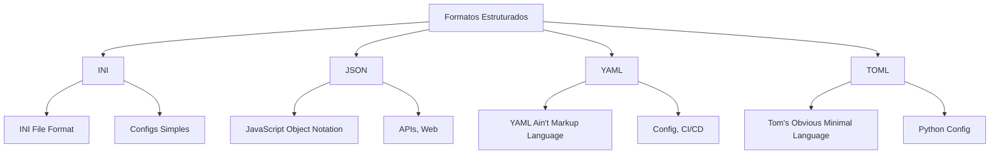
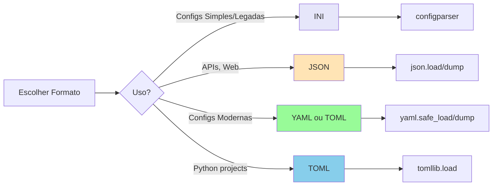

# Aula 3: INI, JSON, TOML, YAML e Formatos Estruturados

## 1. Formatos Estruturados

Formatos estruturados organizam dados de forma hierárquica, permitindo representar estruturas complexas como objetos aninhados, listas e tipos de dados.



### Comparação de Formatos

| Característica | INI | JSON | YAML | TOML |
|----------------|-----|------|------|------|
| Legibilidade | Alta | Média | Alta | Alta |
| Verbosidade | Baixa | Média | Baixa | Baixa |
| Tipos nativos | Não | Sim | Sim | Sim |
| Comentários | Sim | Não | Sim | Sim |
| Aninhamento | Seções | Sim | Sim | Limitado |
| Uso comum | Configs legadas | APIs | Configs | Python projects |

## 2. Inferência de Tipos

Diferente de CSV (tudo é string), formatos estruturados preservam tipos de dados:

```python
# CSV: tudo é string
"nome","idade","ativo"
"João","30","true"

# JSON: tipos preservados
{
  "nome": "João",      # string
  "idade": 30,         # number
  "ativo": true        # boolean
}
```

**Tipos suportados:**
- Strings
- Numbers (int, float)
- Booleans (true/false)
- Null/None
- Arrays/Lists
- Objects/Dicts

**Nota sobre INI:** O formato INI não preserva tipos nativamente - tudo é tratado como string e precisa ser convertido manualmente.

## 3. INI (Initialization File)

### Estrutura INI

O formato INI é um dos mais antigos e simples formatos de configuração, amplamente usado em aplicações Windows e configs legadas.

```ini
# Comentários começam com # ou ;
; Este é outro comentário

# Seção DEFAULT (valores padrão para todas as seções)
[DEFAULT]
debug = false
timeout = 30

# Seção database
[database]
host = localhost
port = 5432
user = admin
password = secret123

# Seção api
[api]
host = 0.0.0.0
port = 8000
debug = true

# Seção logging
[logging]
level = INFO
file = /var/log/app.log
```

**Características do INI:**
- Organizado em **seções** entre colchetes `[seção]`
- Pares **chave = valor** dentro de cada seção
- Seção especial `[DEFAULT]` fornece valores padrão
- Comentários com `#` ou `;`
- **Não possui tipos nativos** - tudo é string
- Aninhamento limitado (apenas seções)

### Lendo INI em Python

```python
import configparser

# Criar parser
config = configparser.ConfigParser()

# Ler arquivo
config.read('config.ini', encoding='utf-8')

# Acessar valores
print(config['database']['host'])  # localhost
print(config['database']['port'])  # 5432 (string!)
print(config['api']['debug'])      # true (string!)

# Valores da seção DEFAULT
print(config['database']['timeout'])  # 30 (herdado de DEFAULT)

# Listar todas as seções
print(config.sections())  # ['database', 'api', 'logging']

# Verificar se seção existe
if 'database' in config:
    print("Seção database existe")

# Iterar sobre seção
for key in config['database']:
    print(f"{key} = {config['database'][key]}")
```

### Conversão de Tipos

```python
import configparser

config = configparser.ConfigParser()
config.read('config.ini', encoding='utf-8')

# Tudo é string por padrão
port = config['database']['port']
print(type(port))  # <class 'str'>

# Converter manualmente
port = int(config['database']['port'])
print(type(port))  # <class 'int'>

# Métodos auxiliares para conversão
debug = config['api'].getboolean('debug')  # True (boolean)
port = config['database'].getint('port')   # 5432 (int)
timeout = config['DEFAULT'].getfloat('timeout')  # 30.0 (float)

# Com valor padrão caso não exista
max_connections = config['database'].getint('max_connections', 100)
```

### Escrevendo INI em Python

```python
import configparser

# Criar configuração
config = configparser.ConfigParser()

# Adicionar seções e valores
config['DEFAULT'] = {
    'debug': 'false',
    'timeout': '30'
}

config['database'] = {
    'host': 'localhost',
    'port': '5432',
    'user': 'admin'
}

config['api'] = {
    'host': '0.0.0.0',
    'port': '8000',
    'debug': 'true'
}

# Escrever para arquivo
with open('config.ini', 'w', encoding='utf-8') as f:
    config.write(f)
```

### Exemplo com Múltiplos Ambientes

```ini
# config_multi_ambiente.ini
[production]
database_host = prod.example.com
database_port = 5432
redis_url = redis://prod-redis:6379
cache_ttl = 3600
workers = 4

[staging]
database_host = staging.example.com
database_port = 5432
redis_url = redis://staging-redis:6379
cache_ttl = 600
workers = 2

[development]
database_host = localhost
database_port = 5432
redis_url = redis://localhost:6379
cache_ttl = 60
workers = 1
debug = true
```

```python
import configparser
import os

# Carregar config
config = configparser.ConfigParser()
config.read('config_multi_ambiente.ini', encoding='utf-8')

# Selecionar ambiente
env = os.getenv('ENV', 'development')

# Acessar configuração do ambiente
db_host = config[env]['database_host']
db_port = config[env].getint('database_port')
workers = config[env].getint('workers')

print(f"Ambiente: {env}")
print(f"Database: {db_host}:{db_port}")
print(f"Workers: {workers}")
```

### INI Avançado: Interpolação

```python
import configparser

# Criar config com interpolação
config = configparser.ConfigParser()

# ExtendedInterpolation permite usar ${seção:chave}
config = configparser.ConfigParser(interpolation=configparser.ExtendedInterpolation())

config.read_string("""
[paths]
base_dir = /opt/app
logs_dir = ${base_dir}/logs
data_dir = ${base_dir}/data

[database]
host = localhost
connection_string = postgresql://${host}/mydb
""")

print(config['paths']['logs_dir'])  # /opt/app/logs
print(config['database']['connection_string'])  # postgresql://localhost/mydb
```

### Limitações do INI

```python
# PROBLEMA 1: Sem tipos nativos
# config.ini
[app]
workers = 4
debug = true

# Tudo vem como string!
config = configparser.ConfigParser()
config.read('config.ini')
workers = config['app']['workers']  # "4" (string, não int!)
debug = config['app']['debug']      # "true" (string, não bool!)

# SOLUÇÃO: Usar métodos de conversão
workers = config['app'].getint('workers')
debug = config['app'].getboolean('debug')

# PROBLEMA 2: Sem listas/arrays nativos
# config.ini
[app]
allowed_hosts = localhost,127.0.0.1,example.com

# Precisa parsear manualmente
hosts = config['app']['allowed_hosts'].split(',')

# PROBLEMA 3: Aninhamento limitado
# Não é possível ter estruturas complexas como:
# database:
#   primary:
#     host: db1.example.com
#   replica:
#     host: db2.example.com

# No INI, precisa "achatar":
[database_primary]
host = db1.example.com

[database_replica]
host = db2.example.com
```

### Quando Usar INI

**✅ Use INI quando:**
- Configurações simples e planas
- Compatibilidade com sistemas legados
- Configs que serão editadas manualmente por usuários
- Não precisa de estruturas complexas aninhadas

**❌ Evite INI quando:**
- Precisa preservar tipos de dados nativamente
- Precisa de estruturas aninhadas complexas
- Trabalha com arrays/listas
- Precisa de validação de schema

**Alternativas modernas:**
- Para configs Python: use **TOML** (pyproject.toml)
- Para configs CI/CD: use **YAML**
- Para APIs: use **JSON**

## 4. JSON (JavaScript Object Notation)

### Estrutura JSON

```json
{
  "nome": "João Silva",
  "idade": 30,
  "ativo": true,
  "salario": 5000.50,
  "departamento": null,
  "skills": ["Python", "Docker", "Kubernetes"],
  "endereco": {
    "rua": "Rua A",
    "cidade": "São Paulo",
    "cep": "01000-000"
  }
}
```

### Lendo JSON em Python

```python
import json

# Ler de arquivo
with open('dados.json', 'r', encoding='utf-8') as f:
    dados = json.load(f)

print(dados['nome'])  # João Silva
print(dados['idade'])  # 30 (int, não string!)
print(dados['skills'])  # ['Python', 'Docker', 'Kubernetes']
print(dados['endereco']['cidade'])  # São Paulo
```

```python
# Parsear de string JSON
import json

json_string = '{"nome": "Maria", "idade": 25}'
dados = json.loads(json_string)

print(type(dados))  # <class 'dict'>
print(dados['idade'])  # 25
```

### Escrevendo JSON em Python

```python
import json

dados = {
    'nome': 'João',
    'idade': 30,
    'skills': ['Python', 'Docker'],
    'endereco': {
        'cidade': 'São Paulo'
    }
}

# Escrever para arquivo
with open('saida.json', 'w', encoding='utf-8') as f:
    json.dump(dados, f, indent=2, ensure_ascii=False)

# ensure_ascii=False preserva caracteres Unicode
# indent=2 formata com indentação
```

```python
# Converter para string JSON
import json

dados = {'nome': 'João', 'idade': 30}
json_string = json.dumps(dados, indent=2, ensure_ascii=False)

print(json_string)
# {
#   "nome": "João",
#   "idade": 30
# }
```

### JSON com Tipos Python

```python
import json
from datetime import datetime

# Python -> JSON
dados = {
    'usuario': 'admin',
    'timestamp': datetime.now().isoformat(),
    'valores': (1, 2, 3),  # tupla vira lista
    'config': {'debug': True}
}

json_str = json.dumps(dados)
print(json_str)
# {"usuario": "admin", "timestamp": "2025-01-15T10:30:00", "valores": [1, 2, 3], ...}
```

### Pretty Printing JSON

```python
import json

dados = {'nome': 'João', 'skills': ['Python', 'Docker']}

# Compacto (sem espaços)
print(json.dumps(dados))
# {"nome":"João","skills":["Python","Docker"]}

# Formatado (indent=2)
print(json.dumps(dados, indent=2))
# {
#   "nome": "João",
#   "skills": [
#     "Python",
#     "Docker"
#   ]
# }

# Com sort_keys (ordena chaves)
print(json.dumps(dados, indent=2, sort_keys=True))
```

### JSON Lines (JSONL)

```python
import json

# Escrever múltiplos JSONs (um por linha)
dados = [
    {'nome': 'João', 'idade': 30},
    {'nome': 'Maria', 'idade': 25}
]

with open('dados.jsonl', 'w', encoding='utf-8') as f:
    for registro in dados:
        f.write(json.dumps(registro, ensure_ascii=False) + '\n')

# Ler JSON Lines
with open('dados.jsonl', 'r', encoding='utf-8') as f:
    for linha in f:
        registro = json.loads(linha)
        print(registro)
```

## 5. YAML (YAML Ain't Markup Language)

### Estrutura YAML

```yaml
# Comentários são permitidos!
nome: João Silva
idade: 30
ativo: true
salario: 5000.50
departamento: null

skills:
  - Python
  - Docker
  - Kubernetes

endereco:
  rua: Rua A
  cidade: São Paulo
  cep: "01000-000"  # String explícita

# Multi-line strings
descricao: |
  Esta é uma descrição
  em múltiplas linhas
  preservando quebras.

resumo: >
  Este texto será
  juntado em uma
  única linha.
```

### Lendo YAML em Python

```python
import yaml

# Instalar: pip install pyyaml

with open('config.yaml', 'r', encoding='utf-8') as f:
    dados = yaml.safe_load(f)

print(dados['nome'])  # João Silva
print(dados['skills'])  # ['Python', 'Docker', 'Kubernetes']
print(dados['endereco']['cidade'])  # São Paulo
```

### Escrevendo YAML em Python

```python
import yaml

dados = {
    'nome': 'João',
    'idade': 30,
    'skills': ['Python', 'Docker'],
    'endereco': {
        'cidade': 'São Paulo'
    }
}

with open('saida.yaml', 'w', encoding='utf-8') as f:
    yaml.dump(dados, f, default_flow_style=False, allow_unicode=True)

# default_flow_style=False: formato expandido (não inline)
# allow_unicode=True: preserva caracteres Unicode
```

### YAML Avançado

```yaml
# Âncoras e referências (reutilizar valores)
defaults: &defaults
  timeout: 30
  retry: 3

producao:
  <<: *defaults
  host: prod.example.com

desenvolvimento:
  <<: *defaults
  host: dev.example.com
  timeout: 60  # override
```

```python
import yaml

with open('config.yaml', 'r', encoding='utf-8') as f:
    config = yaml.safe_load(f)

print(config['producao'])
# {'timeout': 30, 'retry': 3, 'host': 'prod.example.com'}

print(config['desenvolvimento'])
# {'timeout': 60, 'retry': 3, 'host': 'dev.example.com'}
```

### YAML Multi-documento

```yaml
---
# Documento 1
nome: João
idade: 30
---
# Documento 2
nome: Maria
idade: 25
```

```python
import yaml

with open('multi.yaml', 'r', encoding='utf-8') as f:
    docs = yaml.safe_load_all(f)  # load_all para múltiplos
    for doc in docs:
        print(doc)
```

## 6. TOML (Tom's Obvious Minimal Language)

### Estrutura TOML

```toml
# Configuração do projeto
nome = "meu-projeto"
versao = "1.0.0"
descricao = "Um projeto exemplo"

# Arrays
autores = ["João Silva", "Maria Santos"]
keywords = ["python", "devops"]

# Tables (dicionários)
[build-system]
requires = ["hatchling"]
build-backend = "hatchling.build"

[project]
name = "gancho"
version = "0.1.0"
requires-python = ">=3.10"

[project.scripts]
gancho = "gancho:main"

# Nested tables
[tool.pytest.ini_options]
testpaths = ["tests"]
python_files = ["test_*.py"]

# Array of tables (lista de dicionários)
[[servers]]
name = "prod"
host = "prod.example.com"
port = 8080

[[servers]]
name = "dev"
host = "dev.example.com"
port = 8000
```

### Lendo TOML em Python

```python
# Python >= 3.11: tomllib (built-in)
import tomllib

with open('pyproject.toml', 'rb') as f:  # Modo binário!
    dados = tomllib.load(f)

print(dados['project']['name'])
print(dados['project']['version'])
print(dados['servers'][0]['host'])  # prod.example.com
```

```python
# Python < 3.11: toml (third-party)
import toml

with open('pyproject.toml', 'r', encoding='utf-8') as f:
    dados = toml.load(f)

print(dados['project']['name'])
```

### Escrevendo TOML em Python

```python
# Escrever TOML (biblioteca toml)
import toml

dados = {
    'project': {
        'name': 'meu-projeto',
        'version': '1.0.0',
        'authors': ['João Silva']
    },
    'servers': [
        {'name': 'prod', 'host': 'prod.example.com'},
        {'name': 'dev', 'host': 'dev.example.com'}
    ]
}

with open('config.toml', 'w', encoding='utf-8') as f:
    toml.dump(dados, f)
```

**Nota:** `tomllib` (Python 3.11+) é apenas para leitura. Para escrever, use `toml` ou `tomli-w`.

```python
# Python 3.11+ com tomli_w para escrita
import tomllib
import tomli_w

# Ler
with open('config.toml', 'rb') as f:
    dados = tomllib.load(f)

# Modificar
dados['project']['version'] = '1.1.0'

# Escrever
with open('config.toml', 'wb') as f:
    tomli_w.dump(dados, f)
```

## 7. Principais Problemas e Soluções

### Problema 0: INI não Preserva Tipos

```python
# PROBLEMA: INI não tem tipos nativos
import configparser

config = configparser.ConfigParser()
config.read_string("""
[app]
workers = 4
debug = true
timeout = 30.5
hosts = localhost,127.0.0.1
""")

# Tudo é string!
workers = config['app']['workers']  # "4"
debug = config['app']['debug']      # "true"

# SOLUÇÃO 1: Usar métodos de conversão do ConfigParser
workers = config['app'].getint('workers')  # 4 (int)
debug = config['app'].getboolean('debug')  # True (bool)
timeout = config['app'].getfloat('timeout')  # 30.5 (float)

# SOLUÇÃO 2: Converter para formato moderno
import yaml

# Converter INI para dict
ini_data = {section: dict(config[section]) for section in config.sections()}

# Salvar como YAML (preserva tipos quando recarregado)
with open('config.yaml', 'w') as f:
    yaml.dump(ini_data, f)
```

### Problema 1: JSON não Suporta Comentários

```python
# PROBLEMA: Preciso de comentários em config JSON

# SOLUÇÃO 1: Usar YAML ou TOML
# config.yaml
database:
  host: localhost  # Servidor local para desenvolvimento
  port: 5432

# SOLUÇÃO 2: Processar JSON com comentários
import json
import re

def json_com_comentarios(arquivo):
    with open(arquivo, 'r', encoding='utf-8') as f:
        conteudo = f.read()

    # Remover comentários // e /* */
    conteudo = re.sub(r'//.*', '', conteudo)
    conteudo = re.sub(r'/\*.*?\*/', '', conteudo, flags=re.DOTALL)

    return json.loads(conteudo)

# SOLUÇÃO 3: Usar jsonc (JSON with Comments) - VSCode
# Biblioteca: pip install jsoncomment
from jsoncomment import JsonComment

parser = JsonComment()
with open('config.jsonc', 'r', encoding='utf-8') as f:
    dados = parser.load(f)
```

### Problema 2: YAML é Sensível a Indentação

```yaml
# ERRO: Indentação inconsistente
database:
  host: localhost
   port: 5432  # 3 espaços (erro!)

# CORRETO: Usar sempre 2 ou 4 espaços
database:
  host: localhost
  port: 5432
```

```python
# Validar YAML antes de usar
import yaml

try:
    with open('config.yaml', 'r', encoding='utf-8') as f:
        config = yaml.safe_load(f)
except yaml.YAMLError as e:
    print(f"Erro no YAML: {e}")
```

### Problema 3: Tipos Inferidos Incorretamente

```yaml
# YAML interpreta valores automaticamente
versao: 1.0  # float
cep: 01000-000  # interpretado como subtração!
```

```yaml
# SOLUÇÃO: Usar aspas para forçar string
versao: "1.0"
cep: "01000-000"
```

```python
# TOML também pode ter problemas
# config.toml
versao = 1.0  # float
versao = "1.0"  # string
```

### Problema 4: Serialização de Objetos Customizados

```python
# PROBLEMA: JSON não serializa objetos Python
from datetime import datetime

dados = {
    'timestamp': datetime.now()  # Erro!
}

# json.dumps(dados)  # TypeError: Object of type datetime is not JSON serializable

# SOLUÇÃO 1: Converter manualmente
dados = {
    'timestamp': datetime.now().isoformat()
}

# SOLUÇÃO 2: Custom encoder
import json
from datetime import datetime

class DateTimeEncoder(json.JSONEncoder):
    def default(self, obj):
        if isinstance(obj, datetime):
            return obj.isoformat()
        return super().default(obj)

dados = {'timestamp': datetime.now()}
json_str = json.dumps(dados, cls=DateTimeEncoder)
```

### Problema 5: Encoding de Caracteres

```python
# PROBLEMA: Caracteres especiais escapados
import json

dados = {'nome': 'João'}
print(json.dumps(dados))
# {"nome": "Jo\u00e3o"}

# SOLUÇÃO: ensure_ascii=False
print(json.dumps(dados, ensure_ascii=False))
# {"nome": "João"}
```

## 8. Exercícios Práticos

### Exercício 1: Conversor de Formatos

```python
#!/usr/bin/env python3
"""Converte entre INI, JSON, YAML e TOML"""

import json
import yaml
import tomllib
import tomli_w
import configparser
import sys
from pathlib import Path

def converter(arquivo_entrada, arquivo_saida):
    """Converte entre formatos baseado na extensão"""

    entrada_ext = Path(arquivo_entrada).suffix.lower()
    saida_ext = Path(arquivo_saida).suffix.lower()

    # Ler arquivo de entrada
    if entrada_ext == '.ini':
        config = configparser.ConfigParser()
        config.read(arquivo_entrada, encoding='utf-8')
        # Converter para dict
        dados = {section: dict(config[section]) for section in config.sections()}
    elif entrada_ext == '.json':
        with open(arquivo_entrada, 'r', encoding='utf-8') as f:
            dados = json.load(f)
    elif entrada_ext in ['.yaml', '.yml']:
        with open(arquivo_entrada, 'r', encoding='utf-8') as f:
            dados = yaml.safe_load(f)
    elif entrada_ext == '.toml':
        with open(arquivo_entrada, 'rb') as f:
            dados = tomllib.load(f)
    else:
        print(f"Formato não suportado: {entrada_ext}")
        return

    # Escrever arquivo de saída
    if saida_ext == '.ini':
        config = configparser.ConfigParser()
        # Converter dict para INI
        for section, values in dados.items():
            config[section] = {k: str(v) for k, v in values.items()}
        with open(arquivo_saida, 'w', encoding='utf-8') as f:
            config.write(f)
    elif saida_ext == '.json':
        with open(arquivo_saida, 'w', encoding='utf-8') as f:
            json.dump(dados, f, indent=2, ensure_ascii=False)
    elif saida_ext in ['.yaml', '.yml']:
        with open(arquivo_saida, 'w', encoding='utf-8') as f:
            yaml.dump(dados, f, default_flow_style=False, allow_unicode=True)
    elif saida_ext == '.toml':
        with open(arquivo_saida, 'wb') as f:
            tomli_w.dump(dados, f)
    else:
        print(f"Formato não suportado: {saida_ext}")
        return

    print(f"✓ Convertido: {arquivo_entrada} -> {arquivo_saida}")

if __name__ == '__main__':
    if len(sys.argv) != 3:
        print("Uso: python converter.py <entrada> <saida>")
        sys.exit(1)

    converter(sys.argv[1], sys.argv[2])
```

### Exercício 2: Gerador de Config

```python
#!/usr/bin/env python3
"""Gera arquivo de configuração a partir de template"""

import yaml
import os

def gerar_config(template, env='dev'):
    """Gera config substituindo variáveis de ambiente"""

    with open(template, 'r', encoding='utf-8') as f:
        config = yaml.safe_load(f)

    # Substituir variáveis
    def substituir_vars(obj):
        if isinstance(obj, dict):
            return {k: substituir_vars(v) for k, v in obj.items()}
        elif isinstance(obj, list):
            return [substituir_vars(item) for item in obj]
        elif isinstance(obj, str):
            # Substituir ${VAR} por valor da env var
            import re
            pattern = r'\$\{(\w+)\}'
            return re.sub(pattern, lambda m: os.getenv(m.group(1), m.group(0)), obj)
        return obj

    config_processado = substituir_vars(config)

    # Salvar
    arquivo_saida = f'config.{env}.yaml'
    with open(arquivo_saida, 'w', encoding='utf-8') as f:
        yaml.dump(config_processado, f, default_flow_style=False)

    print(f"✓ Config gerado: {arquivo_saida}")

if __name__ == '__main__':
    # Template: config.template.yaml
    template_content = """
database:
  host: ${DB_HOST}
  port: ${DB_PORT}
  user: ${DB_USER}

app:
  debug: ${DEBUG}
"""

    with open('config.template.yaml', 'w') as f:
        f.write(template_content)

    # Definir variáveis de ambiente
    os.environ['DB_HOST'] = 'localhost'
    os.environ['DB_PORT'] = '5432'
    os.environ['DB_USER'] = 'admin'
    os.environ['DEBUG'] = 'true'

    gerar_config('config.template.yaml', 'dev')
```

### Exercício 3: Validador de Schema

```python
#!/usr/bin/env python3
"""Valida dados contra schema"""

import json
from jsonschema import validate, ValidationError

# Definir schema
schema = {
    "type": "object",
    "properties": {
        "nome": {"type": "string", "minLength": 1},
        "idade": {"type": "integer", "minimum": 0, "maximum": 150},
        "email": {"type": "string", "format": "email"},
        "ativo": {"type": "boolean"}
    },
    "required": ["nome", "email"]
}

def validar_dados(arquivo, schema):
    """Valida arquivo JSON contra schema"""

    with open(arquivo, 'r', encoding='utf-8') as f:
        dados = json.load(f)

    try:
        validate(instance=dados, schema=schema)
        print("✓ Dados válidos!")
    except ValidationError as e:
        print(f"❌ Validação falhou:")
        print(f"  Erro: {e.message}")
        print(f"  Campo: {'.'.join(str(p) for p in e.path)}")

if __name__ == '__main__':
    # Dados válidos
    valido = {
        "nome": "João",
        "idade": 30,
        "email": "joao@example.com",
        "ativo": True
    }

    with open('valido.json', 'w') as f:
        json.dump(valido, f)

    validar_dados('valido.json', schema)

    # Dados inválidos
    invalido = {
        "nome": "",  # minLength = 1
        "idade": 200,  # maximum = 150
        "email": "invalido"  # formato incorreto
    }

    with open('invalido.json', 'w') as f:
        json.dump(invalido, f)

    validar_dados('invalido.json', schema)
```

### Exercício 4: Merge de Configs

```python
#!/usr/bin/env python3
"""Combina múltiplos arquivos de config (override)"""

import yaml
from pathlib import Path

def merge_dict(base, override):
    """Merge recursivo de dicionários"""
    resultado = base.copy()

    for key, valor in override.items():
        if key in resultado and isinstance(resultado[key], dict) and isinstance(valor, dict):
            resultado[key] = merge_dict(resultado[key], valor)
        else:
            resultado[key] = valor

    return resultado

def merge_configs(*arquivos):
    """Combina múltiplos YAMLs (último tem prioridade)"""

    config_final = {}

    for arquivo in arquivos:
        with open(arquivo, 'r', encoding='utf-8') as f:
            config = yaml.safe_load(f) or {}
            config_final = merge_dict(config_final, config)

    return config_final

if __name__ == '__main__':
    # config.default.yaml
    with open('config.default.yaml', 'w') as f:
        yaml.dump({
            'database': {'host': 'localhost', 'port': 5432},
            'app': {'debug': False, 'timeout': 30}
        }, f)

    # config.dev.yaml (override)
    with open('config.dev.yaml', 'w') as f:
        yaml.dump({
            'app': {'debug': True}  # Sobrescreve apenas debug
        }, f)

    # Merge
    config = merge_configs('config.default.yaml', 'config.dev.yaml')

    print(yaml.dump(config, default_flow_style=False))
    # database:
    #   host: localhost
    #   port: 5432
    # app:
    #   debug: true
    #   timeout: 30
```

### Exercício 5: Config Loader Inteligente

```python
#!/usr/bin/env python3
"""Carrega config automaticamente baseado no ambiente"""

import os
import yaml
import json
from pathlib import Path

class ConfigLoader:
    """Carrega configuração de múltiplas fontes"""

    def __init__(self, config_dir='config'):
        self.config_dir = Path(config_dir)
        self.env = os.getenv('ENV', 'dev')
        self.config = {}

    def load(self):
        """Carrega configs em ordem de prioridade"""

        # 1. Config padrão
        default_config = self.config_dir / 'default.yaml'
        if default_config.exists():
            self.config = self._load_yaml(default_config)

        # 2. Config do ambiente
        env_config = self.config_dir / f'{self.env}.yaml'
        if env_config.exists():
            self.config.update(self._load_yaml(env_config))

        # 3. Config local (gitignored)
        local_config = self.config_dir / 'local.yaml'
        if local_config.exists():
            self.config.update(self._load_yaml(local_config))

        # 4. Variáveis de ambiente (override tudo)
        self._load_env_vars()

        return self.config

    def _load_yaml(self, arquivo):
        with open(arquivo, 'r', encoding='utf-8') as f:
            return yaml.safe_load(f) or {}

    def _load_env_vars(self):
        """Carrega variáveis de ambiente no formato APP_DATABASE_HOST"""
        prefix = 'APP_'

        for key, value in os.environ.items():
            if key.startswith(prefix):
                # APP_DATABASE_HOST -> database.host
                path = key[len(prefix):].lower().split('_')
                self._set_nested(self.config, path, value)

    def _set_nested(self, dicionario, path, valor):
        """Define valor em caminho aninhado"""
        for key in path[:-1]:
            dicionario = dicionario.setdefault(key, {})
        dicionario[path[-1]] = valor

if __name__ == '__main__':
    # Criar estrutura de config
    os.makedirs('config', exist_ok=True)

    # default.yaml
    with open('config/default.yaml', 'w') as f:
        yaml.dump({'database': {'host': 'localhost', 'port': 5432}}, f)

    # dev.yaml
    with open('config/dev.yaml', 'w') as f:
        yaml.dump({'database': {'host': 'dev.example.com'}}, f)

    # Variável de ambiente
    os.environ['ENV'] = 'dev'
    os.environ['APP_DATABASE_PORT'] = '3306'

    # Carregar
    loader = ConfigLoader()
    config = loader.load()

    print(json.dumps(config, indent=2))
    # {
    #   "database": {
    #     "host": "dev.example.com",
    #     "port": "3306"
    #   }
    # }
```

## Resumo



**Pontos-chave:**
- **INI**: Configs simples, legadas, sem tipos nativos, use `configparser`
- **JSON**: APIs, dados estruturados, sem comentários
- **YAML**: Configs gerais, CI/CD, muito legível, suporta comentários
- **TOML**: Configs Python (pyproject.toml), boa legibilidade
- Sempre use `ensure_ascii=False` em JSON
- Use `yaml.safe_load()` (não `yaml.load()`)
- Python 3.11+: `tomllib` built-in (somente leitura)
- Para INI: use `.getint()`, `.getboolean()`, `.getfloat()` para converter tipos
- Valide schemas com `jsonschema` quando necessário
