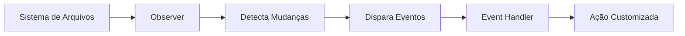
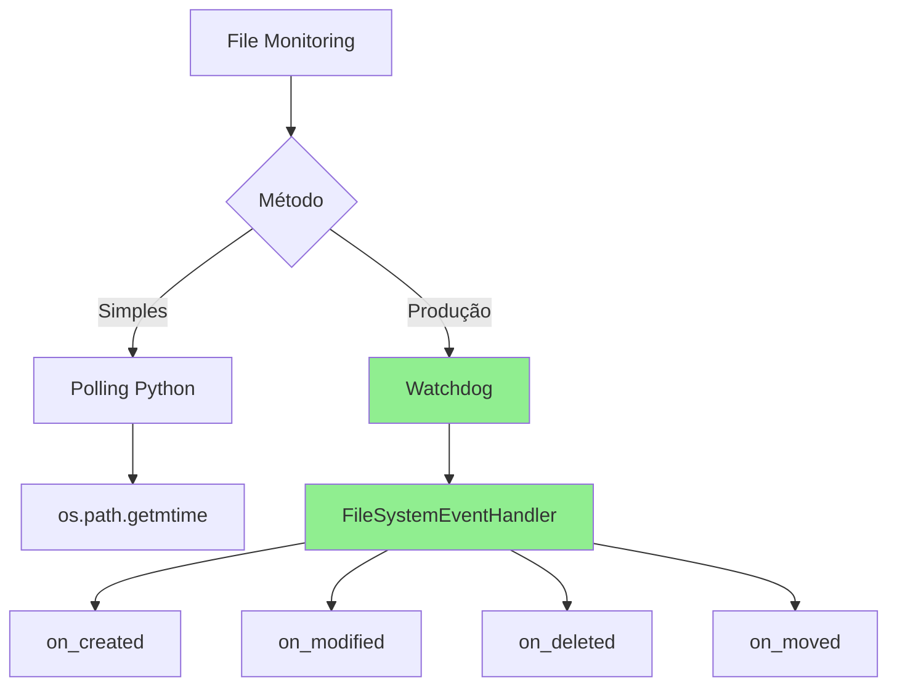

# Aula 4: Watchdog para Monitorar Mudanças em Arquivos e Diretórios

## 1. O que é Watchdog?

Watchdog é uma biblioteca Python que monitora mudanças no sistema de arquivos em tempo real, disparando eventos quando arquivos ou diretórios são criados, modificados, movidos ou deletados.



**Casos de uso:**
- Auto-reload de configs quando modificadas
- Processamento automático de arquivos novos
- Sincronização de arquivos
- Build systems (rebuild on change)
- Deploy automático
- Backup incremental

## 2. Monitorando com Python Puro

### Polling Simples

```python
import os
import time
from pathlib import Path

def monitorar_arquivo_simples(arquivo, intervalo=1):
    """Monitora mudanças em arquivo usando polling"""

    if not Path(arquivo).exists():
        print(f"Arquivo {arquivo} não existe")
        return

    # Obter timestamp inicial
    ultima_modificacao = os.path.getmtime(arquivo)
    print(f"Monitorando: {arquivo}")

    try:
        while True:
            time.sleep(intervalo)

            # Verificar se arquivo foi modificado
            modificacao_atual = os.path.getmtime(arquivo)

            if modificacao_atual != ultima_modificacao:
                print(f"✓ Arquivo modificado: {arquivo}")
                ultima_modificacao = modificacao_atual

    except KeyboardInterrupt:
        print("\nMonitoramento interrompido")

if __name__ == '__main__':
    monitorar_arquivo_simples('config.yaml')
```

### Monitorando Diretório com Polling

```python
import os
import time
from pathlib import Path

def obter_snapshot(diretorio):
    """Retorna snapshot do diretório (arquivos e mtimes)"""
    snapshot = {}

    for arquivo in Path(diretorio).rglob('*'):
        if arquivo.is_file():
            snapshot[str(arquivo)] = arquivo.stat().st_mtime

    return snapshot

def monitorar_diretorio_simples(diretorio, intervalo=2):
    """Monitora mudanças em diretório usando polling"""

    print(f"Monitorando: {diretorio}")
    snapshot_anterior = obter_snapshot(diretorio)

    try:
        while True:
            time.sleep(intervalo)

            snapshot_atual = obter_snapshot(diretorio)

            # Arquivos novos
            novos = set(snapshot_atual.keys()) - set(snapshot_anterior.keys())
            for arquivo in novos:
                print(f"✓ Novo arquivo: {arquivo}")

            # Arquivos deletados
            deletados = set(snapshot_anterior.keys()) - set(snapshot_atual.keys())
            for arquivo in deletados:
                print(f"✗ Arquivo deletado: {arquivo}")

            # Arquivos modificados
            for arquivo in set(snapshot_atual.keys()) & set(snapshot_anterior.keys()):
                if snapshot_atual[arquivo] != snapshot_anterior[arquivo]:
                    print(f"✓ Arquivo modificado: {arquivo}")

            snapshot_anterior = snapshot_atual

    except KeyboardInterrupt:
        print("\nMonitoramento interrompido")

if __name__ == '__main__':
    monitorar_diretorio_simples('.')
```

**Limitações do polling:**
- Atraso (latência = intervalo de polling)
- Consome CPU mesmo sem mudanças
- Pode perder eventos rápidos entre polls
- Não diferencia tipo de mudança (created vs modified)

## 3. Usando a Biblioteca Watchdog

### Instalação

```bash
pip install watchdog
```

### Monitoramento Básico

```python
import time
from watchdog.observers import Observer
from watchdog.events import FileSystemEventHandler

class MeuHandler(FileSystemEventHandler):
    """Handler customizado para eventos do sistema de arquivos"""

    def on_modified(self, event):
        if not event.is_directory:
            print(f"✓ Modificado: {event.src_path}")

    def on_created(self, event):
        if not event.is_directory:
            print(f"✓ Criado: {event.src_path}")

    def on_deleted(self, event):
        if not event.is_directory:
            print(f"✗ Deletado: {event.src_path}")

    def on_moved(self, event):
        if not event.is_directory:
            print(f"↔ Movido: {event.src_path} -> {event.dest_path}")

def monitorar_diretorio(caminho):
    """Monitora diretório usando watchdog"""

    event_handler = MeuHandler()
    observer = Observer()
    observer.schedule(event_handler, caminho, recursive=True)
    observer.start()

    print(f"Monitorando: {caminho}")

    try:
        while True:
            time.sleep(1)
    except KeyboardInterrupt:
        observer.stop()
        print("\nMonitoramento interrompido")

    observer.join()

if __name__ == '__main__':
    monitorar_diretorio('.')
```

### Event Handler com Filtros

```python
from watchdog.events import PatternMatchingEventHandler

class LogFileHandler(PatternMatchingEventHandler):
    """Handler que monitora apenas arquivos .log"""

    def __init__(self):
        # Monitorar apenas .log
        super().__init__(
            patterns=['*.log'],
            ignore_patterns=['*.tmp', '*~'],
            ignore_directories=True,
            case_sensitive=False
        )

    def on_created(self, event):
        print(f"✓ Novo log: {event.src_path}")
        self.processar_log(event.src_path)

    def on_modified(self, event):
        print(f"✓ Log atualizado: {event.src_path}")
        self.processar_log(event.src_path)

    def processar_log(self, arquivo):
        """Processa arquivo de log"""
        with open(arquivo, 'r', encoding='utf-8') as f:
            linhas = f.readlines()
            print(f"  Total de linhas: {len(linhas)}")

if __name__ == '__main__':
    from watchdog.observers import Observer
    import time

    event_handler = LogFileHandler()
    observer = Observer()
    observer.schedule(event_handler, '/var/log', recursive=True)
    observer.start()

    try:
        while True:
            time.sleep(1)
    except KeyboardInterrupt:
        observer.stop()

    observer.join()
```

## 4. Monitorando Mudanças em Arquivos e Diretórios

### Auto-reload de Configuração

```python
import json
from watchdog.observers import Observer
from watchdog.events import FileSystemEventHandler

class ConfigWatcher(FileSystemEventHandler):
    """Recarrega configuração automaticamente"""

    def __init__(self, config_file):
        self.config_file = config_file
        self.config = {}
        self.carregar_config()

    def carregar_config(self):
        """Carrega configuração do arquivo"""
        try:
            with open(self.config_file, 'r', encoding='utf-8') as f:
                self.config = json.load(f)
                print(f"✓ Config carregada: {self.config}")
        except Exception as e:
            print(f"✗ Erro ao carregar config: {e}")

    def on_modified(self, event):
        if event.src_path.endswith(self.config_file):
            print(f"\n→ Config modificada, recarregando...")
            self.carregar_config()

def main():
    config_file = 'config.json'

    # Criar config inicial
    with open(config_file, 'w') as f:
        json.dump({'debug': True, 'port': 8000}, f)

    # Monitorar
    watcher = ConfigWatcher(config_file)
    observer = Observer()
    observer.schedule(watcher, '.', recursive=False)
    observer.start()

    print(f"Monitorando {config_file}...")
    print("Edite o arquivo para ver o auto-reload")

    try:
        while True:
            time.sleep(1)
    except KeyboardInterrupt:
        observer.stop()

    observer.join()

if __name__ == '__main__':
    import time
    main()
```

### Processador Automático de Arquivos

```python
import shutil
from pathlib import Path
from watchdog.observers import Observer
from watchdog.events import FileSystemEventHandler

class ProcessadorArquivos(FileSystemEventHandler):
    """Processa arquivos automaticamente quando adicionados"""

    def __init__(self, diretorio_entrada, diretorio_saida):
        self.entrada = Path(diretorio_entrada)
        self.saida = Path(diretorio_saida)
        self.saida.mkdir(exist_ok=True)

    def on_created(self, event):
        if event.is_directory:
            return

        arquivo = Path(event.src_path)

        # Processar apenas .txt
        if arquivo.suffix == '.txt':
            print(f"→ Processando: {arquivo.name}")
            self.processar(arquivo)

    def processar(self, arquivo):
        """Processa arquivo (exemplo: converter para uppercase)"""
        try:
            # Ler conteúdo
            with open(arquivo, 'r', encoding='utf-8') as f:
                conteudo = f.read()

            # Processar (uppercase)
            conteudo_processado = conteudo.upper()

            # Salvar no diretório de saída
            arquivo_saida = self.saida / arquivo.name
            with open(arquivo_saida, 'w', encoding='utf-8') as f:
                f.write(conteudo_processado)

            print(f"✓ Processado: {arquivo_saida}")

            # Opcional: remover arquivo original
            # arquivo.unlink()

        except Exception as e:
            print(f"✗ Erro ao processar {arquivo.name}: {e}")

if __name__ == '__main__':
    import time
    import os

    # Criar diretórios
    os.makedirs('input', exist_ok=True)
    os.makedirs('output', exist_ok=True)

    # Monitorar
    handler = ProcessadorArquivos('input', 'output')
    observer = Observer()
    observer.schedule(handler, 'input', recursive=False)
    observer.start()

    print("Processador iniciado")
    print("Coloque arquivos .txt em input/ para processar")

    try:
        while True:
            time.sleep(1)
    except KeyboardInterrupt:
        observer.stop()

    observer.join()
```

## 5. Respondendo a Eventos de Mudança

### Trigger de Deploy

```python
from watchdog.observers import Observer
from watchdog.events import FileSystemEventHandler
import subprocess

class DeployTrigger(FileSystemEventHandler):
    """Dispara deploy quando código é atualizado"""

    def __init__(self, branch='main'):
        self.branch = branch

    def on_modified(self, event):
        # Monitorar apenas arquivos Python
        if event.src_path.endswith('.py'):
            print(f"→ Código modificado: {event.src_path}")
            self.executar_testes()

    def executar_testes(self):
        """Executa testes antes de deploy"""
        print("→ Executando testes...")

        try:
            result = subprocess.run(
                ['python', '-m', 'pytest'],
                capture_output=True,
                text=True,
                timeout=60
            )

            if result.returncode == 0:
                print("✓ Testes passaram")
                self.deploy()
            else:
                print("✗ Testes falharam")
                print(result.stdout)

        except Exception as e:
            print(f"✗ Erro ao executar testes: {e}")

    def deploy(self):
        """Executa deploy"""
        print("→ Executando deploy...")

        try:
            # Exemplo: git push ou script de deploy
            subprocess.run(['./deploy.sh'], check=True)
            print("✓ Deploy concluído")

        except Exception as e:
            print(f"✗ Erro no deploy: {e}")

if __name__ == '__main__':
    import time

    handler = DeployTrigger()
    observer = Observer()
    observer.schedule(handler, 'src/', recursive=True)
    observer.start()

    print("Deploy trigger ativo")

    try:
        while True:
            time.sleep(1)
    except KeyboardInterrupt:
        observer.stop()

    observer.join()
```

### Build System Automático

```python
from watchdog.observers import Observer
from watchdog.events import PatternMatchingEventHandler
import subprocess
import time

class AutoBuilder(PatternMatchingEventHandler):
    """Rebuild automático quando código muda"""

    def __init__(self):
        super().__init__(
            patterns=['*.py', '*.js', '*.css'],
            ignore_patterns=['*/node_modules/*', '*/__pycache__/*'],
            ignore_directories=False
        )
        self.ultimo_build = 0
        self.debounce = 2  # segundos

    def on_any_event(self, event):
        # Debounce (evitar múltiplos builds)
        agora = time.time()
        if agora - self.ultimo_build < self.debounce:
            return

        self.ultimo_build = agora
        print(f"\n→ Mudança detectada: {event.src_path}")
        self.build()

    def build(self):
        """Executa build"""
        print("→ Executando build...")

        try:
            # Exemplo: npm run build ou python setup.py build
            result = subprocess.run(
                ['npm', 'run', 'build'],
                capture_output=True,
                text=True,
                timeout=120
            )

            if result.returncode == 0:
                print("✓ Build concluído com sucesso")
            else:
                print("✗ Build falhou")
                print(result.stderr)

        except Exception as e:
            print(f"✗ Erro no build: {e}")

if __name__ == '__main__':
    handler = AutoBuilder()
    observer = Observer()
    observer.schedule(handler, 'src/', recursive=True)
    observer.start()

    print("Auto-builder ativo")

    try:
        while True:
            time.sleep(1)
    except KeyboardInterrupt:
        observer.stop()

    observer.join()
```

## 6. Principais Problemas e Soluções

### Problema 1: Eventos Duplicados

```python
# PROBLEMA: Alguns editores geram múltiplos eventos ao salvar

import time
from collections import defaultdict

class DebouncedHandler(FileSystemEventHandler):
    """Handler com debounce para evitar eventos duplicados"""

    def __init__(self, debounce_segundos=1):
        self.debounce = debounce_segundos
        self.ultimo_evento = defaultdict(float)

    def on_modified(self, event):
        arquivo = event.src_path
        agora = time.time()

        # Ignorar se evento muito recente
        if agora - self.ultimo_evento[arquivo] < self.debounce:
            return

        self.ultimo_evento[arquivo] = agora
        print(f"✓ Modificado: {arquivo}")
```

### Problema 2: Muitos Eventos (Bulk Operations)

```python
# PROBLEMA: Copiar 1000 arquivos gera 1000 eventos

import time
from threading import Timer

class BatchHandler(FileSystemEventHandler):
    """Processa eventos em lote"""

    def __init__(self, batch_delay=2):
        self.batch_delay = batch_delay
        self.eventos_pendentes = []
        self.timer = None

    def on_any_event(self, event):
        self.eventos_pendentes.append(event)

        # Cancelar timer anterior
        if self.timer:
            self.timer.cancel()

        # Novo timer
        self.timer = Timer(self.batch_delay, self.processar_lote)
        self.timer.start()

    def processar_lote(self):
        """Processa todos os eventos acumulados"""
        print(f"\n→ Processando {len(self.eventos_pendentes)} eventos")

        for evento in self.eventos_pendentes:
            print(f"  {evento.event_type}: {evento.src_path}")

        self.eventos_pendentes = []
```

### Problema 3: Observer não Detecta Mudanças

```python
# PROBLEMA: Alguns sistemas de arquivos não suportam eventos nativos

# SOLUÇÃO 1: Usar PollingObserver
from watchdog.observers.polling import PollingObserver

observer = PollingObserver()  # Funciona em qualquer filesystem
observer.schedule(handler, path)
observer.start()

# SOLUÇÃO 2: Polling Observer com timeout customizado
observer = PollingObserver(timeout=1)  # Poll a cada 1 segundo
```

### Problema 4: Recursão Infinita

```python
# PROBLEMA: Handler modifica arquivo que está monitorando

class SafeHandler(FileSystemEventHandler):
    """Previne recursão infinita"""

    def __init__(self):
        self.processando = set()

    def on_modified(self, event):
        arquivo = event.src_path

        # Ignorar se já está processando
        if arquivo in self.processando:
            return

        try:
            self.processando.add(arquivo)
            print(f"Processando: {arquivo}")

            # Processar arquivo (pode modificá-lo)
            # ...

        finally:
            self.processando.remove(arquivo)
```

### Problema 5: Permissões e Erros

```python
# PROBLEMA: Erro ao acessar arquivos sendo escritos

import time

class RobustHandler(FileSystemEventHandler):
    """Handler robusto com retry"""

    def on_created(self, event):
        arquivo = event.src_path

        # Aguardar arquivo estar completamente escrito
        time.sleep(0.5)

        # Retry com backoff
        for tentativa in range(3):
            try:
                with open(arquivo, 'r', encoding='utf-8') as f:
                    conteudo = f.read()
                    print(f"✓ Arquivo lido: {arquivo}")
                    break

            except (PermissionError, IOError) as e:
                print(f"  Tentativa {tentativa + 1} falhou: {e}")
                time.sleep(1 * (tentativa + 1))  # Backoff
        else:
            print(f"✗ Falha ao ler {arquivo} após 3 tentativas")
```

## 7. Exercícios Práticos

### Exercício 1: Hot Reload Web Server

```python
#!/usr/bin/env python3
"""Servidor web com auto-reload"""

from http.server import HTTPServer, SimpleHTTPRequestHandler
from watchdog.observers import Observer
from watchdog.events import FileSystemEventHandler
import threading
import time

class ReloadHandler(FileSystemEventHandler):
    """Handler que notifica servidor para reload"""

    def __init__(self, servidor):
        self.servidor = servidor

    def on_modified(self, event):
        if event.src_path.endswith(('.html', '.css', '.js')):
            print(f"\n→ Arquivo modificado: {event.src_path}")
            print("→ Reiniciando servidor...")
            self.servidor.restart()

class HotReloadServer:
    """Servidor HTTP com hot reload"""

    def __init__(self, porta=8000, diretorio='.'):
        self.porta = porta
        self.diretorio = diretorio
        self.servidor = None
        self.thread = None

    def start(self):
        """Inicia servidor"""
        self.thread = threading.Thread(target=self._run_server, daemon=True)
        self.thread.start()

        # Monitorar arquivos
        handler = ReloadHandler(self)
        observer = Observer()
        observer.schedule(handler, self.diretorio, recursive=True)
        observer.start()

        print(f"Servidor rodando em http://localhost:{self.porta}")
        print("Monitorando mudanças em arquivos HTML/CSS/JS...")

        try:
            while True:
                time.sleep(1)
        except KeyboardInterrupt:
            observer.stop()
            print("\nServidor parado")

        observer.join()

    def _run_server(self):
        """Executa servidor HTTP"""
        self.servidor = HTTPServer(('', self.porta), SimpleHTTPRequestHandler)
        self.servidor.serve_forever()

    def restart(self):
        """Reinicia servidor"""
        if self.servidor:
            self.servidor.shutdown()
            time.sleep(0.5)
            self._run_server()

if __name__ == '__main__':
    server = HotReloadServer(porta=8000)
    server.start()
```

### Exercício 2: Sincronizador de Arquivos

```python
#!/usr/bin/env python3
"""Sincroniza diretórios automaticamente"""

import shutil
from pathlib import Path
from watchdog.observers import Observer
from watchdog.events import FileSystemEventHandler

class SyncHandler(FileSystemEventHandler):
    """Sincroniza origem -> destino"""

    def __init__(self, origem, destino):
        self.origem = Path(origem)
        self.destino = Path(destino)
        self.destino.mkdir(exist_ok=True)

    def _get_dest_path(self, src_path):
        """Converte caminho origem para destino"""
        rel_path = Path(src_path).relative_to(self.origem)
        return self.destino / rel_path

    def on_created(self, event):
        dest = self._get_dest_path(event.src_path)

        if event.is_directory:
            dest.mkdir(exist_ok=True)
            print(f"✓ Diretório criado: {dest}")
        else:
            dest.parent.mkdir(parents=True, exist_ok=True)
            shutil.copy2(event.src_path, dest)
            print(f"✓ Arquivo copiado: {dest}")

    def on_modified(self, event):
        if not event.is_directory:
            dest = self._get_dest_path(event.src_path)
            shutil.copy2(event.src_path, dest)
            print(f"✓ Arquivo atualizado: {dest}")

    def on_deleted(self, event):
        dest = self._get_dest_path(event.src_path)

        if dest.exists():
            if dest.is_dir():
                shutil.rmtree(dest)
            else:
                dest.unlink()
            print(f"✗ Removido: {dest}")

    def on_moved(self, event):
        src_dest = self._get_dest_path(event.src_path)
        dest_dest = self._get_dest_path(event.dest_path)

        if src_dest.exists():
            shutil.move(str(src_dest), str(dest_dest))
            print(f"↔ Movido: {src_dest} -> {dest_dest}")

if __name__ == '__main__':
    import time

    handler = SyncHandler('source/', 'backup/')
    observer = Observer()
    observer.schedule(handler, 'source/', recursive=True)
    observer.start()

    print("Sincronização ativa: source/ -> backup/")

    try:
        while True:
            time.sleep(1)
    except KeyboardInterrupt:
        observer.stop()

    observer.join()
```

### Exercício 3: Log Aggregator

```python
#!/usr/bin/env python3
"""Agrega logs de múltiplos arquivos"""

from watchdog.observers import Observer
from watchdog.events import PatternMatchingEventHandler
from datetime import datetime

class LogAggregator(PatternMatchingEventHandler):
    """Agrega logs em arquivo centralizado"""

    def __init__(self, log_centralizado='all.log'):
        super().__init__(patterns=['*.log'], ignore_directories=True)
        self.log_central = log_centralizado

    def on_modified(self, event):
        self.processar_log(event.src_path)

    def on_created(self, event):
        self.processar_log(event.src_path)

    def processar_log(self, arquivo_log):
        """Lê novas linhas e adiciona ao log central"""
        try:
            # Ler log
            with open(arquivo_log, 'r', encoding='utf-8') as f:
                linhas = f.readlines()

            # Adicionar ao log central com timestamp e origem
            with open(self.log_central, 'a', encoding='utf-8') as f:
                for linha in linhas[-10:]:  # Últimas 10 linhas
                    timestamp = datetime.now().isoformat()
                    origem = arquivo_log
                    f.write(f"[{timestamp}] [{origem}] {linha}")

            print(f"✓ Agregado: {arquivo_log}")

        except Exception as e:
            print(f"✗ Erro: {e}")

if __name__ == '__main__':
    import time
    import os

    os.makedirs('logs', exist_ok=True)

    handler = LogAggregator('logs/all.log')
    observer = Observer()
    observer.schedule(handler, 'logs/', recursive=True)
    observer.start()

    print("Log aggregator ativo")

    try:
        while True:
            time.sleep(1)
    except KeyboardInterrupt:
        observer.stop()

    observer.join()
```

## Resumo



**Pontos-chave:**
- **Watchdog**: Biblioteca robusta para monitoramento de arquivos
- **FileSystemEventHandler**: Classe base para handlers customizados
- **PatternMatchingEventHandler**: Filtrar por padrões de arquivo
- **Observer**: Gerencia monitoramento em thread separada
- Use **debounce** para evitar eventos duplicados
- Use **batch processing** para operações em lote
- **PollingObserver**: Alternativa quando eventos nativos não funcionam
- Sempre trate exceções (arquivos podem estar bloqueados)

**Aplicações práticas:**
- Auto-reload de configs
- Hot reload em desenvolvimento
- Deploy automático
- Processamento de arquivos em tempo real
- Sincronização e backup
- Agregação de logs
